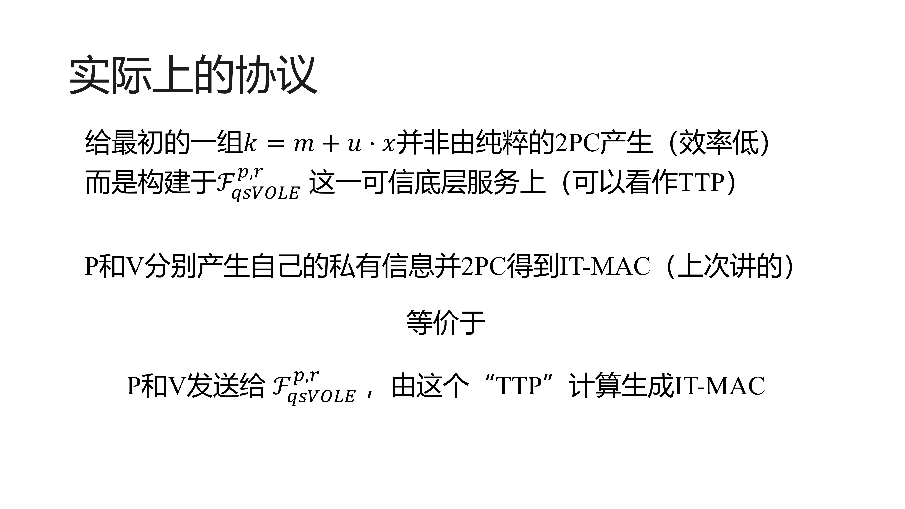
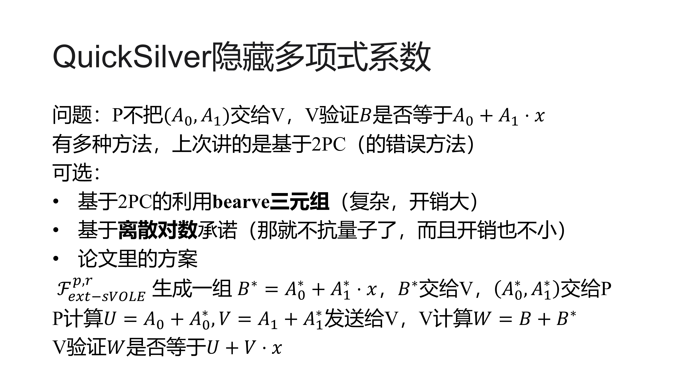
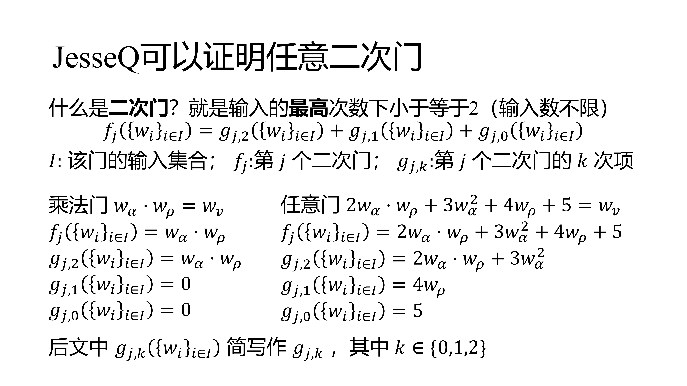
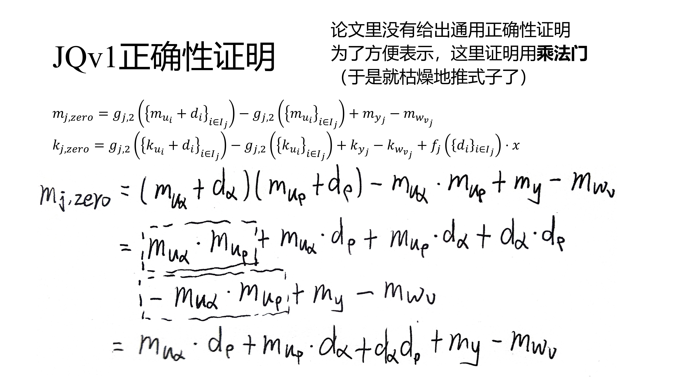
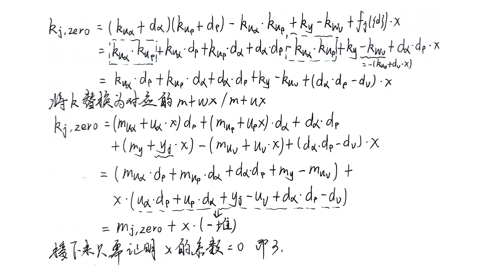
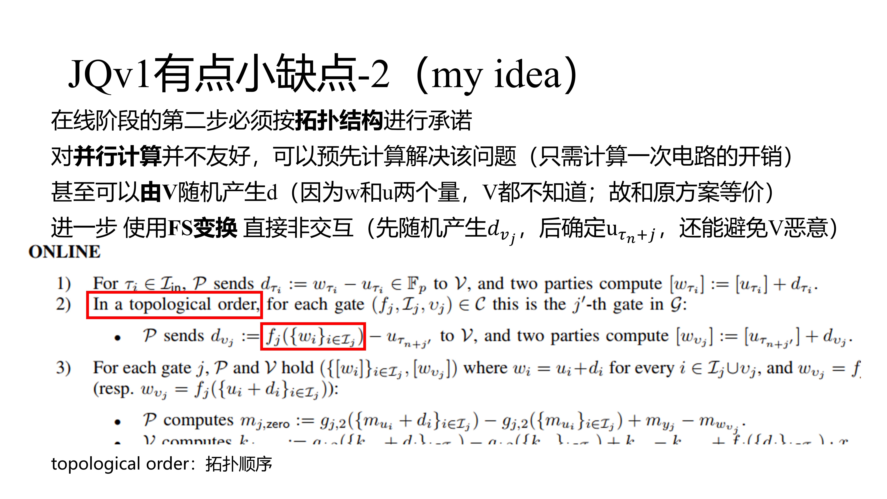
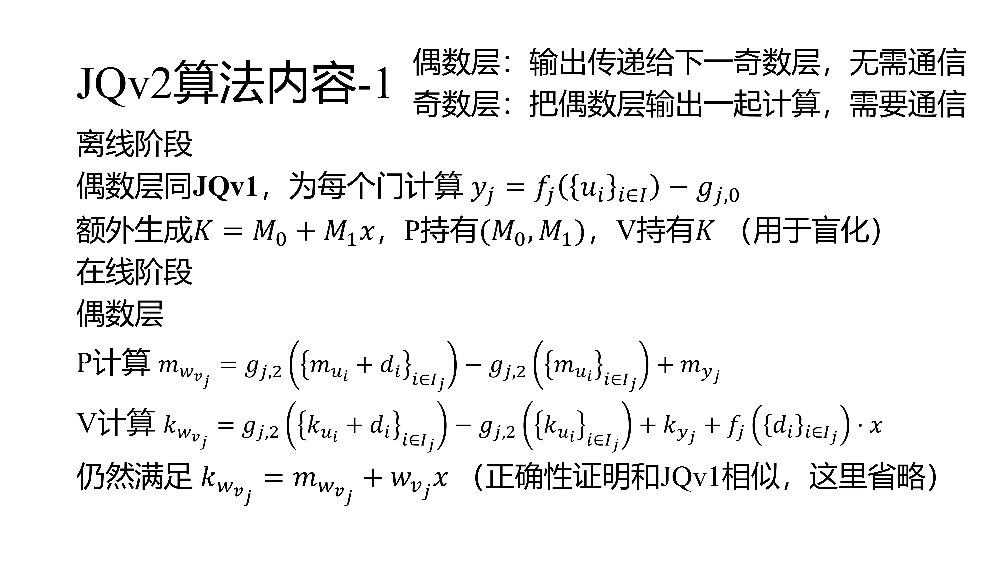
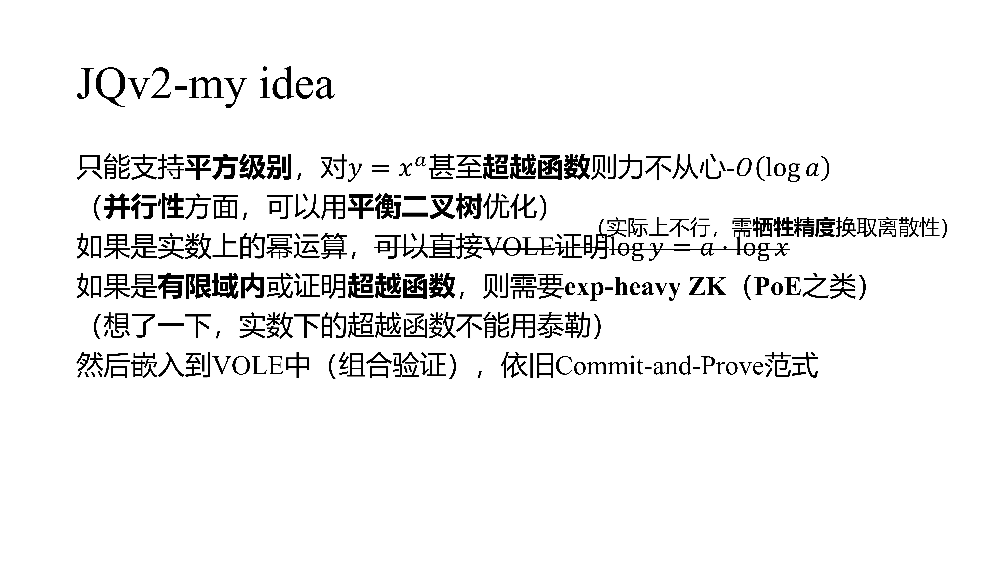
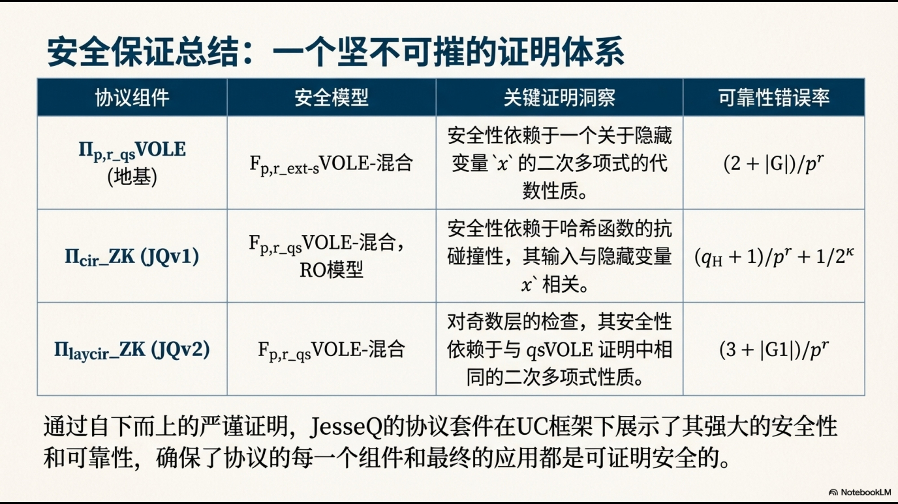

继续上次的内容，具体讲JesseQ的算法

（上次的内容是前情提要，本次的内容全部建立在上次的基础上，主要体现在差异点）

文字部分是对PPT的补充


上次组会我是按直接运行2PC来理解的，但是实际上用到的是一个名为OT的东东，好像是叫什么不经意传输，反正可以当作可信第三方来用



JesseQ提出了三个这个$\mathcal{F}$的东东，其中$\mathcal{F}_{qsVOLE}^{p,r}$基于QuivkSilver模型，而又是JQv1和JQv2的基石


这是JesseQ的，前面的方案不一定这样更新








其实我也不知道他的式子怎么来的，但是看起来确实是正确的-并且作者也没有给正确性证明，故我这里用乘法门手动推了一下






这是一点小感悟，但是不知道如何优化~


这是我第一个idea，最终被证明不行了

```
该方案在正确性和安全性（零知识性与健全性）方面是可以保障的，但在效率上难以优于现有方案。
具体来说，对于 d=w−u，原方案中 u 由随机数生成器产生；若令 d 由类随机数生成器产生，则需要在在线阶段对 IT-MAC 进行额外绑定，因此整体效率不可能优于 JesseQ 论文中的方案。
```






然后这是另一个创新点，最终发现没什么意思，做起来不太划算







最后一个创新点，用TEE实现公开验证，但是比较草率


后续工作打算把那篇美密关于VOLEitH看了，在具体决定这个值不值得做
