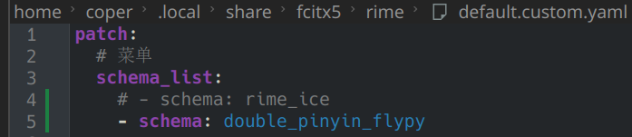

# 双拼学习

因为有搭建知识库的需求，需要大量打字，故顺便学习双拼

## 双拼是什么，有什么好处？

还没写

## 环境搭建

我使用的是`小鹤双拼`，下面是配置方式

你问我为什么选择小鹤？因为用的人最多~

### windows 下，使用默认输入法

我用的是默认的微软输入法

首先打开命令行


输入这一串内容

```
reg add HKCU\Software\Microsoft\InputMethod\Settings\CHS /v UserDefinedDoublePinyinScheme0 /t REG_SZ /d "小鹤双拼*2*^*iuvdjhcwfg^xmlnpbksqszxkrltvyovt" /f
```

然后回车即可


打开`设置-时间和语言-语言和区域-微软拼音输入法-常规-拼音设置`

直接改为双拼即可

然后下面选择`小鹤双拼`


即可享用双拼

### arch linux 下，使用rime

rime自带小鹤，直接改配置即可



### mac 下

我暂时买不起mac，所以没研究

后面再说

## 双拼学习

没别的，熟能生巧


多练习就会有提升，基本两三天就熟练了
