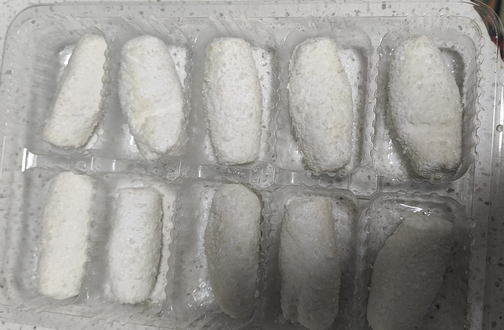

# 空气炸锅

## 蛋挞

> 记录于「2026/01/29」

直接在网上买蛋挞的壳子，一颗鸡蛋+一瓶旺仔牛奶（125ml）当蛋挞液，搅拌均匀后过滤，倒进去（别太满），最后放进空气炸锅里即可，时间是10分钟能吃，最多不宜超过15分钟，温度不知道，因为我觉得我的空气炸锅温控是假的~

## 炸牛奶

> 记录于「2026/01/30」

直接放进去炸8分钟就能吃了

感觉做出的不太对劲，可能是需要刷油，我没刷吧，但是味道还行

