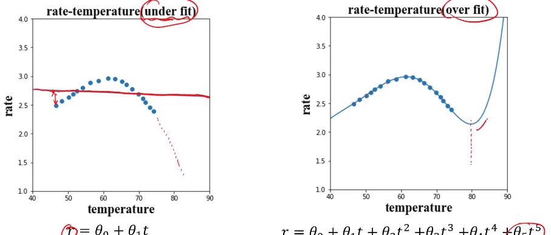
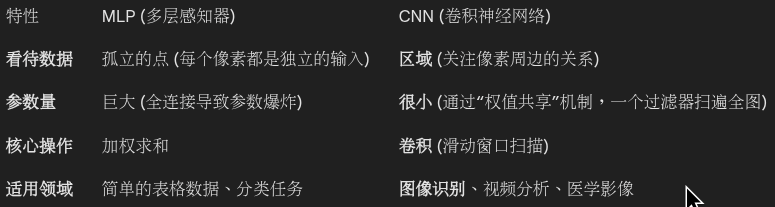
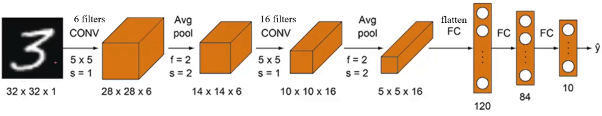
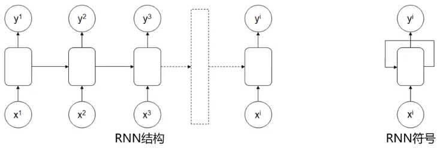
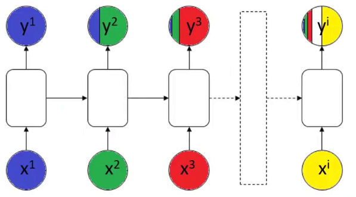
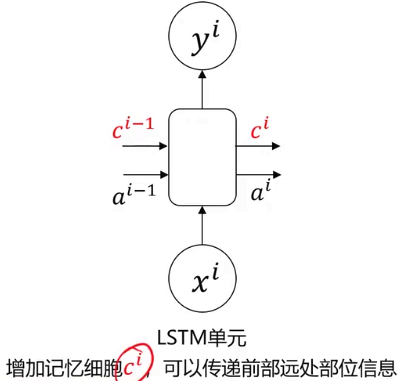

# 从零学习人工智能

[课程链接](https://www.bilibili.com/video/BV1qZSLBYEpa) 

我选择这个课程，是因为我需要一个覆盖面很广的课，先广而后精

## 引入

人工智能在实现方式上分为**符号学习**和**机器学习**，机器学习分为**监督学习**、**非监督学习**和**强化学习**；**深度学习**属于机器学习

人工智能的分类（**技术**范式演进（核心内功） + **应用**模态（感知外功）的二维分类法）

### 第一维度：核心技术范式（内功心法）

这是AI的“大脑”和“底层逻辑”。学习时建议按此顺序进阶，因为后一种技术往往建立在前一种的基础之上。

#### 1. 符号主义与逻辑推理 (Symbolic AI / Logic)

这是AI的早期形式，基于明确的规则和逻辑符号。

* **核心概念**：知识图谱 (Knowledge Graph)、专家系统、逻辑推理、搜索算法（如A\*搜索）。

* **学习重点**：适合理解如何让机器进行推演，目前在需要可解释性的领域（如医疗诊断辅助、法律推理）依然重要。

#### 2. 传统机器学习 (Classical Machine Learning)

基于统计学，让机器从数据中发现规律，而非人工编写规则。这是AI学习的基石。

* **监督学习 (Supervised Learning)**：给数据打标签。

  * *回归 (Regression)*：预测数值（如房价预测）。

  * *分类 (Classification)*：预测类别（如垃圾邮件过滤）。

  * *算法*：SVM, 决策树, 随机森林, 逻辑回归, Naive Bayes.

* **无监督学习 (Unsupervised Learning)**：数据无标签，让机器自己找结构。

  * *聚类 (Clustering)*：如 K-Means.

  * *降维 (Dimensionality Reduction)*：如 PCA.

* **学习重点**：数学基础（线性代数、概率论）和特征工程。

#### 3. 深度学习 (Deep Learning)

机器学习的一个子集，利用多层神经网络模拟人脑，解决高维、非线性难题。

* **基础架构**：MLP (多层感知机), BP算法 (反向传播).

* **专门架构**：

  * *CNN (卷积神经网络)*：主要用于处理网格数据（如图像）。

  * *RNN/LSTM/GRU*：主要用于处理序列数据（如时间序列、文本）。

* **学习重点**：这是目前的主流，重点在于理解网络架构的设计和优化（Loss function, Optimizer）。

#### 4. 生成式人工智能 (Generative AI) & 大模型 (LLMs)

深度学习的最新前沿，从“判别/分类”转向“创造/生成”。

* **架构**：Transformer (Attention机制).

* **模型类型**：

  * *LLM (大语言模型)*：如 GPT, LLaMA.

  * *扩散模型 (Diffusion Models)*：如 Stable Diffusion (用于生图).

* **学习重点**：Prompt Engineering, Fine-tuning (微调), RAG (检索增强生成).

#### 5. 强化学习 (Reinforcement Learning, RL)

独立于上述分类的一个特殊分支，侧重于“决策”和“行动”。

* **核心逻辑**：Agent (智能体) 在 Environment (环境) 中通过 Trial-and-Error (试错) 获得 Reward (奖励)。

* **应用**：游戏AI (AlphaGo), 机器人控制, 自动驾驶决策层.

### 第二维度：应用模态分类（招式/感知）

当你掌握了上述“内功”后，可以根据处理的数据类型（模态）选择一个专精方向。

#### 1. 计算机视觉 (Computer Vision, CV)

让AI“看懂”世界。

* **任务**：图像分类, 目标检测 (Object Detection), 图像分割 (Segmentation), 人脸识别.

* **前置技能**：CNN, 图像处理基础.

#### 2. 自然语言处理 (Natural Language Processing, NLP)

让AI“读懂”和“生成”语言。

* **任务**：机器翻译, 情感分析, 文本摘要, 问答系统.

* **前置技能**：RNN, Transformer, 语言学基础.

#### 3. 语音与音频处理 (Speech & Audio)

让AI“听懂”和“说话”。

* **任务**：ASR (语音识别), TTS (语音合成), 声纹识别.

#### 4. 推荐系统 (Recommender Systems)

让AI处理用户行为数据。

* **任务**：内容分发, 广告点击率预测 (CTR).

* **特点**：高度依赖稀疏数据处理和大规模工程架构。

### 工具
- python 不必多言
    - matplotlib 画图用的
    - pandas numpy数据处理
- anacanda 多版本python，用uv替代即可
- jupyter notebook 运行并共享代码

## 机器学习

将数据喂给计算机，计算机自动求解

- 监督学习 - 包括正确结果（label）- 人脸识别 - 线性回归，逻辑回归，决策树，神经网络 卷积 循环

- 无监督学习 - 不包含正确结果 - 聚类

- 半监督学习 - 少量正确结果 - 混合学习（无监督+监督）

- 强化学习 - 根据奖惩进行学习 - 下棋

### 线性回归

回归分析 -> 拟合

梯度下降法 -> $p_{i+1}=p_i-\alpha\frac{\partial}{\partial p_i}f(p_i)$，$\alpha$是步长

### 逻辑回归

垃圾邮件检测，考试是否能够通过（本质用于做分类的，花一条分界线，把两类数据分开）

检测关键词 -> $x_i=0\ \text{or}\ 1$（是否有垃圾邮件的词汇）-> 规约到线性回归里

### 无监督学习（聚类）

- 聚类（自动分组）：K-Means，Mean-Shift
- 降维（数据压缩/特征提取）： PCA
- 监督学习（分类/回归）：KNN

#### K-Means（K-均值聚类）

核心： 先定好要分 $K$ 堆，然后不断调整中心点，直到稳定。（假设数据是“成团”分布的）

 工作流程：
1. 指定 K 值： 你必须先告诉算法“我要把数据分成 K 类”。
2. 随机初始化： 随机选 3 个点作为初始的“中心点” (Centroids)。
3. 归队： 算一下每个数据点离哪个中心点最近，就把它划归到哪个队。
4. 更新中心： 队伍分好后，计算这支队伍里所有点的平均位置，把“中心点”挪到这个新的平均位置去。（更新中心）
5. 循环： 重复步骤3和4，直到中心点不再移动。

优点：简单快速

缺点：必须猜到K值，对异常数据敏感

#### KNN (K-Nearest Neighbors, K-近邻)

核心： 近朱者赤，近墨者黑。把改点染色为最接近的点最频繁出现的点的颜色。

注意： KNN 通常是监督学习（用于分类或回归），而不是无监督学习。

如果你想判断一个新的点 X 是好人还是坏人（分类），你就看离 X 最近的 K 个邻居。
如果这  K个邻居里，有 8 个好人，2 个坏人，那 X 大概率也是好人。

KNN vs K-Means 的区别：

- K-Means (无监督)： 只有数据，没有标签。任务是“把数据分成几堆”。 代表“分成  堆”。
- KNN (监督)： 历史数据有标签（知道谁是好人坏人）。任务是“判断新数据是谁”。 代表“参考最近的  个邻居”。

使用均值漂移寻找中心

#### Mean-Shift（均值漂移）

核心： 在雾中爬山，大家往“密度”最大的地方走，最后聚在一起。

 工作流程：
1. 滑动窗口： 想象有很多圆形的窗口（Kernel）覆盖在数据上。
2. 寻找质心： 对于每个窗口，计算里面所有点的“重心”（平均位置）。
3. 漂移： 把窗口的圆心移动到刚才算出的“重心”去。因为数据密集的地方点多，重心会自然偏向密集处，所以窗口会往数据密集的地方“爬”。
4. 汇合： 不断重复，直到窗口停留在密度最高的峰值点。最终，爬到同一个峰值的点就被归为一类。

优点： 不需要指定 K 值（自动发现有多少类）；对形状不规则的聚类效果较好。

缺点： 计算量极大，速度慢，不适合大规模数据。

需要指定半径

#### DBSCAN算法（基于密度的空间聚类算法）

有效数据扩展，无效数据（密度过低）舍弃

### 决策树

核心：通过一系列规则进行分类或回归。

优点：计算量小，速度快，易于理解

缺点：忽略属性直接相关性

常用方法： ID3 C4.5 CART

核心问题的解决方式：当来到一个节点时，我该选择哪个特征（Feature）来进行分裂，才能分得最“纯”？我们把“不纯度” (Impurity) 想象成“混乱程度”。

#### ID3(Iterative Dichotomiser 3)

核心指标：信息增益 (Information Gain)

 原理：
1. 先计算当前的混乱程度（系统熵）。
2. 尝试用“特征A”来切分数据。
3. 计算切分后剩下的混乱程度（条件熵）。
4. 信息增益 = 切分前的熵 - 切分后的熵。
5. 哪个特征带来的“信息增益”最大（即让混乱度下降得最快），就选哪个。

 公式（熵）：$H(D) = - \sum p_i \log_2(p_i)$

 致命缺点：ID3 极其偏爱取值多的特征。如果把“身份证号”作为一个特征放进去，ID3 会毫不犹豫地选它。因为每个人的身份证号都不一样，一旦按身份证号切分，每个叶子节点只有一个人，纯度100%，混乱度为0，信息增益最大。但这对预测没有任何意义（过拟合）。

其他局限： 只能处理离散数据（不能处理“身高1.75米”这种连续值），不能处理缺失值。

#### C4.5

核心指标：信息增益率 (Information Gain Ratio)

 原理：它在 ID3 的“信息增益”基础上，除以了一个惩罚项（该特征的固有熵）。如果一个特征取值特别多（像身份证号），它的惩罚项就很大。信息增益率 = 信息增益 / 特征熵。这样就抑制了算法对“多值特征”的偏好。

 重大改进：
1. 处理连续值： 它能把“温度”切成“>25度”和“<=25度”，不再局限于离散类别。
2. 处理缺失值： 数据缺了一块也能算。
3. 剪枝 (Pruning)： 它引入了剪枝策略，切完树后会检查一下，“这根树枝是不是太细碎了？如果是，剪掉防止过拟合”。

 缺点： 依然是多叉树（一个特征有几个值就分几个叉），计算涉及到对数（log），速度稍慢。

#### CART (Classification And Regression Tree)

核心指标：基尼系数 (Gini Impurity) / 平方误差

既能做分类，也能做回归（预测数值）。

原理（分类任务）：它不使用“熵”（因为算 Log 太慢了），而是用 Gini 系数。 Gini 系数代表：从袋子里随便摸两个球，颜色不一样的概率。 Gini 越小，纯度越高。

结构特点：二叉树 (Binary Tree)

CART 永远是二叉树：它会问“是晴天吗？”（Yes/No）。如果是“雨”，它可能会在下一层再问“是雨天吗？”。二叉树结构更简单，更易于计算机实现。

#### 异常检测

高斯分布：3-sigma原则

孤立森林 (Isolation Forest)：切割更容易被孤立（适用于高维大数据）

#### PCA (Principal Component Analysis, 主成分分析)

核心： 降维算法。换个角度拍照，把 3D 的东西拍成 2D 照片，同时保留主要特征。在尽量不丢失信息的前提下减少数据的维度。

桌上有一个茶壶（3D物体）。你想给它拍张照片（降维到2D），发朋友圈让人一眼认出这是茶壶。
- 如果你从壶底拍，可能只看到一个圆圈（丢失了大量信息，方差小）。
- 如果你从侧面拍，能看到壶嘴、壶把、壶身（保留了最大信息，方差大）。
- PCA 就是通过数学方法找到这个“最佳拍摄角度”（主成分），把数据投影上去。

作用：
1. 压缩数据： 加快后续模型的训练速度。
2. 可视化： 把高维数据（100维）降到 2维或 3维，这样人类才能画图看懂。

## 模型评价与优化

### 过拟合与欠拟合

核心问题：模型到底是在“学习规律”，还是在“死记硬背”？

#### 欠拟合(Underfitting)——“不好好学习”

- 表现：模型太简单，抓不住数据的特征。在训练集上表现差，测试集上也差。
- 类比：考前复习只看了目录。考试时不管题目怎么变，你都只会写“略”。
- 特征：高偏差(HighBias)。
- 原因：模型复杂度不够（比如用一条直线去拟合抛物线），或者特征太少。

#### 过拟合(Overfitting)——“死记硬背”

- 表现：模型太复杂，把训练数据里的噪声和偶然误差都当成了规律。在训练集上表现完美（100分），但在测试集上一塌糊涂。
- 类比：你把《五年高考三年模拟》的答案全部背下来了。考试时遇到原题你会做，但只要题目改了一个数字，你就不会了。
- 特征：高方差(HighVariance)。
- 原因：模型太强（参数太多，维度高），数据太少，或者训练时间太长。有过多干扰项信息。

解决方法：简化（使用低阶甚至线性模型）；PCA处理（降低维度）；增加正则化项。

#### 刚刚好(GoodFit/Generalization)

目标：我们追求的是泛化能力，即举一反三的能力。

### 数据分离与混淆矩阵

#### 数据分离(DataSplitting)

为了验证模型是不是“过拟合”了，不能用训练过的数据来考它。我们需要把手头的数据切分成三份：

1.训练集(TrainingSet)-约60-80%：模型的“课本”。用来计算梯度，更新权重，让模型学习。

2.验证集(ValidationSet)-约10-20%：模型的“模拟考”。用来调整超参数（比如K-Means的K，决策树的深度）。我们在训练过程中不断用它来测试，选出表现最好的模型。

3.测试集(TestSet)-约10-20%：模型的“高考”。模型定型后，最后测一次。注意：在训练结束前，绝对不能让模型看到测试集，否则就是作弊（DataLeakage）。

K-折交叉验证(K-FoldCross-Validation)：如果数据很少，不够切分怎么办？把数据分成份（比如5份），轮流坐庄。每次用其中4份训练，剩1份验证。跑5次取平均值。这在学术论文中非常常用，因为结果更稳健。

#### 混淆矩阵(ConfusionMatrix)

癌症检测。99%的人没病。模型只要全猜“没病”，准确率就是99%，但这个模型是垃圾，因为它漏掉了所有病人。

混淆矩阵把预测结果分成了四类（以检测入侵为例）：
|真实情况\预测结果|预测：是入侵(Positive)|预测：正常(Negative)|
|---|---|---|
|真实：是入侵(True)|TP(真阳性)-抓到了攻击者(好!)|FN(假阴性/漏报)-没抓到，放跑了(最危险!)|
|真实：正常(False)|FP(假阳性/误报)- 误把正常流量当攻击(很烦人)|TN(真阴性)-平安无事(好!)|

基于这个矩阵，衍生出两个关键指标：

1.查准率(Precision)=$TP / (TP + FP)$
含义：你报的警里，有多少是真的狼来了？
场景：垃圾邮件过滤。我们要高查准率，因为不想把重要邮件误判为垃圾邮件（FP代价高）。

2.查全率(Recall)=$TP / (TP + FN)$
含义：所有的狼里，你抓到了几只？
场景：地震预测、癌症筛查、入侵检测。我们要高查全率，宁可误报三千，不可漏过一个（FN代价高）。

F1-Score：它是Precision和Recall的调和平均数，用来平衡两者。

### 模型优化(ModelOptimization)

用什么模型，用什么参数。

#### 针对欠拟合(太笨)：

1. 增加特征：挖掘更多的数据维度（比如除了“面积”，再加入“朝向”、“楼层”）。
2. 增加模型复杂度：线性模型不行就换多项式，或者用深度神经网络。
3. 减少正则化：别管得太严，让模型自由发挥一下。

#### 针对过拟合(太聪明/钻牛角尖)：

1. 更多数据：见多识广了，就不会被个别特例迷惑。（数据质量决定模型表现的上限）
2. 正则化(Regularization-L1/L2)：给损失函数加一个“惩罚项”。如果模型参数太大、太复杂，就罚分。迫使模型学习更平滑的曲线（奥卡姆剃刀原理）。
3. Dropout(仅限神经网络)：训练时随机“关掉”一部分神经元。防止模型过于依赖某个特定的路径，增强鲁棒性。
4. 早停(EarlyStopping)：看着验证集的误差。一旦训练集误差还在降，但验证集误差开始反弹（说明开始背答案了），立刻停止训练。

#### 针对超参数(HyperparameterTuning)：

模型里有很多参数不是学出来的，而是你设定的（比如学习率、树的深度）。

- 网格搜索(GridSearch)：穷举法。试遍所有组合（慢，但必有解）。
- 随机搜索(RandomSearch)：随机试一些组合（通常比网格搜索快且效果不错）。

#### 总结流程

1. 拿到数据，先做DataSplitting（训练/验证/测试）。
2. 训练一个基础模型。
3. 看ConfusionMatrix，分析是Precision低还是Recall低。
4. 判断是Overfitting还是Underfitting。
5. 使用ModelOptimization技术（正则化、调参）去修正。
6. 重复直到满意。

## 深度学习

### 多层感知器

之前学的逻辑回归（Logistic Regression），本质上是一个**单层**的神经网络，它只能画一条直线（分界线）。但现实世界是不讲道理的，数据往往是你中有我、我中有你，像太极图一样纠缠在一起（非线性）。这时候，只给你一把直尺，你怎么把它们分开？这就需要 **多层感知器 (MLP, Multi-Layer Perceptron)**，也就是最基础的**深度神经网络 (Deep Neural Networks)**。

#### MLP实现非线性分类

假设坐标系上有四个点：

* (0,0) 和 (1,1) 是第一类（比如红色圆圈）
* (0,1) 和 (1,0) 是第二类（比如蓝色叉叉）

你试着用之前学的逻辑回归，在纸上画一条直线把红蓝分开。结论是不可能。无论你怎么画，总会有分错的。

MLP 的解决思路：既然一把尺子不够，那就给你两把，甚至更多把。

1. 第一层（隐藏层）：用几把尺子（几个神经元），分别从不同角度去切分数据，画出几条局部的线。
2. 第二层（输出层）：把刚才切出来的区域进行组合和逻辑判断。

比如：如果一个点“在直线A上方” 且“在直线B下方”，那么它就是红色。这种组合直线的能力，使得 MLP 可以逼近任意复杂的曲线边界。

但是如果你只是单纯地把好几层逻辑回归堆叠在一起，不加任何特殊处理，数学上可以证明，它们最终的效果等价于一层。你堆了一百层，依然只能画直线。因为线性函数的叠加依然是线性的 ($W_2(W_1x) = W_{new}x$)。

为了引入“弯曲”的能力，我们需要在每一层神经元输出结果之前，给它加一个非线性的“开关”，这就是激活函数。它模拟了生物神经元的特性：只有输入的电信号超过一定阈值，神经元才会被“激活”并向下传递信号。

常见的非线性激活函数：

1. ReLU (Rectified Linear Unit) —— 现代深度学习的标配

   * 公式：$f(x) = \max(0, x)$
   * 人话：“负数全归零，正数保持不变。”
   * 作用：极其简单高效，解决了深层网络训练难的问题。隐藏层基本都用它。

2. Sigmoid

   * 公式：之前的逻辑回归用过，把数值压缩到 (0, 1) 之间。
   * 作用：现在主要用于二分类问题的最后一层输出，因为它输出的就像概率。

#### Keras

Keras 是目前最流行、最用户友好的深度学习框架（现在是 TensorFlow 的高级 API）。用它搭积木一样构建网络非常简单。我们将解决一个经典的非线性问题：同心圆分类。（具体细节省略，反正能干）

### 卷积神经网络

卷积（提取特征）-> 池化（压缩数据）-> 全连接（分类）

#### 第一步：卷积层 (Convolutional Layer) —— 提取特征

* 过滤器 (Filter/Kernel)：这是一个小的矩阵，你可以把它想象成“特征探测器”。有的探测器专门找“横线”，有的专门找“竖线”，有的找“圆弧”。
* 滑动窗口：这个探测器在原始图片上从左到右、从上到下滑动。
* 点积运算：每到一个位置，它就和图片上的像素做乘法。如果图片这一块的形状和探测器长的很像，乘积就会很大（激活）。
* 层级理解：
    * 浅层网络：看到的是线条、边缘、颜色斑点。
    * 深层网络：组合线条变成了形状（眼睛、耳朵）。
    * 更深层：组合形状变成了物体概念（猫脸、车轮）。

#### 第二步：池化层 (Pooling Layer) —— 压缩简化

提取完特征后，数据量还是太大了。我们需要在保留主要特征的同时，把图片变小。

* Max Pooling (最大池化)：在一个小区域里，只取那个最大的数值。
* 直观理解：就像把一张 4K 高清图压缩成 720p。虽然模糊了一点，但你依然能看出那是一只猫。这让模型具有了平移不变性（猫在图片的左上角还是右下角，都不影响识别）。

#### 第三步：全连接层 (Fully Connected Layer) —— 最终决策

经过几轮的“卷积+池化”，原本的图片变成了一组“高度抽象的特征码”（比如：有耳朵=1，有胡须=1，有轮子=0）。这时候，我们把这些特征码拍扁 (Flatten)，喂给一个普通的 MLP，让它算出最后的概率：是猫 (90%) 还是狗 (10%)。

**目标检测 (YOLO)：** 不仅知道图里是猫，还能框出**猫在哪**。

#### LeNet-5(1998)

输入32*32黑白像素，单层

卷积 -> 池化 -> 卷积 -> 池化 -> 全连接 -> 全连接 -> 输出

激活函数主要用 Sigmoid 或 Tanh（还没发明 ReLU）

池化使用平均池化 (Average Pooling)

只能处理简单的黑白小图，层数很浅（只有 5 层），在复杂的高清彩色照片上表现不佳

#### AlexNet(2012)

输入 227x227 像素（彩色 RGB），8 层（5 个卷积层 + 3 个全连接层）

创新点：

- ReLU激活函数
- Dropout（全连接层随机“关掉”一半神经元，有效防止了过拟合）
- GPU加速（CTX 580 * 2）
- 数据增强

#### VGG(2014)

核心设计哲学：全用 $3 \times 3$ 的小卷积核。

VGG-16 (16层) 和 VGG-19 (19层) 最著名。

卷积-卷积-池化 -> 卷积-卷积-池化 ... -> 全连接。

缺点：参数巨大，吃内存；梯度消失，层数增加，效果反而变差。

#### ResNet (残差网络)

直接把网络干到 152 层甚至 1000 层。

### 循环神经网络

关注前后序的关系

#### 循环神经网络

无论线性回归、MLP 还是 CNN，它们处理的数据都是“静态”的

如果你要处理一段文字、一段语音、或者股票走势，顺序很重要；“我爱你”和“你爱我”，字都一样，但因为顺序不同，意思截然不同。

MLP/CNN不记得当前数据之前的数据信息，RNN核心是给神经网络加上“记忆”。

今天的记忆 ($h_t$) = 激活函数( 今天的输入 $x_t$ + 昨天的记忆 $h_{t-1}$ )

#### 不同类型的RNN模型

##### 一对一

其实就是普通的神经网络（MLP/CNN）

图像分类（一张图 -> 一个标签）。严格来说这不算典型的 RNN 应用。

##### 一对多

给一个输入，生成一串序列。

看图说话：输入一张照片，输出：“一只”、“猫”、“坐在”、“沙发上”。

##### 多对一

读完一串序列，最后给出一个结论。

输入一段影评（长序列），输出是正面还是负面（一个标签）。

输入一段视频（多帧图像），输出这是什么运动（比如“打篮球”）。

##### 多对多

同步型 (Tx = Ty)：输入和输出长度一样，一一对应。

视频帧级分类（每一帧都打标）、词性标注（输入“我爱AI”，输出“代词/动词/名词”）。

异步型 (Tx $\neq$ Ty) —— 最著名的 `Seq2Seq` 模型：

先读完整个输入（Encoder），再开始生成输出（Decoder）。

例如机器翻译。输入：“I love you”（3个词）；输出：“Je t'aime”（2个词）。长度不一定要对等。

#### RNN缺陷

记忆力短

##### LSTM (Long Short-Term Memory, 长短期记忆网络)

* 遗忘门 (Forget Gate)：决定丢弃多少昨天的废话信息。

* 输入门 (Input Gate)：决定把多少今天的新信息存入长时记忆。

* 输出门 (Output Gate)：决定现在的状态要对外输出多少。

##### GRU (Gated Recurrent Unit, 门控循环单元)

LSTM 的“精简版”

把 LSTM 的三个门合并简化成了两个（更新门和重置门）。效果和 LSTM 差不多，但是参数更少，计算更快。现在很多工业界应用倾向于用 GRU。

##### 双向 RNN (Bidirectional RNN)

上下文都很重要。两个 RNN，一个从前往后读，一个从后往前读，最后拼起来。这在自然语言处理（NLP）中非常常用

##### 深度循环神经网络(DRNN)

