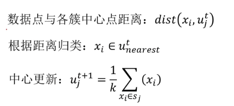
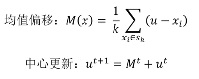
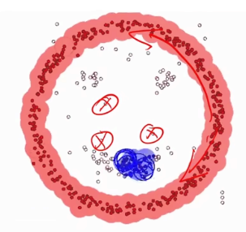

# 1-从零学习人工智能

[课程链接](https://www.bilibili.com/video/BV1qZSLBYEpa) 

我选择这个课程，是因为我需要一个覆盖面很广的课，先广而后精

## 1 引入

人工智能在实现方式上分为**符号学习**和**机器学习**，机器学习分为**监督学习**、**非监督学习**和**强化学习**；**深度学习**属于机器学习

人工智能的分类（**技术**范式演进（核心内功） + **应用**模态（感知外功）的二维分类法）

### 第一维度：核心技术范式（内功心法）

这是AI的“大脑”和“底层逻辑”。学习时建议按此顺序进阶，因为后一种技术往往建立在前一种的基础之上。

#### 1. 符号主义与逻辑推理 (Symbolic AI / Logic)

这是AI的早期形式，基于明确的规则和逻辑符号。

* **核心概念**：知识图谱 (Knowledge Graph)、专家系统、逻辑推理、搜索算法（如A\*搜索）。

* **学习重点**：适合理解如何让机器进行推演，目前在需要可解释性的领域（如医疗诊断辅助、法律推理）依然重要。

#### 2. 传统机器学习 (Classical Machine Learning)

基于统计学，让机器从数据中发现规律，而非人工编写规则。这是AI学习的基石。

* **监督学习 (Supervised Learning)**：给数据打标签。

  * *回归 (Regression)*：预测数值（如房价预测）。

  * *分类 (Classification)*：预测类别（如垃圾邮件过滤）。

  * *算法*：SVM, 决策树, 随机森林, 逻辑回归, Naive Bayes.

* **无监督学习 (Unsupervised Learning)**：数据无标签，让机器自己找结构。

  * *聚类 (Clustering)*：如 K-Means.

  * *降维 (Dimensionality Reduction)*：如 PCA.

* **学习重点**：数学基础（线性代数、概率论）和特征工程。

#### 3. 深度学习 (Deep Learning)

机器学习的一个子集，利用多层神经网络模拟人脑，解决高维、非线性难题。

* **基础架构**：MLP (多层感知机), BP算法 (反向传播).

* **专门架构**：

  * *CNN (卷积神经网络)*：主要用于处理网格数据（如图像）。

  * *RNN/LSTM/GRU*：主要用于处理序列数据（如时间序列、文本）。

* **学习重点**：这是目前的主流，重点在于理解网络架构的设计和优化（Loss function, Optimizer）。

#### 4. 生成式人工智能 (Generative AI) & 大模型 (LLMs)

深度学习的最新前沿，从“判别/分类”转向“创造/生成”。

* **架构**：Transformer (Attention机制).

* **模型类型**：

  * *LLM (大语言模型)*：如 GPT, LLaMA.

  * *扩散模型 (Diffusion Models)*：如 Stable Diffusion (用于生图).

* **学习重点**：Prompt Engineering, Fine-tuning (微调), RAG (检索增强生成).

#### 5. 强化学习 (Reinforcement Learning, RL)

独立于上述分类的一个特殊分支，侧重于“决策”和“行动”。

* **核心逻辑**：Agent (智能体) 在 Environment (环境) 中通过 Trial-and-Error (试错) 获得 Reward (奖励)。

* **应用**：游戏AI (AlphaGo), 机器人控制, 自动驾驶决策层.

### 第二维度：应用模态分类（招式/感知）

当你掌握了上述“内功”后，可以根据处理的数据类型（模态）选择一个专精方向。

#### 1. 计算机视觉 (Computer Vision, CV)

让AI“看懂”世界。

* **任务**：图像分类, 目标检测 (Object Detection), 图像分割 (Segmentation), 人脸识别.

* **前置技能**：CNN, 图像处理基础.

#### 2. 自然语言处理 (Natural Language Processing, NLP)

让AI“读懂”和“生成”语言。

* **任务**：机器翻译, 情感分析, 文本摘要, 问答系统.

* **前置技能**：RNN, Transformer, 语言学基础.

#### 3. 语音与音频处理 (Speech & Audio)

让AI“听懂”和“说话”。

* **任务**：ASR (语音识别), TTS (语音合成), 声纹识别.

#### 4. 推荐系统 (Recommender Systems)

让AI处理用户行为数据。

* **任务**：内容分发, 广告点击率预测 (CTR).

* **特点**：高度依赖稀疏数据处理和大规模工程架构。

### 工具
- python 不必多言
    - matplotlib 画图用的
    - pandas numpy数据处理
- anacanda 多版本python，用uv替代即可
- jupyter notebook 运行并共享代码

## 2 机器学习

将数据喂给计算机，计算机自动求解

- 监督学习 - 包括正确结果（label）- 人脸识别 - 线性回归，逻辑回归，决策树，神经网络 卷积 循环

- 无监督学习 - 不包含正确结果 - 聚类

- 半监督学习 - 少量正确结果 - 混合学习（无监督+监督）

- 强化学习 - 根据奖惩进行学习 - 下棋

### 线性回归

回归分析 -> 拟合

梯度下降法 -> $p_{i+1}=p_i-\alpha\frac{\partial}{\partial p_i}f(p_i)$，$\alpha$是步长

### 逻辑回归

垃圾邮件检测，考试是否能够通过（本质用于做分类的，花一条分界线，把两类数据分开）

检测关键词 -> $x_i=0\ \text{or}\ 1$（是否有垃圾邮件的词汇）-> 规约到线性回归里

### 无监督学习（聚类）

- 聚类（自动分组）：K-Means，Mean-Shift
- 降维（数据压缩/特征提取）： PCA
- 监督学习（分类/回归）：KNN

#### K-Means（K-均值聚类）

核心： 先定好要分 $K$ 堆，然后不断调整中心点，直到稳定。（假设数据是“成团”分布的）

 工作流程：
1. 指定 K 值： 你必须先告诉算法“我要把数据分成 K 类”。
2. 随机初始化： 随机选 3 个点作为初始的“中心点” (Centroids)。
3. 归队： 算一下每个数据点离哪个中心点最近，就把它划归到哪个队。
4. 更新中心： 队伍分好后，计算这支队伍里所有点的平均位置，把“中心点”挪到这个新的平均位置去。（更新中心）
5. 循环： 重复步骤3和4，直到中心点不再移动。

优点：简单快速

缺点：必须猜到K值，对异常数据敏感

#### KNN (K-Nearest Neighbors, K-近邻)

核心： 近朱者赤，近墨者黑。把改点染色为最接近的点最频繁出现的点的颜色。

注意： KNN 通常是监督学习（用于分类或回归），而不是无监督学习。

如果你想判断一个新的点 X 是好人还是坏人（分类），你就看离 X 最近的 K 个邻居。
如果这  K个邻居里，有 8 个好人，2 个坏人，那 X 大概率也是好人。

KNN vs K-Means 的区别：

- K-Means (无监督)： 只有数据，没有标签。任务是“把数据分成几堆”。 代表“分成  堆”。
- KNN (监督)： 历史数据有标签（知道谁是好人坏人）。任务是“判断新数据是谁”。 代表“参考最近的  个邻居”。

使用均值漂移寻找中心

#### Mean-Shift（均值漂移）

核心： 在雾中爬山，大家往“密度”最大的地方走，最后聚在一起。

 工作流程：
1. 滑动窗口： 想象有很多圆形的窗口（Kernel）覆盖在数据上。
2. 寻找质心： 对于每个窗口，计算里面所有点的“重心”（平均位置）。
3. 漂移： 把窗口的圆心移动到刚才算出的“重心”去。因为数据密集的地方点多，重心会自然偏向密集处，所以窗口会往数据密集的地方“爬”。
4. 汇合： 不断重复，直到窗口停留在密度最高的峰值点。最终，爬到同一个峰值的点就被归为一类。

优点： 不需要指定 K 值（自动发现有多少类）；对形状不规则的聚类效果较好。

缺点： 计算量极大，速度慢，不适合大规模数据。

需要指定半径

#### DBSCAN算法（基于密度的空间聚类算法）

有效数据扩展，无效数据（密度过低）舍弃

### 决策树

核心：通过一系列规则进行分类或回归。

优点：计算量小，速度快，易于理解

缺点：忽略属性直接相关性

常用方法： ID3 C4.5 CART

核心问题的解决方式：当来到一个节点时，我该选择哪个特征（Feature）来进行分裂，才能分得最“纯”？我们把“不纯度” (Impurity) 想象成“混乱程度”。

##### ID3(Iterative Dichotomiser 3)

核心指标：信息增益 (Information Gain)

 原理：
1. 先计算当前的混乱程度（系统熵）。
2. 尝试用“特征A”来切分数据。
3. 计算切分后剩下的混乱程度（条件熵）。
4. 信息增益 = 切分前的熵 - 切分后的熵。
5. 哪个特征带来的“信息增益”最大（即让混乱度下降得最快），就选哪个。

 公式（熵）：$H(D) = - \sum p_i \log_2(p_i)$

 致命缺点：ID3 极其偏爱取值多的特征。如果把“身份证号”作为一个特征放进去，ID3 会毫不犹豫地选它。因为每个人的身份证号都不一样，一旦按身份证号切分，每个叶子节点只有一个人，纯度100%，混乱度为0，信息增益最大。但这对预测没有任何意义（过拟合）。

其他局限： 只能处理离散数据（不能处理“身高1.75米”这种连续值），不能处理缺失值。

##### C4.5

核心指标：信息增益率 (Information Gain Ratio)

 原理：它在 ID3 的“信息增益”基础上，除以了一个惩罚项（该特征的固有熵）。如果一个特征取值特别多（像身份证号），它的惩罚项就很大。信息增益率 = 信息增益 / 特征熵。这样就抑制了算法对“多值特征”的偏好。

 重大改进：
1. 处理连续值： 它能把“温度”切成“>25度”和“<=25度”，不再局限于离散类别。
2. 处理缺失值： 数据缺了一块也能算。
3. 剪枝 (Pruning)： 它引入了剪枝策略，切完树后会检查一下，“这根树枝是不是太细碎了？如果是，剪掉防止过拟合”。

 缺点： 依然是多叉树（一个特征有几个值就分几个叉），计算涉及到对数（log），速度稍慢。

##### CART (Classification And Regression Tree)

核心指标：基尼系数 (Gini Impurity) / 平方误差

既能做分类，也能做回归（预测数值）。

原理（分类任务）：它不使用“熵”（因为算 Log 太慢了），而是用 Gini 系数。 Gini 系数代表：从袋子里随便摸两个球，颜色不一样的概率。 Gini 越小，纯度越高。

结构特点：二叉树 (Binary Tree)

CART 永远是二叉树：它会问“是晴天吗？”（Yes/No）。如果是“雨”，它可能会在下一层再问“是雨天吗？”。二叉树结构更简单，更易于计算机实现。

#### 异常检测

高斯分布：3-sigma原则

孤立森林 (Isolation Forest)：切割更容易被孤立（适用于高维大数据）

#### PCA (Principal Component Analysis, 主成分分析)

核心： 降维算法。换个角度拍照，把 3D 的东西拍成 2D 照片，同时保留主要特征。在尽量不丢失信息的前提下减少数据的维度。

桌上有一个茶壶（3D物体）。你想给它拍张照片（降维到2D），发朋友圈让人一眼认出这是茶壶。
- 如果你从壶底拍，可能只看到一个圆圈（丢失了大量信息，方差小）。
- 如果你从侧面拍，能看到壶嘴、壶把、壶身（保留了最大信息，方差大）。
- PCA 就是通过数学方法找到这个“最佳拍摄角度”（主成分），把数据投影上去。

作用：
1. 压缩数据： 加快后续模型的训练速度。
2. 可视化： 把高维数据（100维）降到 2维或 3维，这样人类才能画图看懂。

## 3 模型评价与优化

### 过拟合与欠拟合

## 4 深度学习

### 多层感知器

### 卷积神经网络

### 循环神经网络

