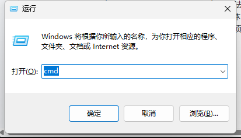
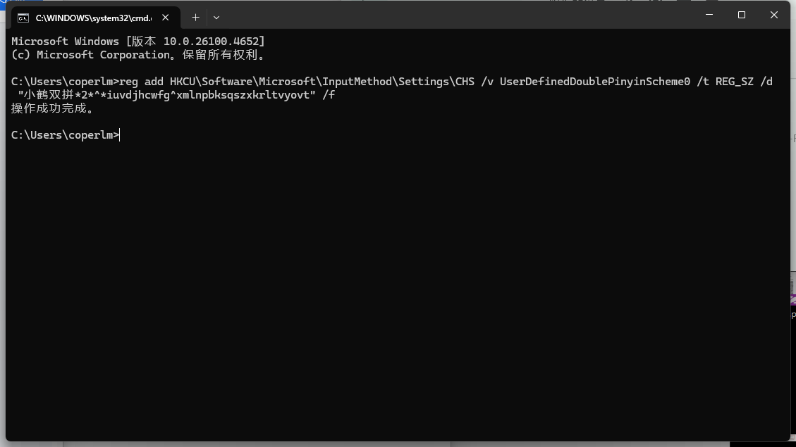
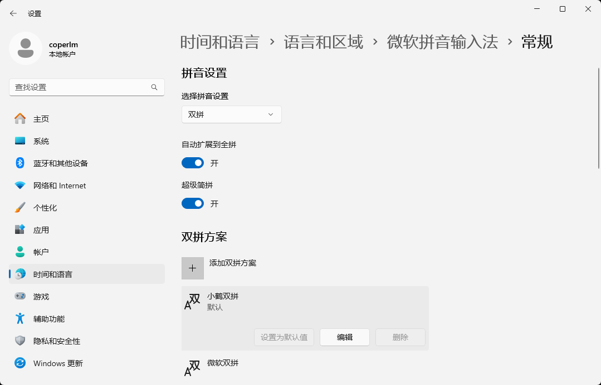
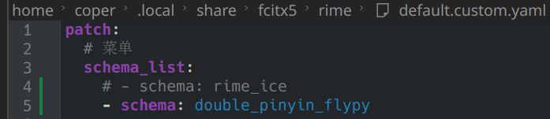
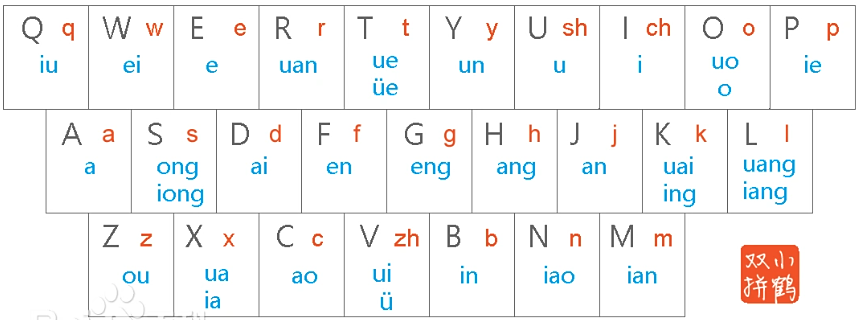

# 双拼学习

因为有搭建知识库的需求，需要大量打字，故顺便学习双拼

## 双拼是什么，有什么好处？

和双拼相对的，是我们经常使用的全拼

本质上是一个映射，把`声母`和`韵母`分别映射到每个字母上，也就是说，打两个键即可确定一个读音（这两个键分别对应`声母`和`韵母`）

举个例子，`shuang`用双拼打是`ul`（`u`对应`sh`，`l`对应`uang`）

原本就是两个键的不变（例如`li`、`ru`之类的）

双拼的理论效率可以是全拼的二倍（相等于用思考的时间复杂度换手指的时间复杂度）

叽里咕噜说啥呢，管你听没听懂，学就完了

## 环境搭建

我使用的是`小鹤双拼`，下面是配置方式

你问我为什么选择小鹤？因为用的人最多，选它准没错~

### windows 下，使用默认输入法

我用的是默认的微软输入法

首先打开命令行



输入这一串内容

```
reg add HKCU\Software\Microsoft\InputMethod\Settings\CHS /v UserDefinedDoublePinyinScheme0 /t REG_SZ /d "小鹤双拼*2*^*iuvdjhcwfg^xmlnpbksqszxkrltvyovt" /f
```

然后回车即可



打开`设置-时间和语言-语言和区域-微软拼音输入法-常规-拼音设置`

直接改为双拼即可

然后下面选择`小鹤双拼`



即可享用双拼

### arch linux 下，使用rime

rime自带小鹤，直接改配置即可



### mac 下

我暂时买不起mac，所以没研究

后面有钱了再说

## 双拼学习

没别的，熟能生巧



多[练习](https://dazi.kukuw.com/)就会有提升，几天就熟练了

最初半小时到一小时需要对应着表打字，前两到三天经常打错 可以查表找到对应的按键，一周之后基本熟悉，一个月之后就忘本（觉得全拼不香）了

## 后记

现在是 `26/05/31`，使用小鹤双拼已经数月，打字基本不会出错，并且手机也已经修改为中州韵的双拼，体验良好

输入正确率和最初用全拼不相上下，优势是期望按键的确少了将近一半，缺点是不能连着输入（除非用百度输入法之类的商用输入法），也就是打`漂亮`必须输入`pnl`（对应全拼`piao l`），而全拼或者百度输入法的小鹤双拼直接输入`pl`即可

后续不打算学习形码了，因为我学习小鹤双拼本身就是从实用主义出发，提升输入效率即可，并不是为了“探索所以可能，把什么什么到极致”。双拼和全拼都可以使用到输入法的智能推荐，而音形码或者形音码就单一选字了 而无须智能推荐，我觉得没必要，认为期望输入效率更低了

目前我的双拼基本全部都打单字双字，以词为单元，例如我打`以词为单元`是输入`以` `词` `为` `单元`这样子，不然输入发的确不太好识别，不过这也无所谓了，我觉得输入空格的开销的确不大

---

这里是本主题第一个基本成功的，希望后面会有更多