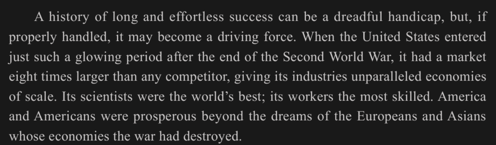
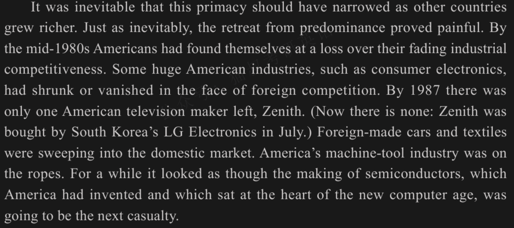
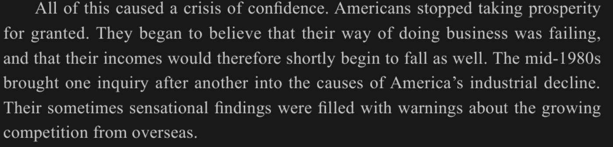
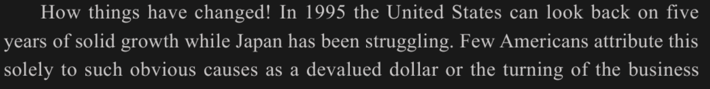
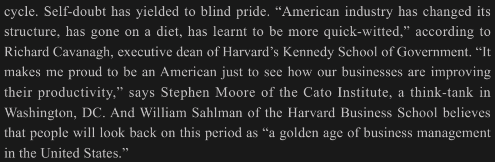
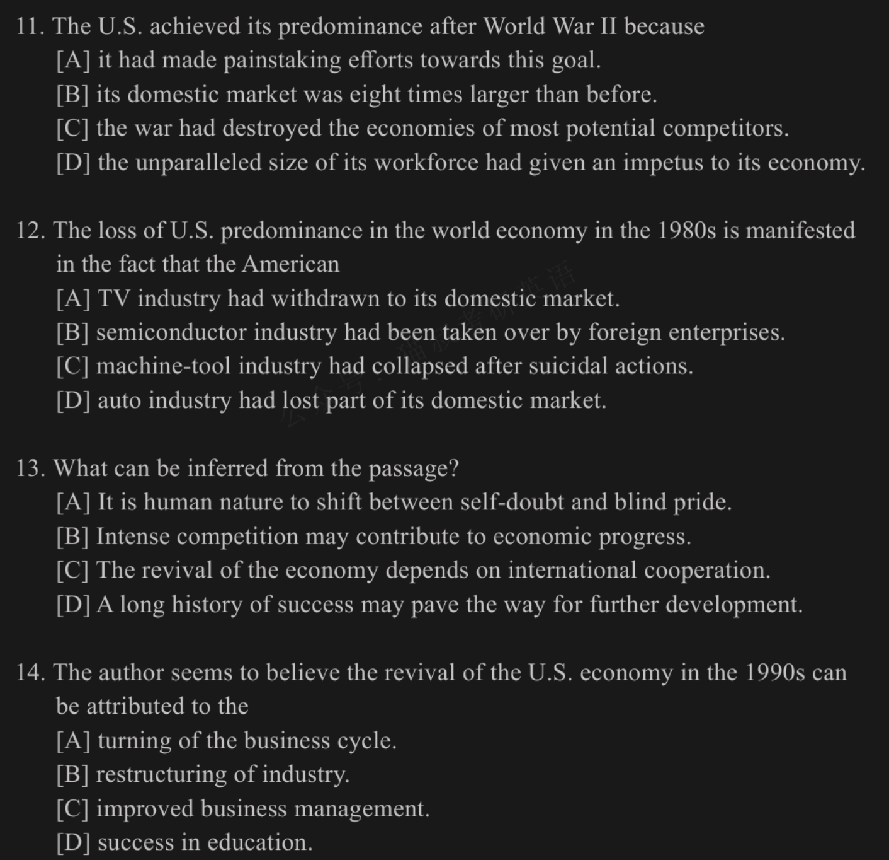
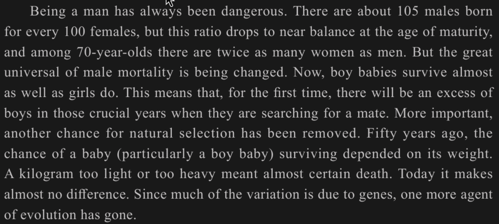
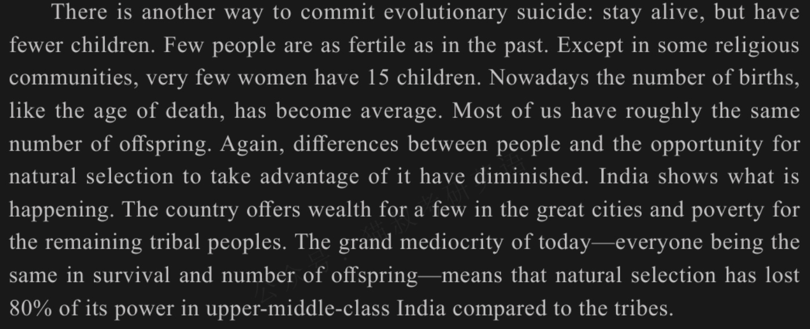
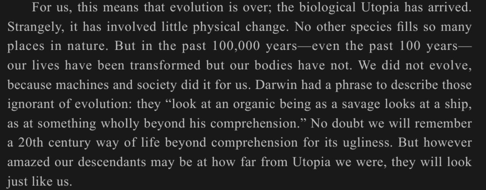
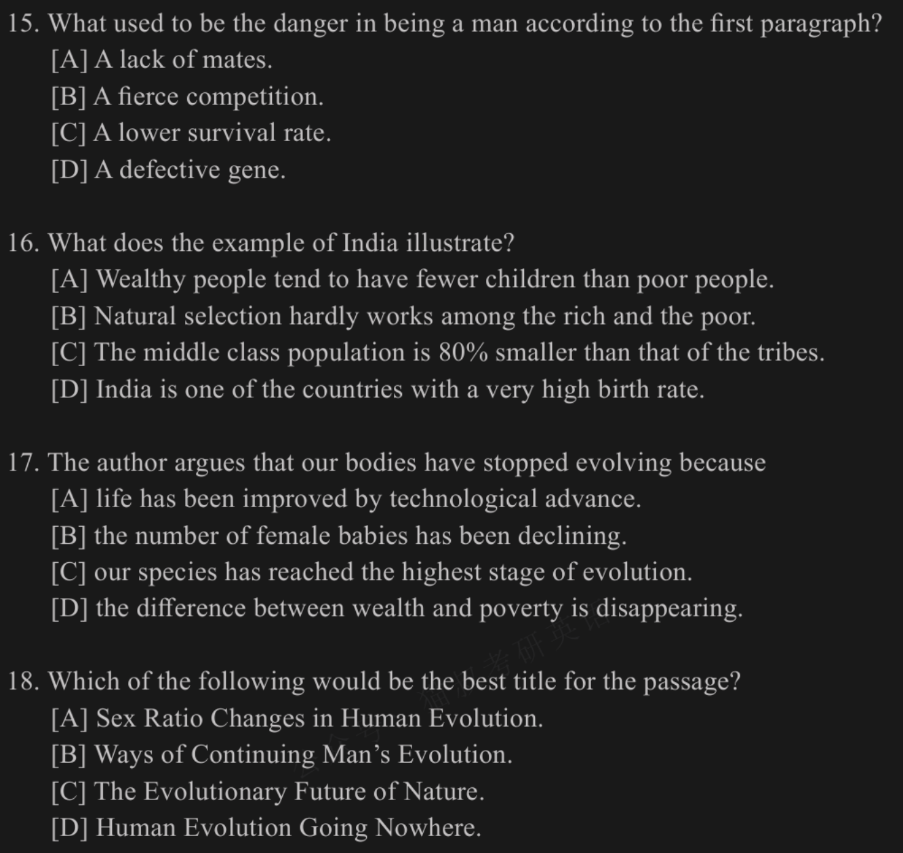

# 真题翻译

我要每天都翻译真题，然后这样才能变为英语糕守

prompt
```
我的英语阅读能力很弱，我现在要翻译考研真题并查阅不会的单词，你需要做的是点评我的翻译并指导我不正确或者不合适的地方，告诉我哪里出错了并指导我改进。无须在意一些微不足道的细节，目标是我未来再读真题可以高效并且准确的读懂并且做题
你帮我看一下我做的题是否正确，如果不对的话请告诉我为什么，并告诉我如何才能做对
```

## 2000 年真题

### Text 1



初次翻译
```
一个长时间和不费力成功的历史可以是一个 dreadful handicap，但是如果正确的处理，那将会变为一个驱动力
当美国进入二战后的发展时期，它拥有了比任何公司都要大八倍的市场，给他的工业不平行经济的天平
它的科学家是世界上最好的，它的工人是最有技术的
美国和美国人比欧洲亚洲人在经济被战争毁灭后后梦想中的还要繁荣
```

单词查阅与纠错
```
dreadful: 可怕的
handicap: 本意指残疾，这里引申为障碍
漏翻译了 glowing 发光的
competitor 是对手而非公司
parallel 是平行的匹敌的，而 unparalleled 是无敌的
scale 不仅仅是天平，还有规模的意思
```

修正
```
一段漫长而轻松的成功史可能成为一个可怕的障碍，但是如果处理得当，他可能转化为一种驱动力
美国二战后正是进入了这样的一个辉煌时期，他拥有比任何公司大八倍的市场，赋予了它的工业无与伦比的经济规模
---
美国和美国人的繁荣程度，超过了经济被战争摧毁的欧亚人的想象
```



初次翻译
```
作为一个国家变得富有，primacy是不可避免地应当被讲述的
不可避免的，来自退出主导地位带来疼痛
在 1980 中叶 美国人发现他们自己失去了他们衰退的工厂的竞争对手
一些大的美国工厂，就像客户电子，面对国外竞争对手已经缩水或者消亡
在 1987 年，只有一个叫 Zenith 的美国电视市场留存
现在也没了，七月份 Zenith 被南韩的 LG 电子厂收购了
国外制造的汽车和织物席卷了国内市场
美国的机器工具工厂在绳子上（命悬一线）
再看半导体市场，也就是美国人发明并且稳坐新的计算机纪元的核心位置，也即将去到下一个偶然
```

单词差异与纠错
```
as: 随着
narrowed: 变窄 | narrated: 讲述
primacy: 首要地位
prove: 证明
at a loss over: 不知所措
competitiveness: 竞争力
consumer electronics: 消费电子产品
industries: 除了工厂，还有行业/产业的意思
machine-tool: 机床
casualty: 受伤者 | casual: 偶然
```

修正
```
随着其他国家变得富有，这种主导地位不可避免地会减小
同样不可避免的是，从主导地位退却是被证明痛苦的
到了 1980 中叶，面对自身日益衰退的工业竞争力，美国人发现自己感到不知所措
面对外国的竞争，一些庞大的美国产业，例如消费电子产业，已经萎缩或者消亡
在 1987 年，只有一个叫 Zenith 的美国电视制造商留存
---
美国的机床工业也命悬一线
有一段时间 看起来似乎半导体制造业，这个由美国发明并处于新计算机时代核心地位的产业将成为下一个牺牲品
```



初次翻译
```
造成这些问题的关键信心（可能是原因？）
美国停止了把兴旺为了授予
他们开始认为他们做生意的方式是失败的，并且他们的收入因此减少并且越来越少
在 1980 中叶 在某人在偶然造成美国人工业衰减之后 带来一个询问
他们又是敏感的找到充满警告关于发展的海外竞争者
```

单词差异与纠错
```
crisis: 危及 | crucial: 关键的
take sth. for granted: 把...视作理所当然
shortly: 不久，很快
as well: 也
one after another: 一个接着一个
inquiry: 探究调查 inquiry into: 对...的调查
causes: 原因
sensational: 轰动的 | sensitive: 敏感的
filled with warnings about: 充满了关于...的警告
```

修正
```
这一切导致了一场信心危机
美国人不再把繁荣视作利索当然
他们开始认为自己做生意的方式开始失效，因此他们的收入也很快开始下降
1980中叶 带来了 对每个工业衰退原因的一个接着一个的调查
他们那些有时耸人听闻的调查结果中，充满了关于来自海外日益激烈的竞争的警告
```





初次翻译
```
事情多么改变啊
在 1995 美国可以回望五年前的日本挣扎地稳固增长
很少的美国人单独归结为如此明显造成如此美元贬值或者商业的周转
自我怀疑占据了盲目自豪
美国工业已经在这个结构下改变，已经变为一种饮食习惯，已经学到更变得快速且聪明
通过 RC 这个人说，政府的哈弗肯帝亚大学的执行院长（反正是个官）
它造成了我们作为美国人的骄傲，仅仅去看我们如何贸易提升他们的生产力
由 SM 这个人说，Cato 机构，一个华盛顿的思想界坦克（泰斗的意思），DC（这是什么不重要）
并且哈弗商学院的 WS 相信人们将会回望这段时间作为一个美国商业的黄金岁月
```

单词差异与纠错
```
while 可以翻译为 然而/与此同时，表转折
causes: 原因（名词）
such as: 如此
yielded to: 屈服
go on a diet: 节食
It makes sb. proud just to see...: 仅仅是看到就令某人感到骄傲
businesses: 企业/公司
think-tank: 智囊团（专门提供战略政策建议的机构）
```

修正
```
---
1995 年，美国可以回顾过去五年的扎实经济增长，与此同时日本却在一直苦苦挣扎
很少有美国人仅仅将此（经济增长）归结于像美元贬值或者商业周期转变这样显而易见的原因
自我怀疑已经被满目的骄傲自满取代
哈佛大学肯尼迪政府学院执行院长理查德·卡瓦纳表示，美国工业已经改变了结构，进行了瘦身精简，并学会了变得更加机智敏捷
位于华盛顿特区的智库——卡托研究所的斯蒂芬·摩尔说，仅仅是看到我们的企业如何提升生产力，就让我身为美国人感到自豪
---
```



自己做一遍
```
11
最一开始美国二战后占主导地位是因为什么？因为二战把其他国家给毁了，应该选C
B 选项文章并没有说是本国的八倍，D 选项是结果不是原因
impetus: 动力
12
美国丧失主导地位展示了什么事实？B 和 C 我不知道选哪个，好像都有
A 依旧没说是本国
13
从文章中可以推断出什么？这个是找主旨，我觉得是 A 更贴近一点
14
作者认为 1990s 美国为什么复兴？A首先不对，说了不对了，BCD好像也不太合适
```

答案分析
```
11 答案就是 C，D说的是 economies of scale 有优势而非 workforce size
12 B 说 had been taken over 但是实际上并没有完全接管，只是似乎要成为下一个牺牲品；C说的是 on the ropes 而不是 suicidal action 自杀行为
13 文章只说的美国人，而 A 直接放大到了全人类了；答案是 B，激烈的竞争逼着美国进步
14 作者说 美国人blind pride 说明不认可美国人的自我吹嘘，而认为 business cycle 是obvious causes，潜台词是这就是美元贬值和商业周期性原因造成的，但是盲目骄傲的美国人觉得是自己厉害，所以答案就是 A
```

复盘
```
12 警惕加戏和时态/程度替换，可能出现没有的形容词（例如suicidal）或把可能改为已经
13 警惕过度扩大，把美国人放大为全人类
14 分析作者情感色彩才能得到作者的看法（如显而易见和盲目地）
```

### Text 2

```
我发现很多近义词翻译错，并不是一不小心的，我是不知道那个词是什么意思，所以只能找一个相近的更有可能的词来试图理解这句话，所以翻译得很奇怪也，就造成了偏差，也就是说能不能读懂全靠运气。现在是第二天了，我要开始翻译第二篇文章了，这是第一段。
```




自己做一遍
```
作为一个男人经常是危险的
每 100 个女人出生就有大约 105 个男人出生，但是这个比例在成年时下降到几乎相等，并且在 70 岁里 女人是男人的二倍
但是很普遍男人的道德被改变
现在，男孩幸存和女孩一样
这意味着第一时间，过多的男孩在关键的年龄当他们寻找同伴
更重要的，另一个改变对于自然选择已经被移除
50年以前，对于孩子的改变（特别是男孩）幸存依赖于他们的体重，一千克太轻或者一千克太重意味着关心生命
今天它几乎不同了
因为多数变种因为基因，一个更革新的代理已经离开了
```

分析
```
mortality: 死亡率 | morality: 道德
for the first time： 第一次
excess: 过剩的，多余的
mate: 还可以指配偶
change: 改变 | chance: 机会/可能性
certain: 必然的/确定的
agent: 动因/因素/媒介
evolution: 进化 | revolution: 革命
```

复盘
```
---
---
但是男性的死亡率这一伟大的普遍规律正在被改变
---
这意味着，在他们寻找配偶的哪些关键年龄里，将会首次出现男孩过剩的情况
更重要的是，自然选择的另一个机会已经被移除
50年前，婴儿（尤其是男婴）存活的机会取决于其体重， 轻一公斤或重一公斤几乎意味着必死无疑
今天就没有差异了
既然大部分差异（变异）是基因造成，那么进化的另一个动因也就消失了
```



自己做一遍
```
有另一个道路归因于进化自杀：保持存活，但是有更少孩子
很少的人是 fertile 在过去
尤其是在一些 religious 的社区，很少有女人有 15 个孩子
现在出生的数量，就像死亡的年龄，开始变得平均
我们中的大多数有大概相同的后代
再一次的，在人类和自然选择的机会中冒险去获取 diminished
印第安表现了这件事如何发生的
国家提供了富足给少数在大城市和贫穷给剩下的 tribal 人
今天一个研磨 mediocrity，每个人都是相同幸存并且子孙后代数量一样，意味着自然选择已经失去 80% 的理论 在中上级别的印第安和部落对比
```

分析
```
fertile: 肥沃的，多子的
religious: 宗教的
deminished: 减小的
tribal: 部落的
mediocrity: 平庸
commit suicide: 自杀（做自杀这个行为）
except: 除了 | especially: 尤其是
grand: 巨大的 | grind: 研磨
```

复盘
```
还有另一个道路归因于进化自杀：活着但少生孩子，
很少有人和之前那样多子
除了在一些宗教社区，很少有女人有 15 个孩子
---
---
再一次，人与人之间的差异，以及自然选择利用这种差异的机会，都已经减少了
---
这个国家为大城市的少数人提供财富，把贫困留给了剩下的部落人群
今天这种巨大的平庸——每个人存活率和后代数量都相同——意味着与部落想不，自然选择在印度中上阶级中已经是去了 80% 的效力
```



自己做一遍
```
对于我们而言，这意味着进化已经结束，生物学的 Utopia 已经到来
奇怪的是，这加入一点物理的改变
没有其他物种在自然界占满了如此多的地盘
但是在过去的 100000 年——甚至过去的 100 年——我们的生活已经转变但是我们的身体没有
我们并没有进化，因为机器和社会为我们做了这件事
Darwin 有一段短文去描述这个被忽视的进化：他们“看一个有组织的幸存者看一个船，一些事情完全超出他们的理解”
无疑，我们将会记住 20 世纪生活的道路，超过理解力对于他们的急迫
但是然而令我们震惊十年也许在我们距离 Utopia 多远，他们将会看就像我们
```

分析
```
Utopia: 乌托邦
a little: 有一点 | little单独出现: 几乎没有（否定）
physical: 物理的，身体/生理的
involve: 伴随/包含/涉及
ignorant: 无知的 | ignored: 被忽视的
organic: 有机的 | organized: 有组织的
savage: 野蛮人 | survivor: 幸存者
urgency: 紧急 | ugliness: 丑陋
however+adj.: 无论多么
descendants: 子孙后代 | decades: 十年
```

复盘
```
---
奇怪的是，这（进化结束）几乎没有伴随什么身体上的变化
---
---
---
达尔文有一段话去描述哪些对进化一无所知的人：他们“看着一个有机体（生物），就像一个野蛮人看着一艘船一样，把它看作是完全超出他们理解能力的东西
毫无疑问，我们将记住一种因为太丑陋而令人难以理解的 20 世纪的生活方式
但是无论我们的后代对我们曾经距离乌托邦有多远多么惊讶，他们在长相上看起来将会和我们一模一样
```



自己做题
```
15.第一段男人最大的危险是什么？应该是生存率低主要是，选C
16.印度的例子说明了什么？应该选B，A没说，C应该是中上才对，D没说
17.作者为什么说我们的身体停止进化了？A文章好像没明说，B也根本没有，C可能对，D我觉得也有可能
18.选标题。A或者D，我觉得D更贴切一些
```

纠错
```
16.选A。B实际上在穷人部落里依旧起作用，印度大城市富人->活着但少生孩子->自然选择失效，部落穷人->生生生
17.选A。technological adcance -> machines，机器替代了自然进化
```

总结

1. 细节题必须“对号入座”（15、17题）：
- 脑子想的要和手选的一致。
- 看到问原因（because），必须回原文找带有 `because`, `due to`, `since` 等因果词的句子，找同义替换，绝不脑补！
2. 例证题“找大哥”原则（16题）：
- 问“某个例子/某个人说明了什么”，答案绝大部分不在例子本身，而在例子前面的那一句话（中心句）！ 例子只是小弟，用来证明前面那位大哥的。
3. 警惕“连词”扩大范围（16题B选项）：
- 选项里出现 `and`, `both`, `all` 这种词时要警觉，看原文可能把其中一个给排除。