# AES学习笔记

AES就和玩魔方一样，来回转来转去

明文数据先进行分组，每个分组128bits（不足的部分填充）

然后把16字节（128bits）填入一个4*4的矩阵，每个格子有2位hex

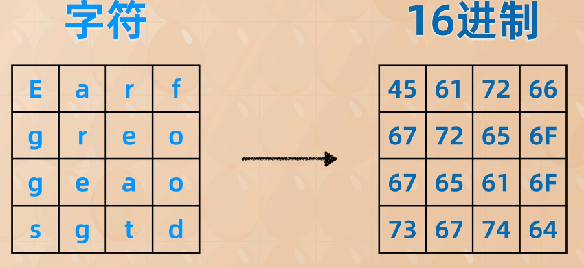

## 轮密钥生成

AES密钥有128 192 256bits，加密轮数分别是10 12 14轮

随机生成种子密钥（128bits）然后派生成10个轮密钥 

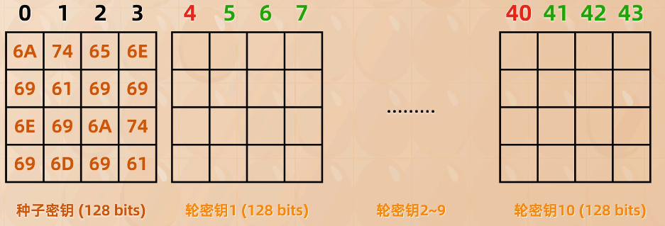

第四列（四的倍数） = 列i-4 $\oplus$ 字节替换(旋转字节i-1) $\oplus$ 轮常量

旋转字节i-1 -> 查表（S-Box）得到 字节替换

轮常量一共十列，每次用一列

不是4的倍数列（这个简单）= 列i-4 $\oplus$ 列i-1

然后种子密钥就派生好了

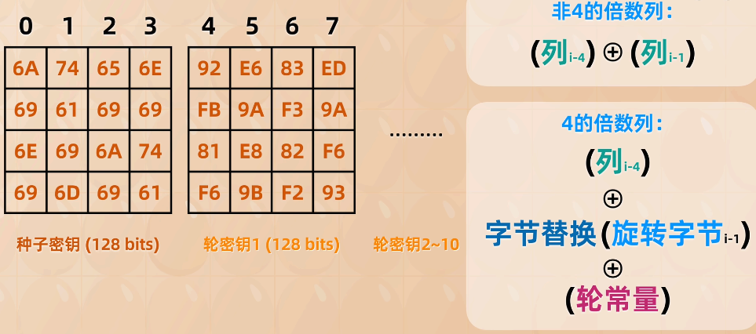

## 种子密钥加、字节代换、行移位

`种子密钥加`在中文语料被称为`轮密钥加`

种子密钥加 = 明文矩阵 $\oplus$ 种子密钥 （都是4*4的矩阵）

字节替换 = S-Box(种子密钥加) （直接查表替换）

但是这样直接替换，一样的字符还是一样的输出，所以需要行移位

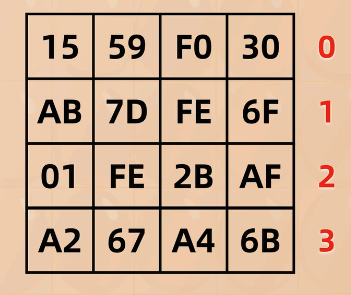

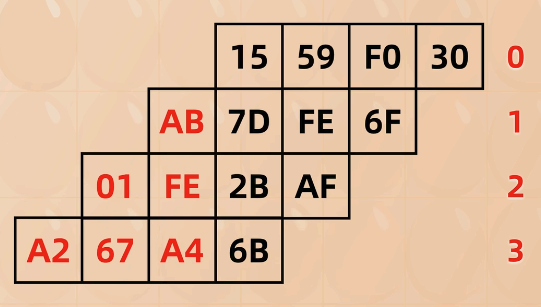

然后再放回来

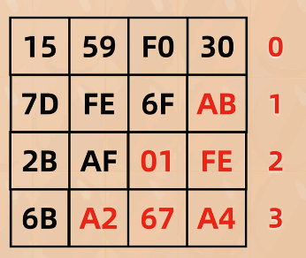

这些都是字节层面的，还需要更深入的打乱（列混淆）

## 列混淆、轮密钥加

列混淆 =  一个常数矩阵 和 行移位 矩阵乘法的结果（$\mathbb{GF}(2^8)$下）

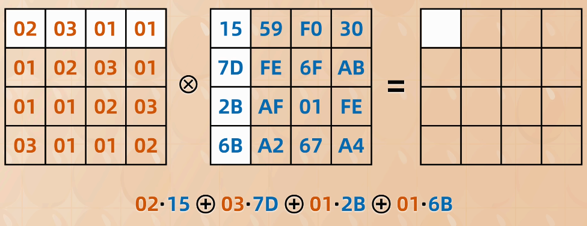

膜的是AES的不可约多项式，不再赘述

最终得到矩阵

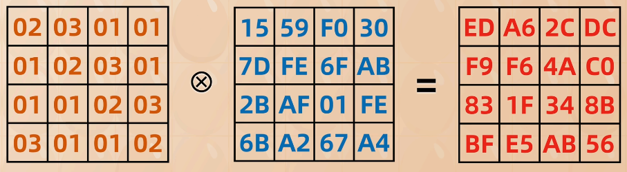

轮密钥加是用列混淆得到的矩阵，和轮密钥i进行直接异或。这是第一轮操作的结果，也是第二轮的初始矩阵

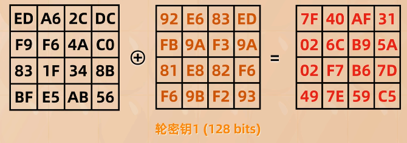

第二轮直接S-Box，无须再种子钥加（只有第一轮用种子密钥）；后续轮密钥加也用相应的轮数对应的轮密钥

最后一轮没有列混淆

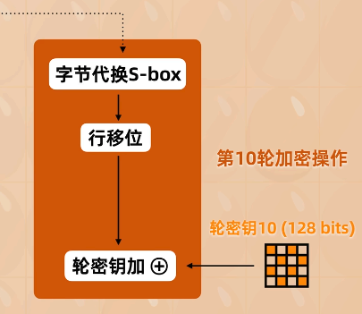

解密直接逆序解决即可

## 总结

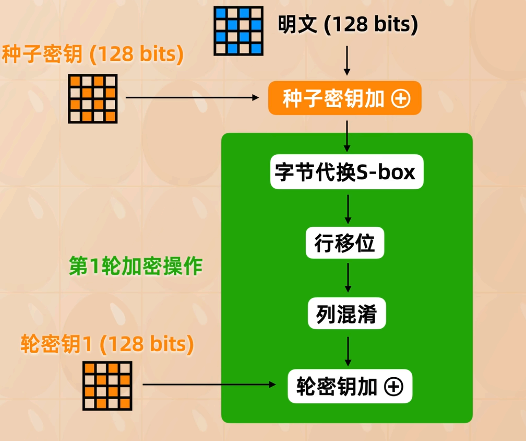

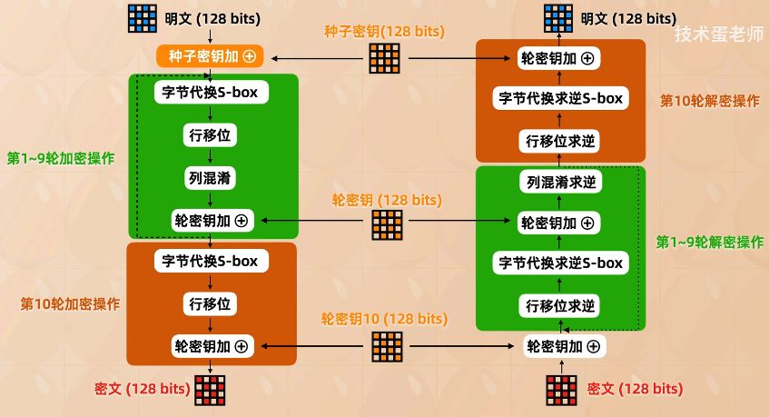

---

reference: https://www.bilibili.com/video/BV1seFJeHEnm
