# 我被高数积分卡死了喵

做到高数这一章，发现积分真有困难吧

然后就推导了一遍，相对好记忆很多

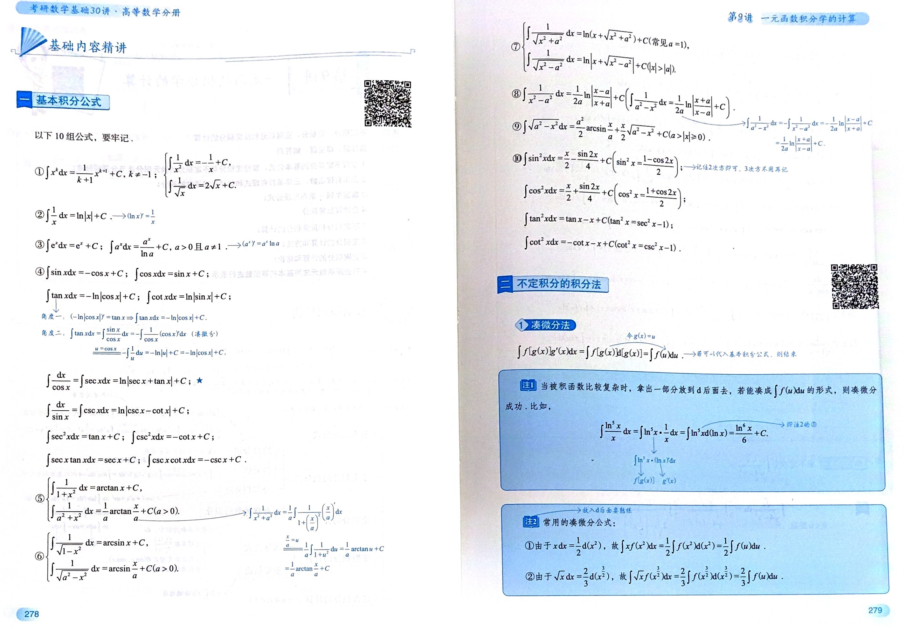

这十条基本可以分为以下四部分：

- 第一类 用导数来倒着记 -> ①幂函数、②对数、③指数、④中的6个基础三角函数、⑤⑥中不带参数 $a$ 的反三角
- 第二类 初级变形凑微分 -> ④中的 $\tan x, \cot x$（凑微分），⑩的平方类 $\sin^2 x, \cos^2 x$（三角降幂公式）
- 第三类 无中生有与裂项 -> ④中的 $\sec x, \csc x$（上下同乘神仙因子），⑧ $\frac{1}{x^2-a^2}$（分式裂项）
- 第四类 就用那三角换元 -> ⑤⑥带有参数 $a$ 的推广，以及最复杂的 ⑦, ⑨；看到 $a^2+x^2$ 想到 $\tan$，看到 $a^2-x^2$ 想到 $\sin$

## 第一类 导数倒着记

因为 $F'(x) = f(x)$，所以 $\int f(x)dx = F(x) + C$

### 1.1 幂函数与对数（图中的 ①、②）

谁求导变为 $x^k$

$k \neq -1$ 时，$\left( \frac{1}{k+1} x^{k+1} \right)' = x^k \implies \int x^k dx = \frac{1}{k+1} x^{k+1} + C$

$k = -1$ 时，也就是 $\frac{1}{x}$，$(\ln|x|)' = \frac{1}{x} \implies \int \frac{1}{x} dx = \ln|x| + C$

### 1.2 指数函数（图中的 ③）

$\int e^x dx = e^x + C$

$\int a^x dx = \frac{a^x}{\ln a} + C$

### 1.3 六个基础三角函数（图中的 ④ 的一部分）

积出 `co` 就加负号

$(\sin x)' = \cos x \implies \int \cos x dx = \sin x + C$

$(\cos x)' = -\sin x \implies \int \sin x dx = -\cos x + C$

$(\tan x)' = \sec^2 x \implies \int \sec^2 x dx = \tan x + C$

$(\cot x)' = -\csc^2 x \implies \int \csc^2 x dx = -\cot x + C$

$(\sec x)' = \sec x \tan x \implies \int \sec x \tan x dx = \sec x + C$

$(\csc x)' = -\csc x \cot x \implies \int \csc x \cot x dx = -\csc x + C$

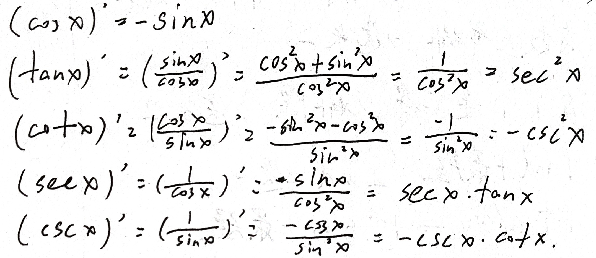

### 1.4 两个最基础的反三角函数（图中的 ⑤、⑥ 的前半部分，没有参数a的）

$(\arctan x)' = \frac{1}{1+x^2} \implies \int \frac{1}{1+x^2} dx = \arctan x + C$

$(\arcsin x)' = \frac{1}{\sqrt{1-x^2}} \implies \int \frac{1}{\sqrt{1-x^2}} dx = \arcsin x + C$

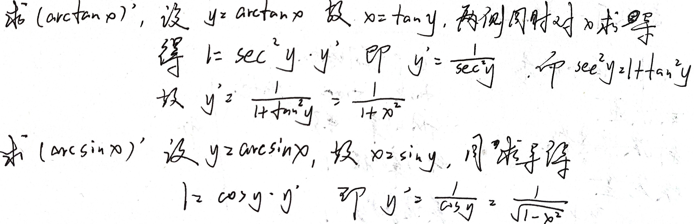

## 第二类 初级变形与凑微分

### 2.1 凑微分（专治 $\tan x$ 和 $\cot x$）

需要用到 $\int f'(x) dx=\int df(x)$

所以有 $\int \frac{\sin x}{\cos x} dx = -\int \frac{1}{\cos x} d(\cos x)$

$\int \tan x dx = -\ln|\cos x| + C$

$\int \cot x dx = \ln|\sin x| + C$

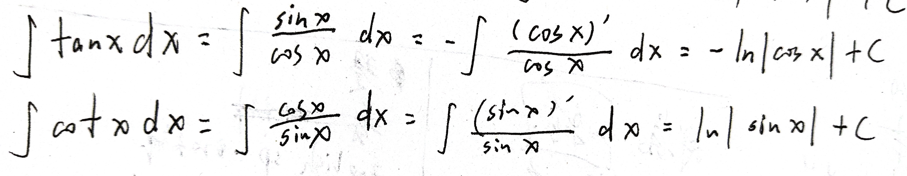

### 2.2 （专治第⑩组：带平方的三角函数）

**降幂法**（针对 $\sin^2 x$ 和 $\cos^2 x$）

二倍角公式：$\cos 2x = 1 - 2\sin^2 x = 2\cos^2 x - 1$

$\int \sin^2 x dx=\frac{x}{2} - \frac{\sin 2x}{4} + C$

$\int \cos^2 x dx=\frac{x}{2} + \frac{\sin 2x}{4} + C$

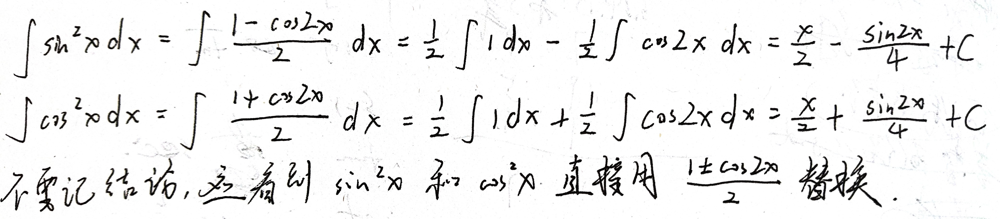

**平方关系法**（针对 $\tan^2 x$ 和 $\cot^2 x$）

平方关系 $1 + \tan^2 x = \sec^2 x$，$1 + \cot^2 x = \csc^2 x$

$\int \tan^2 x dx= \tan x - x + C$

$\int \cot^2 x dx=-\cot x - x + C$

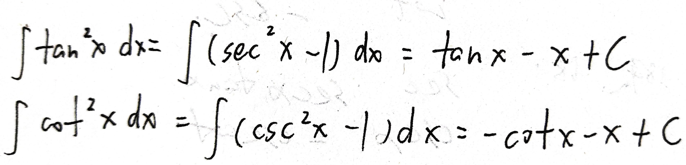

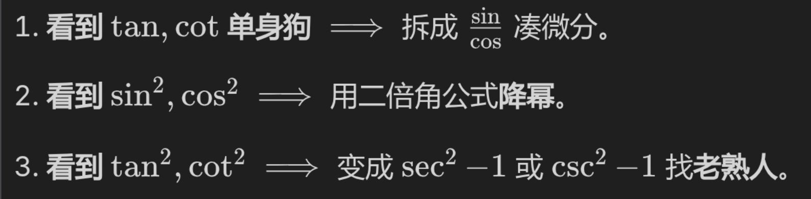

## 第三类 无中生有与裂项

### 3.1 无中生有

$\int \sec x dx= \ln|\sec x + \tan x| + C$

$\int \csc x dx= \ln|\csc x - \cot x| + C$

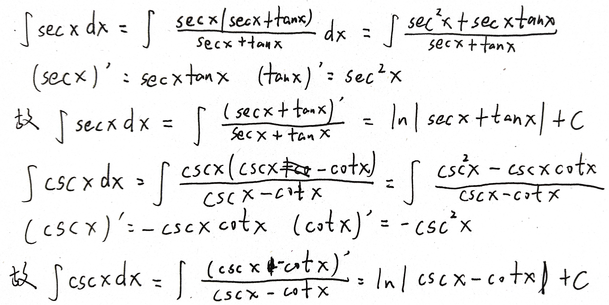

### 3.2 裂项相消

$\int \frac{1}{x^2-a^2} dx= \frac{1}{2a} \ln \left| \frac{x-a}{x+a} \right| + C$

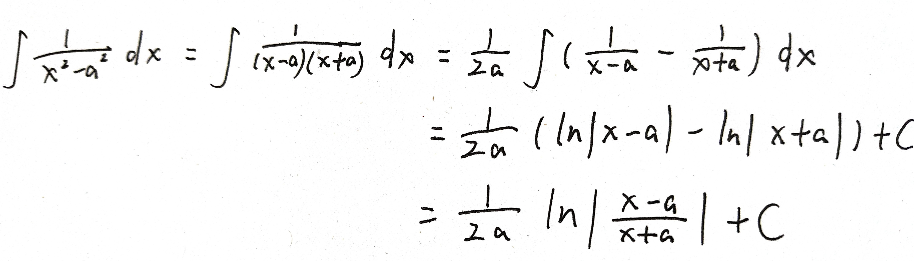

如果分母反过来，其实就是提一个负号出来，对数里的分子分母就倒过来了

$\int \frac{1}{a^2-x^2} dx=\frac{1}{2a} \ln \left| \frac{a+x}{a-x} \right| + C$

总结：
- 遇到 $\sec x$ -> 无中生有，乘 $(\sec x + \tan x)$
- 遇到 $\frac{1}{x^2-a^2}$ -> 裂项大法，拆 $\frac{1}{2a}$ 和两个分式

## 第四类 三角换元

包含：⑤和⑥（带有参数 $a$ 的 $\arctan$ 和 $\arcsin$），以及最长的⑦和⑨（含有根号的对数型和长串型）

核心：利用三角公式，把多项式变成单项式的平方，从而消灭加减号或根号

- 看到 $a^2 + x^2$ $\implies$ $1 + \tan^2 t = \sec^2 t$ $\implies$ 令 $x = a \tan t$
- 看到 $a^2 - x^2$ $\implies$ $1 - \sin^2 t = \cos^2 t$ $\implies$ 令 $x = a \sin t$

$\int \frac{1}{a^2+x^2} dx= \frac{1}{a} \arctan\frac{x}{a} + C$

$\int \frac{1}{\sqrt{a^2-x^2}} dx= \arcsin\frac{x}{a} + C$

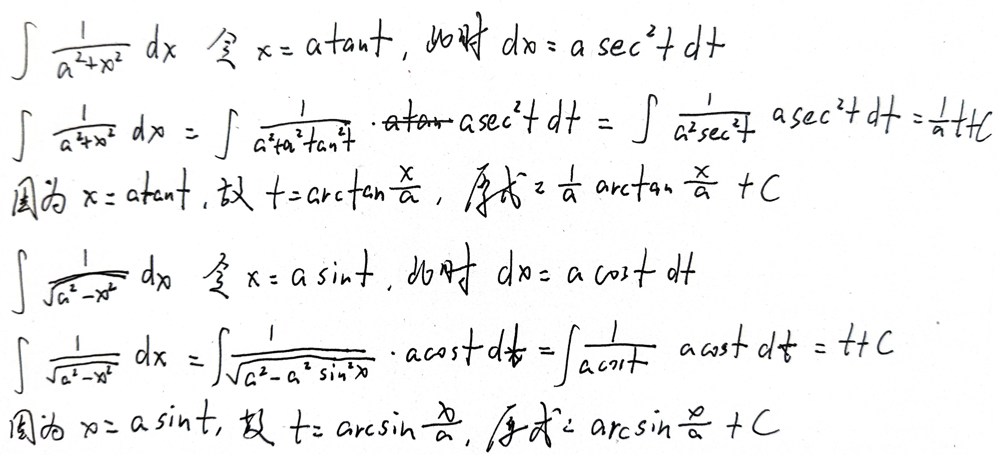

$\arctan$ 有 $\frac{1}{a}$ 是因为分母没有根号，生成了 $a^2$；$\arcsin$ 没有 $\frac{1}{a}$ 是因为分母有根号，把 $a^2$ 劈成了 $a$，和分子的 $dx$ 产生的 $a$ 同归于尽了

$\int \frac{1}{\sqrt{x^2+a^2}} dx = \ln(x + \sqrt{x^2+a^2}) + C$

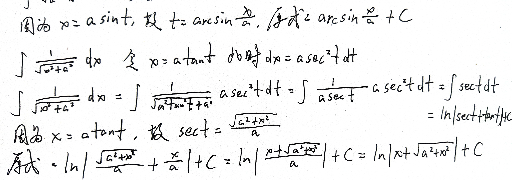

## 总结

1. 导数认亲局 -> 不用推，直接倒背导数表：$x^k, a^x, e^x, \sin, \cos$
2. 凑微分与降幂局 -> 对付 $\tan x$ 拆解法，对付 $\sin^2 x$ 降幂法
3. 无中生有与裂项局 -> 对付 $\sec x$ 强行乘因式，对付 $\frac{1}{x^2-a^2}$ 分母裂项
4. 三角换元大招局 -> 对付根号和平方和，设 $x=a\tan t$ 或 $a\sin t$

这是全部了吗？就书上的“基本积分公式表”而言，这是全部了。

这些够用了吗？从公式储备的角度来说绝对够了，从做题能力的角度来说这只是基石，还需要 kuku 刷题