期末试卷构成：选择 40 题每题 1 分 共计 40 分，计算六题 $5*5+10*1$ 共计35分，简答两题共计 2 题。老师说简答题里有彩蛋

AB卷总共 80 题选择，随机抽 40 题。看看选择和计算就行了

## 第二章导论

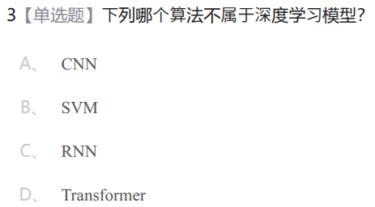

B

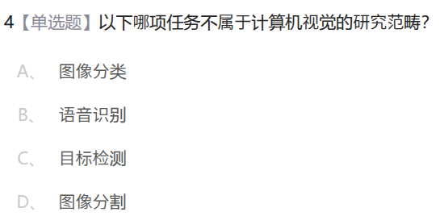

B

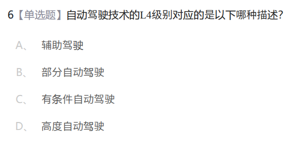

D

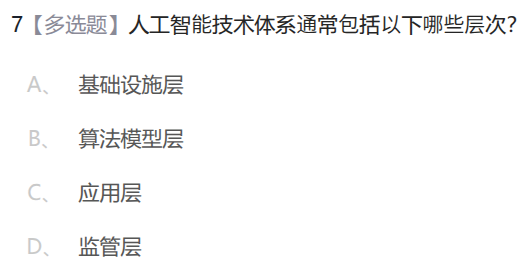

ABC

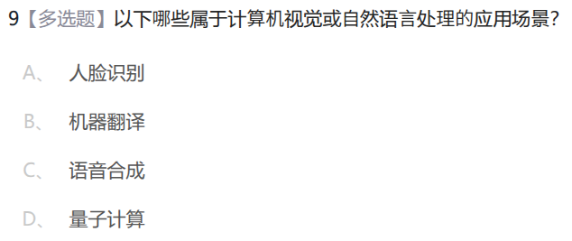

ABC

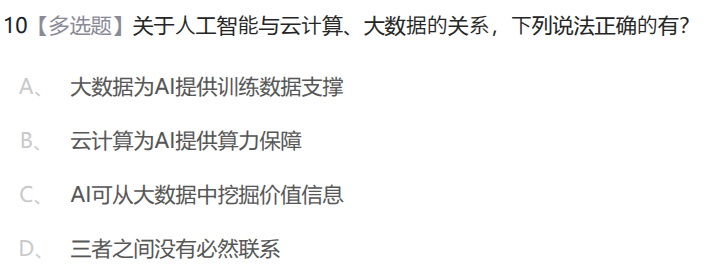

ABC

## 第三章 AI产业

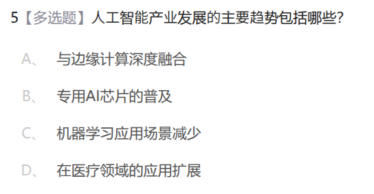

ABD

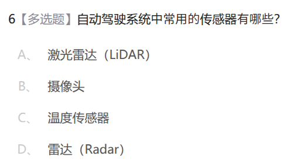

ABD

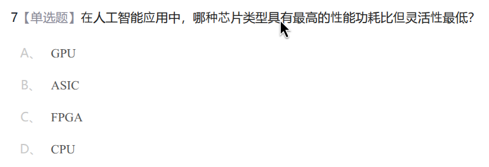

B

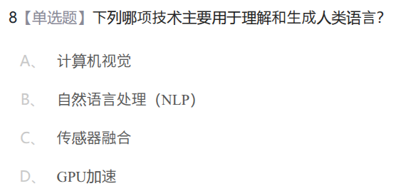

B

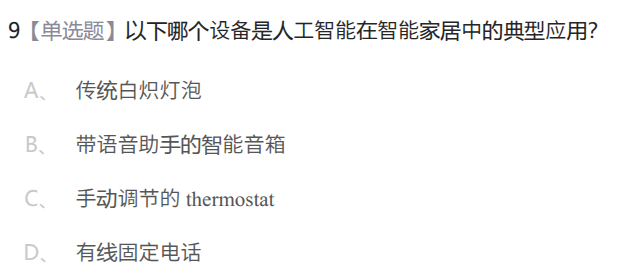

B

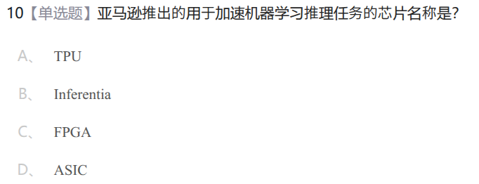

B

## 第四章 数据

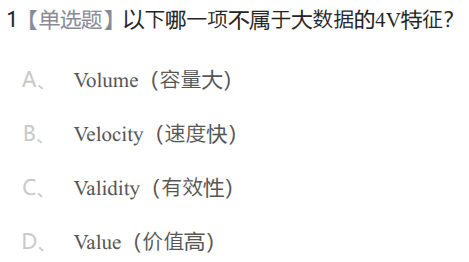

C

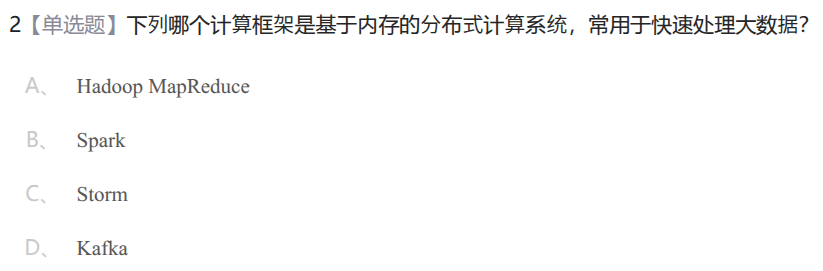

B

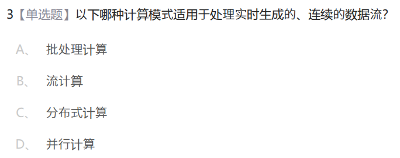

B

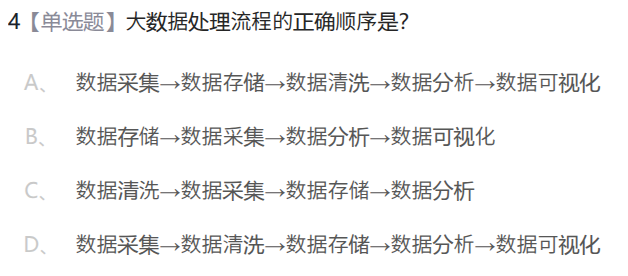

D

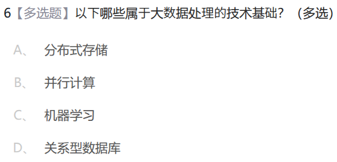

ABC

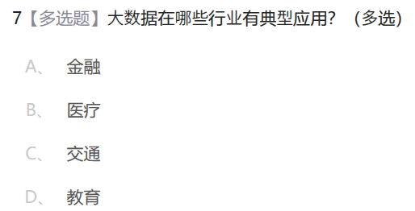

ABCD

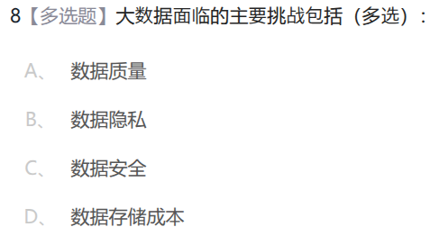

ABCD

## 第六章 模型

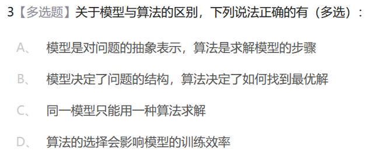

ABD

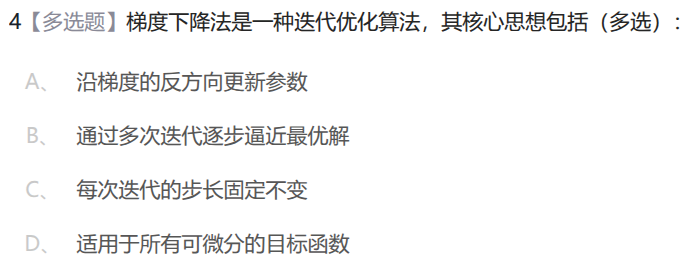

AB

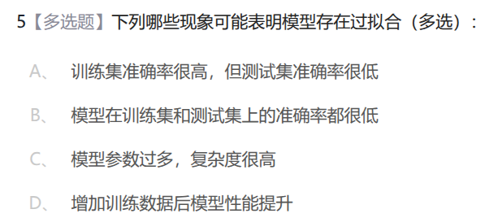

ACD

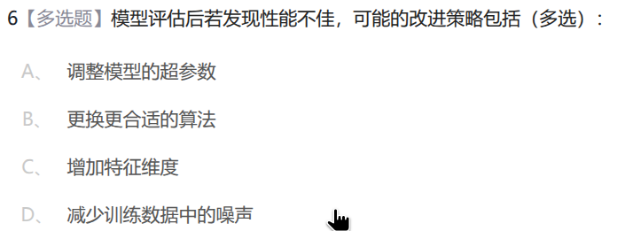

ABCD

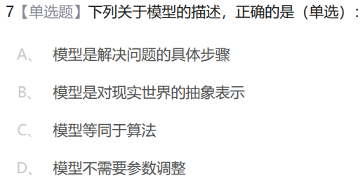

B

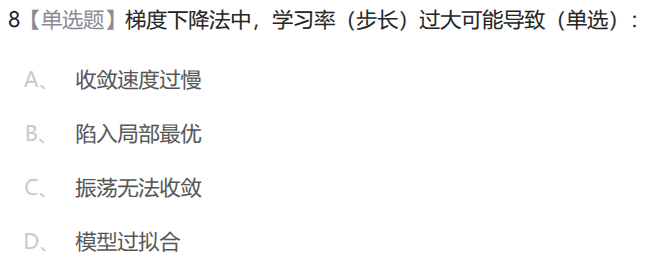

C

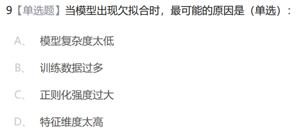

A

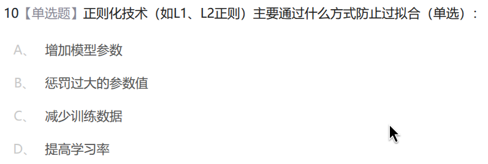

B

## 第七章 机器学习算法

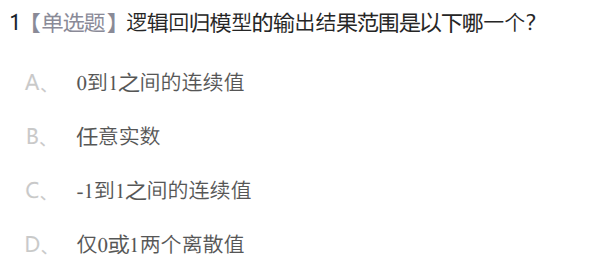

A

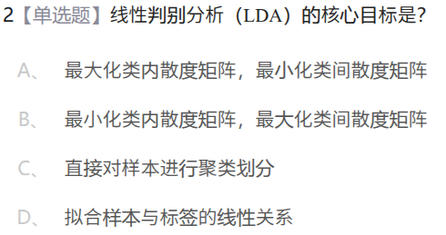

B

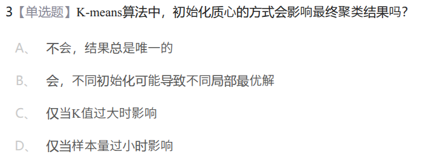

B

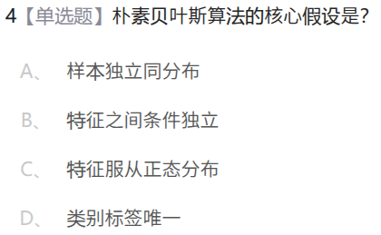

B

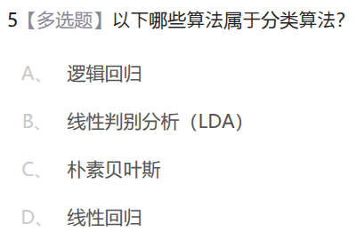

ABC

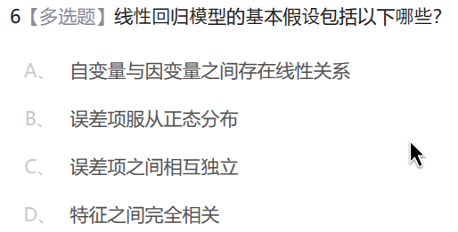

ABC

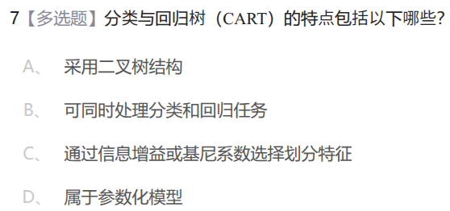

ABC

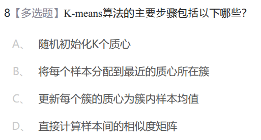

ABC

## 第八章 无监督学习

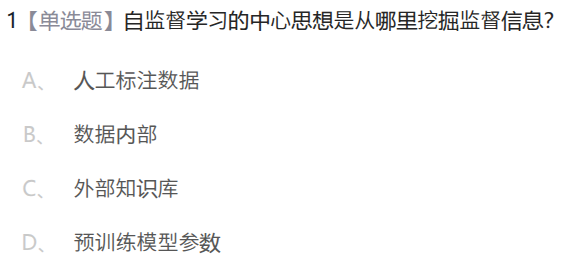

B

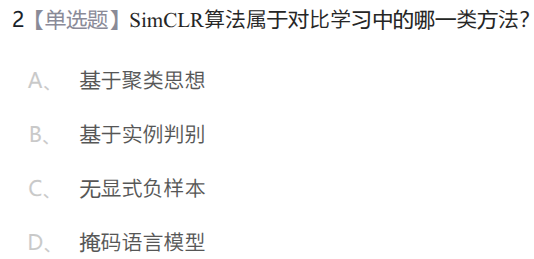

B

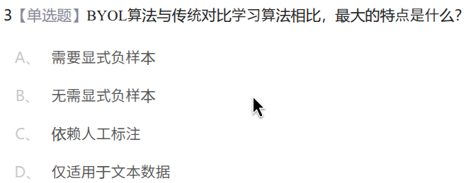

B

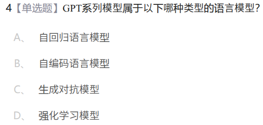

A

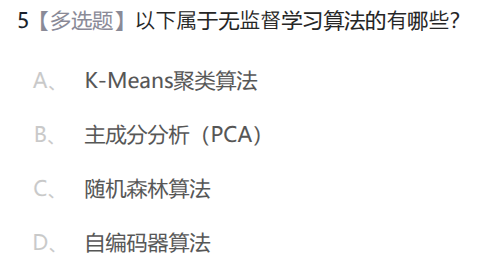

ABD

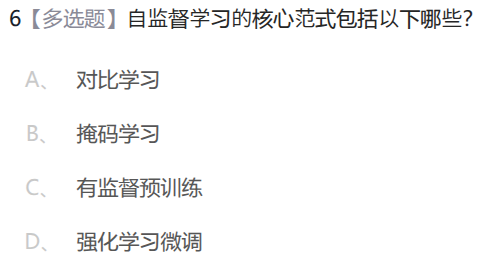

AB

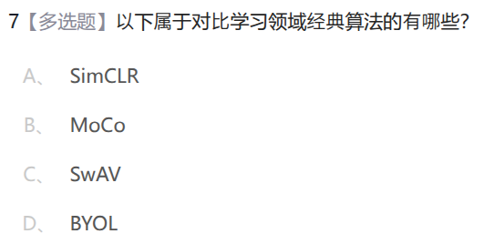

ABCD

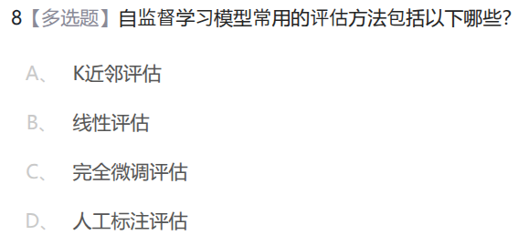

ABC

## 第九章 自动机器学习

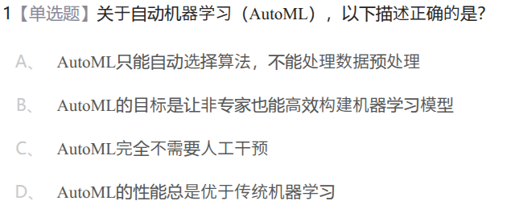

B

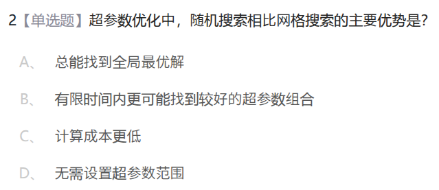

B

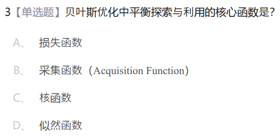

B

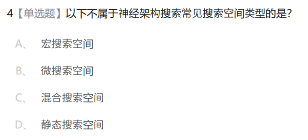

D

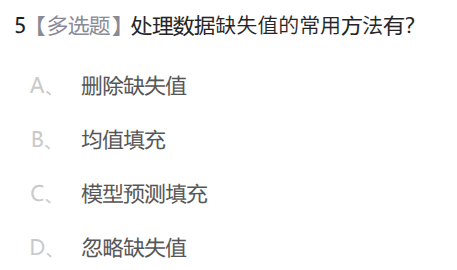

ABC

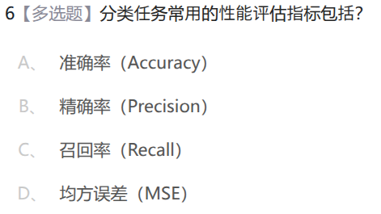

ABC

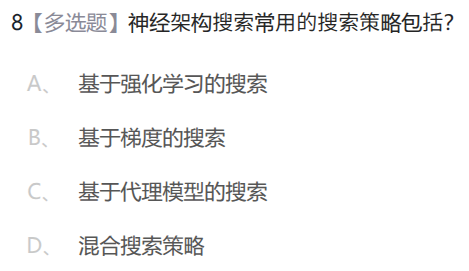

ABCD

## 第十章 人工智能生成内容

BC

ABC

AB

ABCD

A

A

A

A

## 第十一章 人工智能大模型

B

C

C

B

ABC

BC

ABC

BC

## 第十二章 人工智能安全

D

B

A

ABCD

AB

ABCD

## 计算题

### 6.3 误差与 MSE 

MSE 是均方误差

模型 $\hat{y}=f(x)$，真实值为  $y$

$MSE = \frac{1}{n} \sum_{i=1}^{n} (y_i - \hat{y}_i)^2$

例如模型 $\hat{y}=x+4$

$MSE=\frac{1^2+0^2+0^2+(-1)^2+(-3)^2}{5}=2.2$

### 7.1 线性回归和最小二乘

用最小二乘法，先计算 $x$ 和 $y$ 的平均值 $\bar{x} = \frac{1}{n}\sum x_i$ 和 $\bar{y} = \frac{1}{n}\sum y_i$

然后计算斜率 $\beta_1 = \frac{\sum_{i=1}^{n} (x_i - \bar{x})(y_i - \bar{y})}{\sum_{i=1}^{n} (x_i - \bar{x})^2}$

也就是 横纵坐标 分别与平均值差值的乘积 除以 横坐标与平均值的平方的差值

最后是截距 $\beta_0= \bar{y} - \beta_1 \bar{x}$

对于上面的例子，$\beta_1=0.6, \beta_0=2.2$，所以 回归方程为 $y=2.2+0.6x$

### 7.2 逻辑回归

一个 $\mathbb{R}\rightarrow[0,1]$ 的映射

最简单的是二元离散型变量，即 $\mathbb{R}\rightarrow\{0,1\}$

线性回归是类似 $y=a_0+a_1x_1+a_2x_2+...+a_mx_m$

逻辑回归把值域变为 零到一 了  $y=f(a_0+a_1x_1+a_2x_2+...+a_mx_m$)

$f(x)$ 可以是 $\phi(x)=\frac{1}{1+e^{-x}}$

图像长这样

直接来一道题

应当是有一个阈值，大于等于就通过，小于就不通过

得到 $z$ 之后直接计算 $\phi(z)=\frac{1}{1+e^{-z}}$ 即可，得到的就是通过考试的概率

### 7.3 线性判别分析

这个有分类了哦

- 计算每个类别的均值 $\mu_0=\frac{1+2}{2}=1.5, \mu_1=\frac{4+5}{2}=4.5$
- 计算类内方差 类别0 $(1-1.5)^2+(2-1.5)^2=0.5$ ，类别1 $(4-4.5)+(5-4.5)=0.5$，$\sigma^2=\sum类内方差/总元素数量=\frac{0.5+0.5}{4}=0.25$
- 构造判别函数 $g_k=\frac{\mu_k}{\sigma^2}x-\frac{\mu_k^2}{2\sigma}$，$g_0(x)=\frac{1.5}{0.25}x-\frac{1.5^2}{2\cdot0.25}=6x-4.5, g_1(x)=\frac{4.5}{0.25}x-\frac{4.5^2}{2\cdot0.25}=18x-40.5$
- （握草了这个怎么这么难，记不住哇，我赌他不考）
- 带入新的 $x$ ，哪个 $g_k(x)$ 最大，$x$ 就是哪个类的

### 7.4 分类与回归树（决策树算法）

不考决策树，我说的

要是考了就当我没说

### 7.5 Kmeans算法（老师说这个会考）

将目标划分为 $K$ 类（需要人为规定）

- 随机选择 $K$ 个点作为初始聚类中心
- 计算每个数据到 $K$ 个中心的距离，并分配给最近的那个中心，形成 $K$ 个簇
- 重新计算每个簇内所有点的平均值（质心），并将这个平均值位置作为新的聚类中心。
- 重复找新中心并计算距离并分配，直到中心点不再发生变换或到达预设的迭代次数

这 WCSS 是啥玩意，我赌考试不考

例如对于点集 $x=\{1,2,3,8,9\}$，$K=2$

第一次分类

计算中心点，$c_1=\frac{1+2+3+8}{4}=3.5, c_2=9$

然后第二轮分配

$c_1=\frac{1+2+3}{3}=2, c_2=\frac{8+9}{2}=8.5$

分类没变化，终止