# 信安数基复习笔记

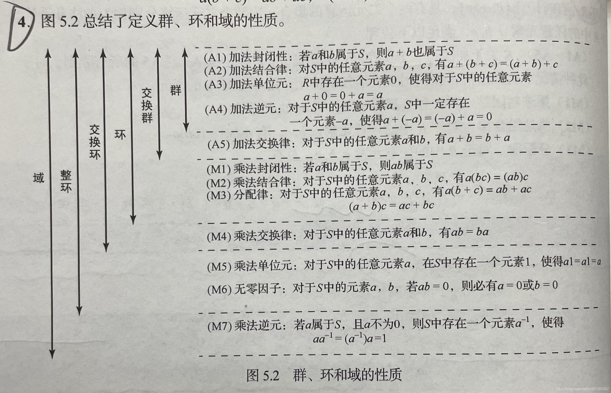

### 往年期末考试题目

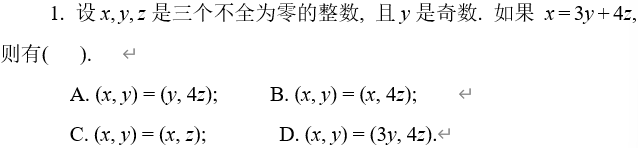

$(x,y)=(3y+4z,y)=(4z,y)$

故A正确

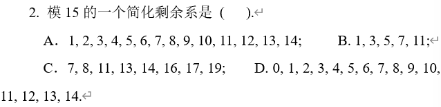

简化剩余系：与模数互素且不同余

与15不互素：$1,3,5,6,9,10,12,15$

故一个简化剩余系为 $\{2,4,7,8,11,13,14\}$

也可以写作 $\{7,8,11,13,14,17,19\}$

故C正确

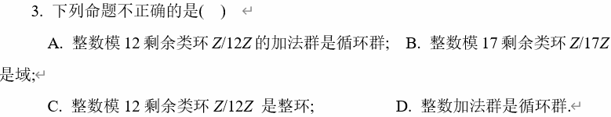

B. 整数模素数剩余类环都是域，故B正确

C. 整环的定义是没有零因子，3*4=12是0，故C错误

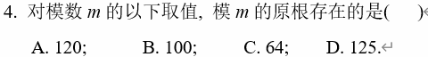

原根存在的充要条件 $m=p^k$ 或 $2p^k$，其中 $p$ 为素数，$k\ge1$

故选D

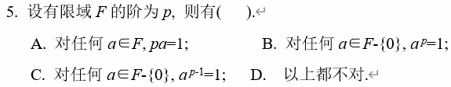

A. pa=0，错误

B. 费马小定理是 $a^{p-1}=1$，错误

C. 正确

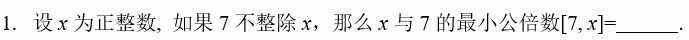

$7x$

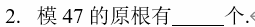

$x$的原根数为$\phi(\phi(x))$

22

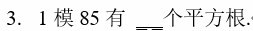

85=5*17

$x^2\equiv1\mod5$ 和 $x^2\equiv1\mod17$ 的解数之和

分别有两个解（分别是$(1,2)$和$(1,4)$）

故总共有四个解

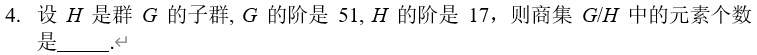

$|G/H|=\frac{|G|}{|H|}=3$

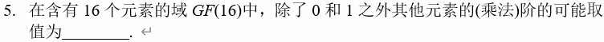

$GF(16)$是一个阶为16的有限域，则$GF(16)^*$是一个阶为$15$的循环群

在一个循环群中，任意元素的阶是$15$的正约数。也就是说，$GF(16)$中非零元素的可能乘法阶是$15$的正约数

故可能取值为$\{3,5,15\}$

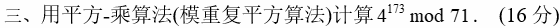
$$
\begin{align}
&4^{173}\\
=&16^{86}*4\\
=&43^{43}*4\\
=&3^{21}*43*4\\
=&9^{10}*3*43*4\\
=&10^5*3*43*4\\
=&29^2*10*3*43*4\\
=&40
\end{align}
$$
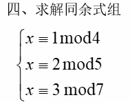

第一步，计算所有模数的乘积$M$

$M=m_1*m_2*m_3=140$

第二步，计算每个模数对应部分的乘积$M_i$

$M_1=35, M_2=28, M_3=20$

第三步，计算$M_i$在$m_i$下的逆元

$inv_1=3, inv_2=2, inv_3=6$

第四步，计算新的$x$

$x=\sum(a_i*M_i*inv_i)\%M=17$

通式：余数乘以模余乘以其逆

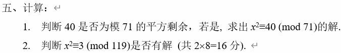

(1) $(\frac{40}{71})=(\frac{40\%71}{71})=(\frac{40}{71})=40^\frac{71-1}2\mod71=40^{35}\mod71$
$$
\begin{align}
&40^{35}\\
=&40*38^{17}\\
=&40*38*25^8\\
=&40*38*8^4\\
=&40*38*4096\\
=&40*38*49\\
=&1
\end{align}
$$

$p=71$ 满足 $p=4k+3$

故 $x=\pm a^\frac{p+1}4=\pm40^{18}\mod71=18$或$53$

(2) $(\frac3{119})=(\frac37)(\frac3{17})$

$(\frac37)=3^\frac{7-1}2\mod7=1$

$(\frac3{17})=3^\frac{17-1}2\mod17=-1$

故 $(\frac3{119})=-1$，$x^2≡3\mod119$ 无解

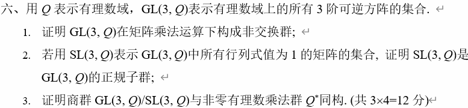

(1) 封闭性：如果$A,B\in GL(3,Q)$，则$AB\in GL(3,Q)$；由于$det(AB)=det(A)det(B)\neq0$，且$AB$元素皆为有理数，因此$AB\in GL(3,Q)$

结合律：矩阵乘法满足结合律，即 $(AB)C=A(BC)$

单位元存在：单位矩阵$I_3\in GL(3,Q)$，且对任意$A\in GL(3,Q)$，有$AI_3=I_3A=A$

逆元存在：对于$A\in GL(3,Q)$，其逆矩阵$A^{-1}\in GL(3,Q)$，因为$det(A^{-1})=\frac1{det(A)}\neq0$

证明$GL(3,Q)$是非交换群，找到反例即可

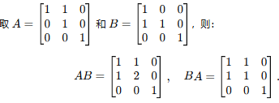

显然$AB\neq BA$，故$GL(3,Q)$是非交换群

(2) 定义$SL(3,Q)=\{A\in GL(3,Q)|det(A)=1\}$，正规子群需要验证两点

$SL(3,Q)$是子群

封闭性：如果$A,B\in SL(3,Q)$，则$AB\in SL(3,Q)$；由于$det(AB)=det(A)det(B)=1$，因此$AB\in SL(3,Q)$

结合律：矩阵乘法满足结合律，即 $(AB)C=A(BC)$

单位元：单位矩阵$I_3\in SL(3,Q)$，因为$det(I_3)=1$

逆元：对于$A\in SL(3,Q)$，其逆矩阵$A^{-1}\in SL(3,Q)$，因为$det(A^{-1})=\frac1{det(A)}=1$

因此$SL(3,Q)$是子群

$SL(3,Q)$是正规子群

对任意$A\in GL(3,Q),B\in SL(3,Q)$

$det(ABA^{-1})=det(A)*1*\frac1{det(A)}=1$

因此 $AB^A{-1}\in SL(3,Q)$

故$SL(3,Q)$是$GL(3,Q)$的正规子群

(3)markdown学不会了（恼

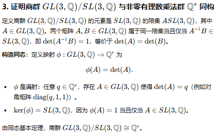

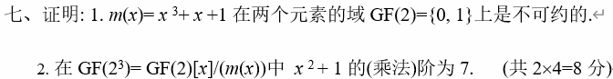

(1) 多项式 $m(x)\in GF(2)[x]$是不可约的，当前仅当它不可分解为两个低阶非常数多项式的积

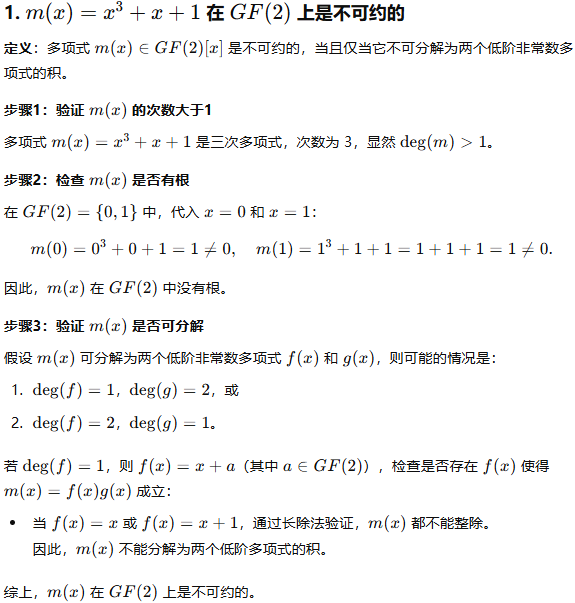

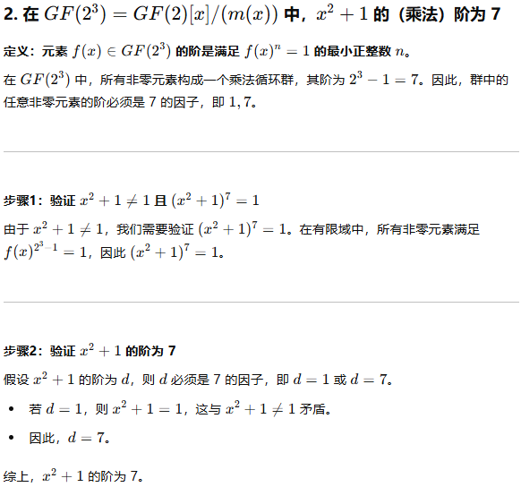

### 拓欧算法

(a,b)=(b,a%b)

### 快速幂

### CRT

### 二次剩余

### 原根

求原根：

1. 确定是否存在原根
2. 计算$\phi(n)$
3. 计算$\phi(n)$的所有素因子
4. 检验原根，当前仅当对$\phi(n)$的每个素因子都满足 $g^\frac{\phi(n)}p\neq1\mod n$
