# 操作系统2025期末考试重点

本文记录了老师讲的操作系统期末考试重点

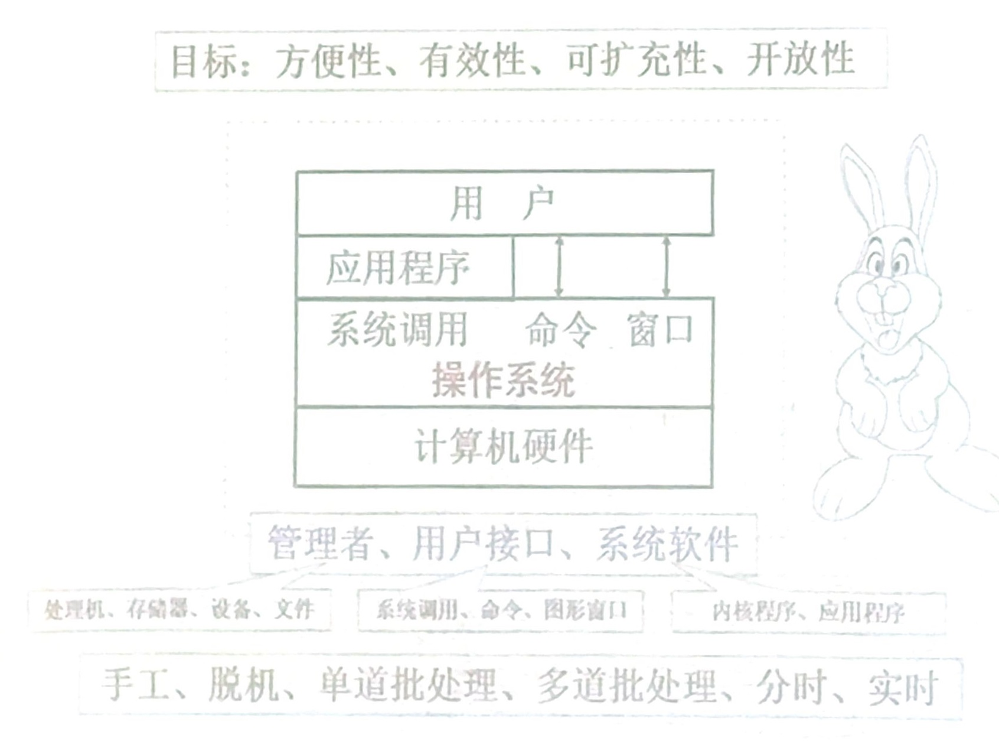

---

一、处理机

- 进程：特征 和线程区别 程序段数据段

  PCB：是什么 有什么 进程索引

- 状态转化 **转化图**

  同步互斥 同步-前后 互斥-同时

  调度算法 **优先算法 时间计算**，**信号量**，作业调度 进程调度 内存调度

  死锁算法 必要条件（4个） 处理办法（大题：银行家算法）

二、存储器

- 层次结构 寄存器 内存 硬盘
- 分配方式 连续分配（单一，固定，**动态**/可重分配）动态分区分配的四个算法  内部外部碎片（利用率）； 离散分配 
  - 页式存储（访问两次，通过PCB） **给逻辑地址求物理地址** ， **计算逻辑地址分成几个页**，倒排页表
  - 段式存储（访问两次）根据逻辑模块存储，每个段大小不一致
  - 区别：页表里存一个数（起始），段表存两个数（起始和终止）
  - 段页式：访问三次
  - 虚拟存储器：基于请求的（不要求进程的全部内容进入内容）1.请求调入 2.页面置换
- 置换算法
  - 先进先出，最长最短时间 追加算法 时钟算法...
  - 执行后发生几次置换，几次中断，缺页次数
- 地址转换

三、设备管理

- 层次结构
  - 从上到下：共性 个性 交互方式
  - 设备独立性，中断
- 控制方法
  - 四种方式
  - 通道程序
- 缓冲管理
  - **单/双缓冲**
- 设备分配
  - sdt dct coct 概念
  - 独占改为共享

四、文件管理

- 物理结构
  - **文件最大数**
  - 文件在磁盘上如何分配空间，正犹如进程在内存上分配空间（前面内容）
  - 链接（隐式，显式）FAT32 刻画内存空间
  - 进程：页表；文件：索引。链接，多层索引（计算文件最大多大）
  - 混合索引（结构求最大，已知大小求索引等级）
- 逻辑结构
  - 概念理解，不容易出计算题
    - 顺序文件等（哪个支持随机访问，哪个可以拓展）
- 目录结构
  - 结构（几级，树形）各自实现功能
- 共享保护

五、磁盘

- 物理构造
- 访问时间
  - 人为优化：寻道时间（大题

- 扫描算法

  - 多个算法

- 优化方式

  - 交替···

- 空间管理

  - 卫视图法（计算）

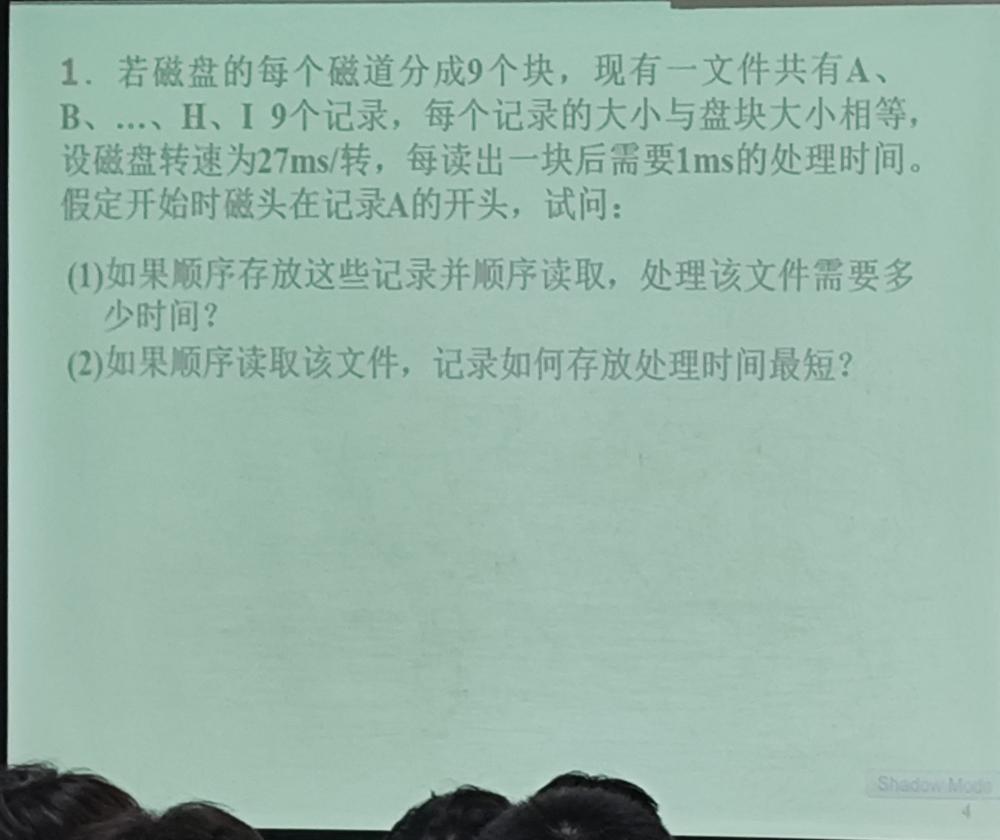

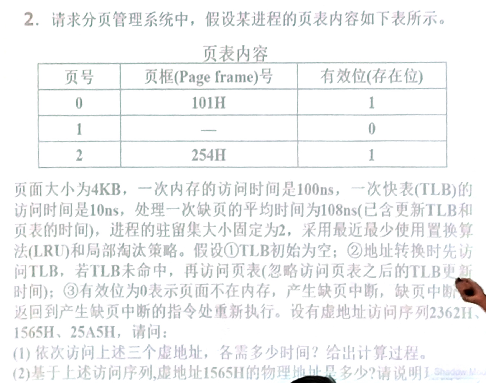

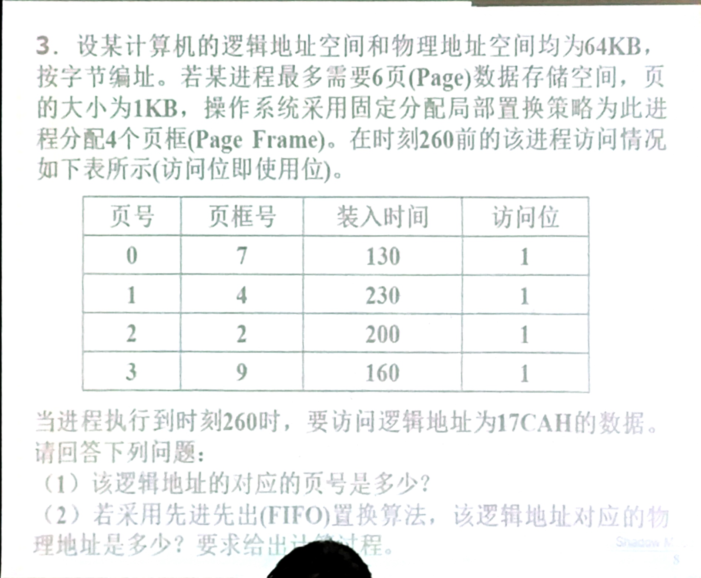

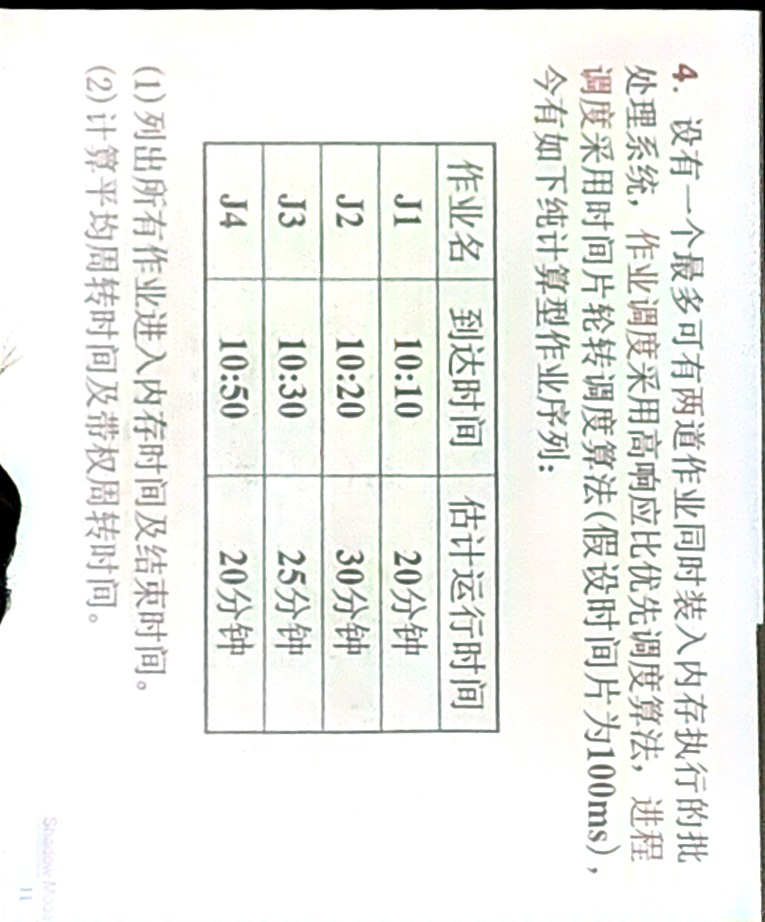

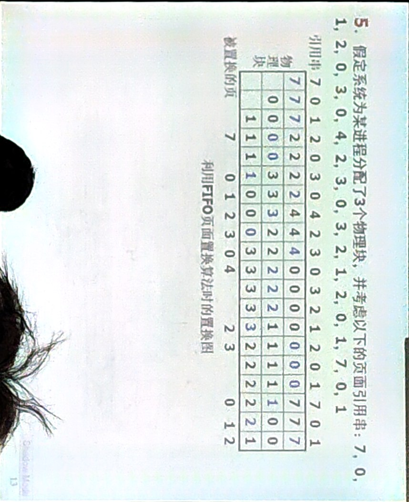

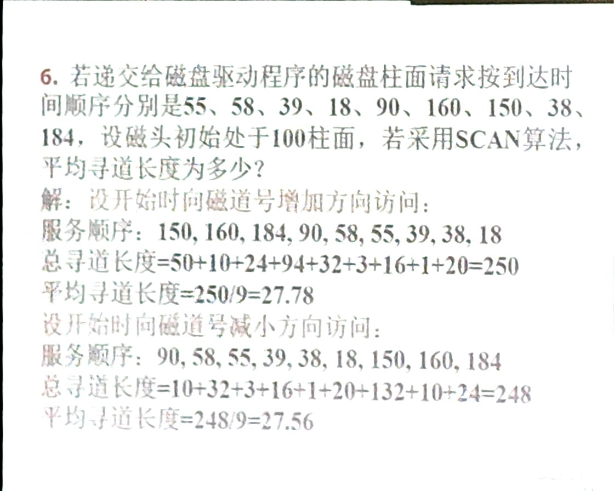

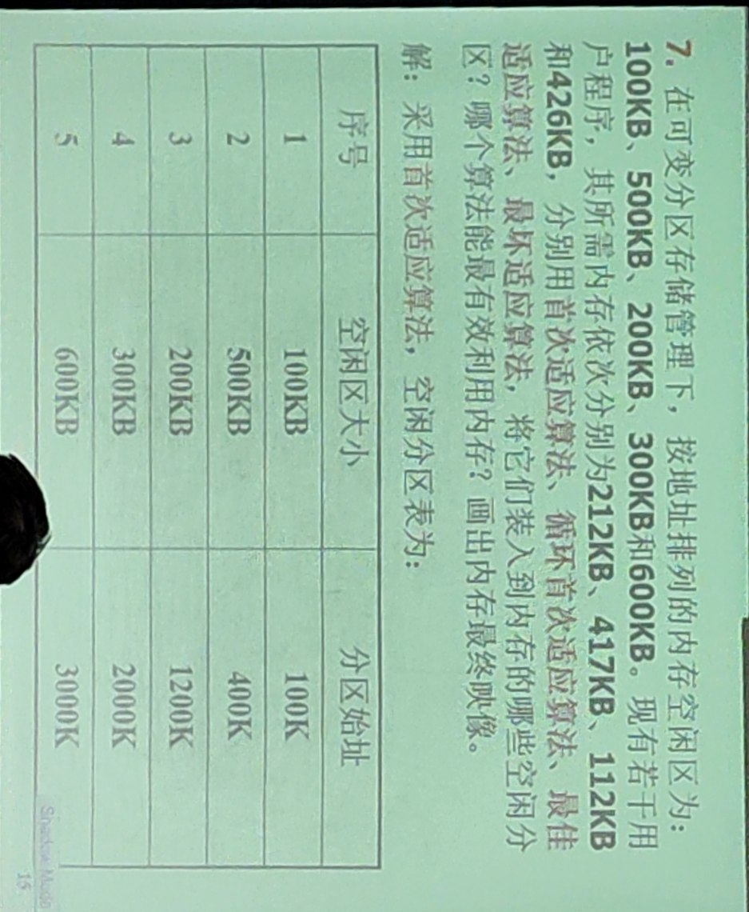

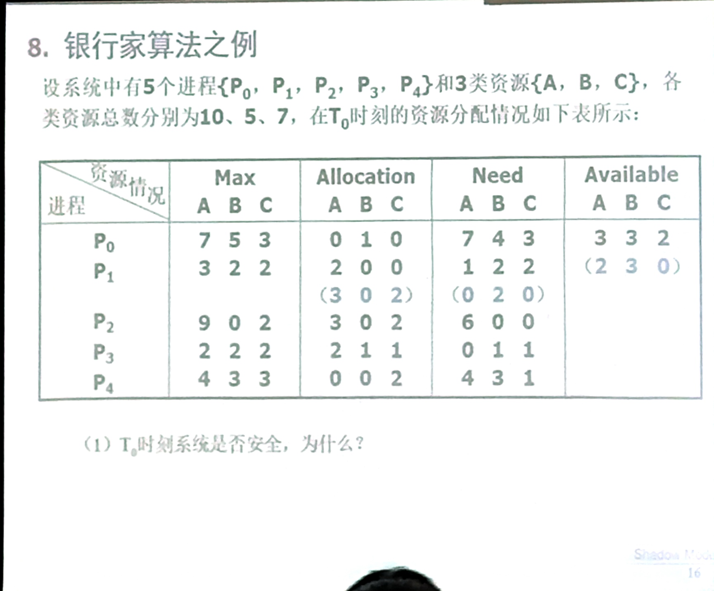

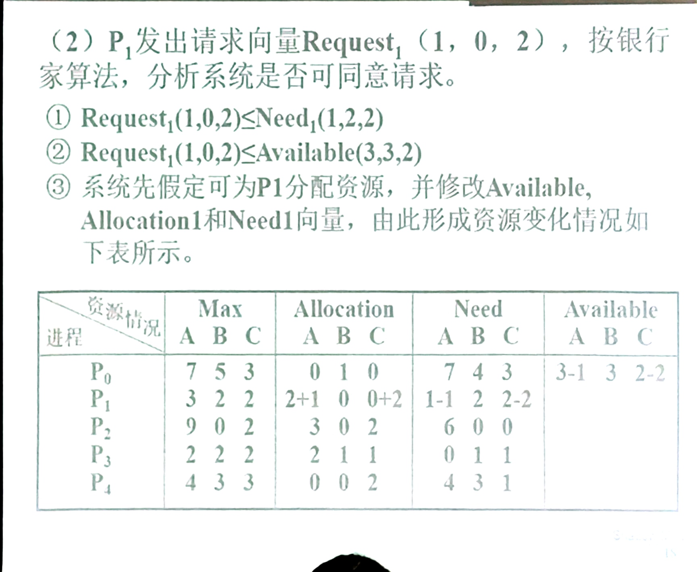

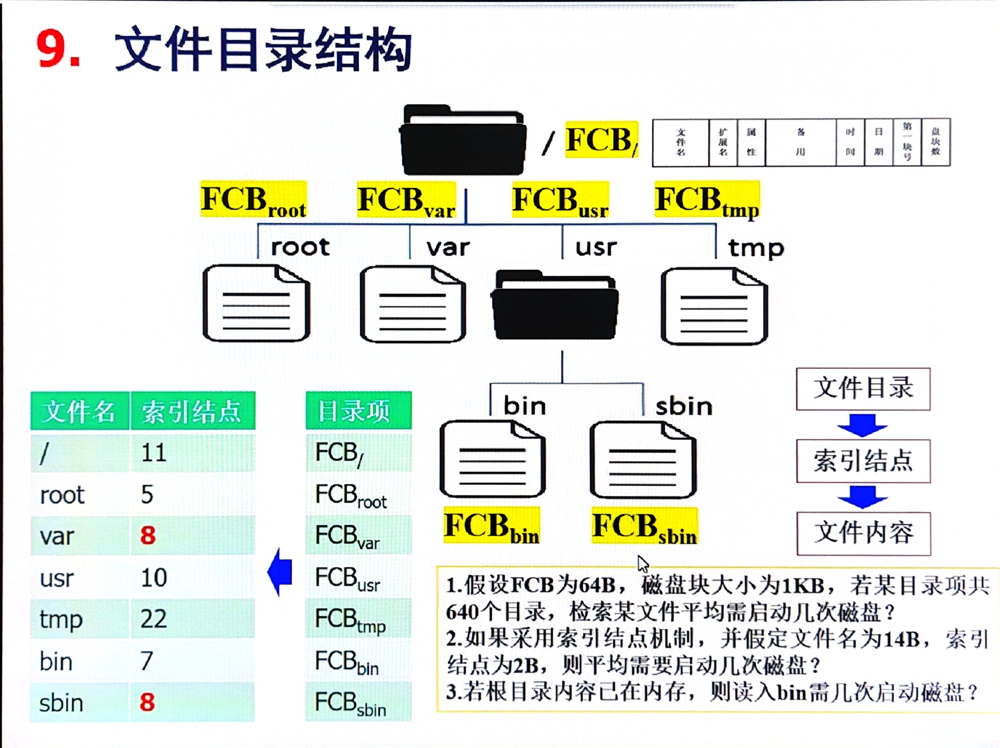
