# 计算机网络有手就行诶我手呢

计算机网络刷题记录

---

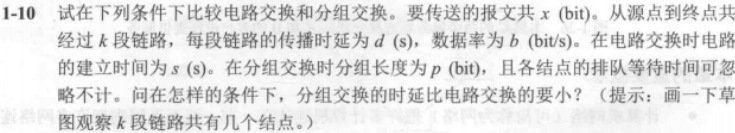

考虑电路交换的三个阶段

建立连接：$s$（题干给出）

数据传输：$\frac{x}{b}$（报文长度除以数据率就是所有报文都传输过去所需要的时间）

连接释放：$kd$（连接释放的报文直接发送，从发送端到接收端所需要的时间为链路段数乘以每段的传播时延）

分组交换

报文如果直接传输，需要的代价是 $\frac{x}{b}$

但是第一个报文未接收完成，后面的节点都是不在工作的，所以这里的代价为空闲的链路数乘以分组除以数据率 $(k-1)\frac{p}b$

加上个倾斜，也就是加上 $kd$

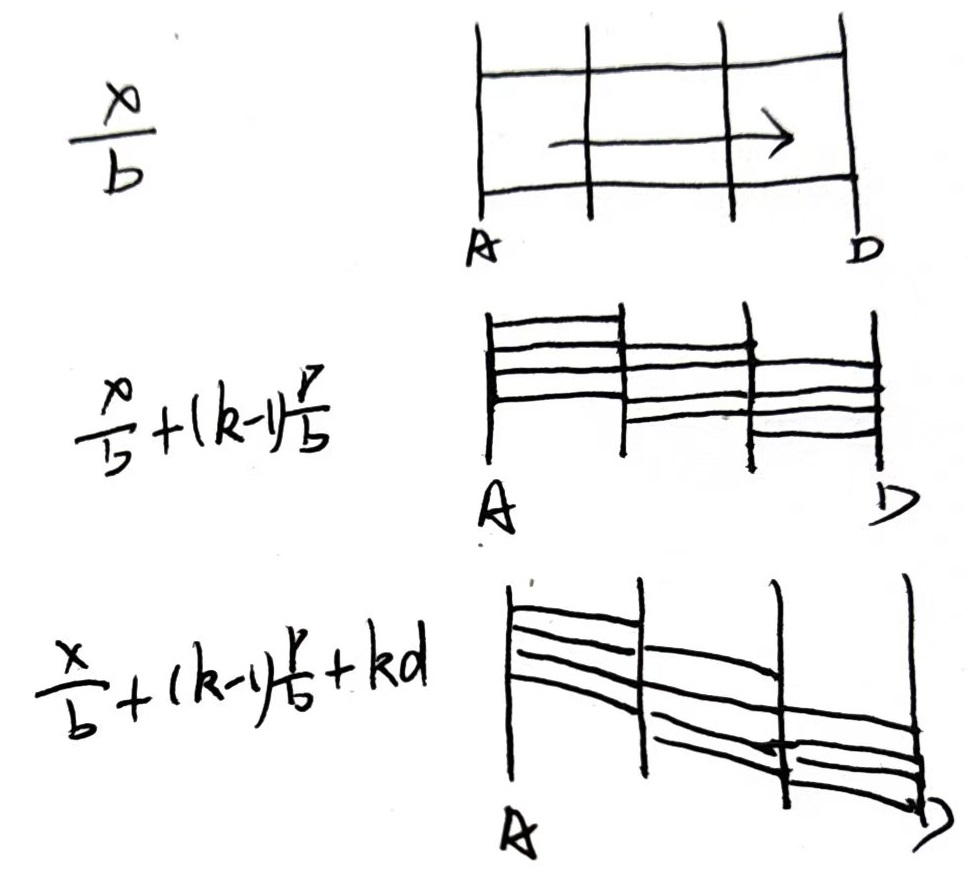

要使分组交换比电路交换快，则：
$$
s+\frac{x}b+kd>\frac{x}b+(k-1)\frac{p}b+kd
$$
即 $s>(k-1)\frac{p}b$

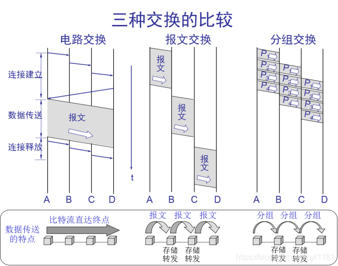

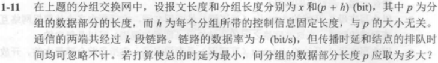

考虑原始的状态 $\frac{x}b+(k-1)\frac{p}b+kd$

没有传播时延，再考虑分组控制信息固定长度，则 $\frac{x}p\cdot\frac{p+h}b+(k-1)\frac{p+h}b$

整理得 $\frac{k-1}b p+\frac{xh}bp^{-1}+\frac{x+(k-1)h}b$

函数值最大，则 $\frac{k-1}b p=\frac{xh}bp^{-1}$

解得 $p=\sqrt{\frac{xh}{k-1}}$

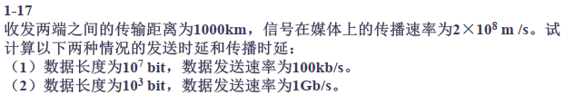

发送时延=数据长度/数据发送速率

传播时延=距离/物理传播速率

(1) 发送时延=$\frac{10^7bit}{100*10^3b/s}=1*10^2s$ ，传播时延=$\frac{1000*10^3m}{2*10^8m/s}=5*10^{-3}s$

(2) 发送时延=$\frac{10^3bit}{1*10^9b/s}=1*10^{-6}s$ ，传播时延=$\frac{1000*10^3m}{2*10^8m/s}=5*10^{-3}s$

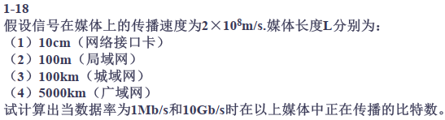

正在传输的比特数=传播时延*数据率

传播时延=媒体长度/传播速度

(1) 传输时延=$\frac{1*10^{-1}m}{2*10^8m/s}=5*10^{-10}s$

$1Mb/s:\quad 5*10^{-10}s*1*10^6b/s=5*10^{-4}bit$

$1Gb/s:\quad 5*10^{-10}s*1*10^9b/s=5*10^{-1}bit$

(2) 传输时延=$\frac{100m}{2*10^8m/s}=5*10^{-7}s$

$1Mb/s:\quad 5*10^{-7}s*1*10^6b/s=5*10^{-1}bit$

$1Gb/s:\quad 5*10^{-7}s*1*10^9b/s=5*10^{2}bit$

(3) 传输时延=$\frac{100*10^3m}{2*10^8m/s}=5*10^{-4}s$

$1Mb/s:\quad 5*10^{-4}s*1*10^6b/s=5*10^{2}bit$

$1Gb/s:\quad 5*10^{-4}s*1*10^9b/s=5*10^{5}bit$

(4) 传输时延=$\frac{5000*10^3m}{2*10^8m/s}=2.5*10^{-2}s$

$1Mb/s:\quad 2.5*10^{-2}s*1*10^6b/s=2.5*10^{4}bit$

$1Gb/s:\quad 2.5*10^{-2}s*1*10^9b/s=2.5*10^{7}bit$

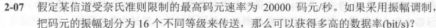

由题意 $2W=20000$

码元变为16，则数据率$=2W\log_216=80000bit/s$

+

最长工作距离$=\frac{20dB}{0.7dB/km}=\frac{200}7km$

衰减$=\frac{20dB}{100km}=0.2dB/km$

$\frac{2*10^8}{1200*10^{-9}}=\frac53*10^{14}Hz$

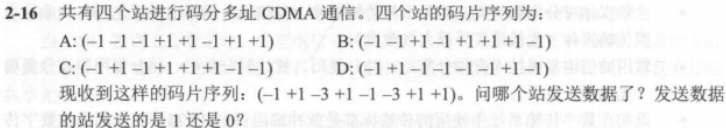

这种题，直接逐项相加即可

$S\cdot A=\frac18\sum_{i=1}^8S_iA_i=\frac{1-1+3+1-1+3+1+1}8=1$

$S\cdot B=\frac18\sum_{i=1}^8S_iB_i=\frac{1-1-3-1-1-3+1-1}8=-1$

$S\cdot C=\frac18\sum_{i=1}^8S_iC_i=\frac{1+1+3+1-1-3-1-1}8=0$

$S\cdot D=\frac18\sum_{i=1}^8S_iD_i=\frac{1+1+3-1+1+3+1-1}8=1$

故AD发送了数据1，B发送了数据0，C未发送数据

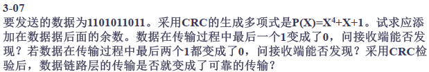

需要发送的数据 `1101011011`，补齐位数为 `11010110110000`

校验多项式 `10011`

做模2减法（逐位异或），得到余数 `0111`

需要发送的数据 `101110`，补齐位数为 `101110000`

校验多项式 `1001`

做模2减法（逐位异或），得到余数 `011`

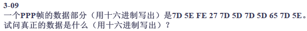

PPP协议中 0x7D 是转义字符

- 0x7D本身表示转义字符
- 如果数据中有0x7E（帧的边界字符），则它也会被转义成0x7D 0x5E
- 如果数据中有0x7D，则它会被转义成0x7D 0x5D

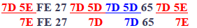

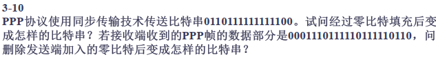

原文：0110111111111100

填充后：011011111011111000

填充后：0001110111110111110110

原文：00011101111111111110

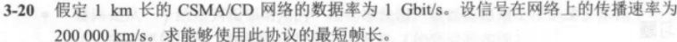

单程传播时延 $\tau=\frac{1*10^3m}{2*10^8m/s}=5*10^{-6}s$

往返传播时延 $2\tau=10*10^{-6}s$

$2\tau$ 即为争用期。
为了能够按照CSMA/CD 工作，最小帧的发送时间即为争用期$10\mu s$发送的数据量

$1*10^9b/s*10*10^{-6}s=1*10^4b=1250B$

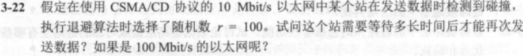

等待时间=$2\tau*r$

10Mb/s的以太网争用期为$51.2\mu s$，则等待时间=5.12ms

100Mb/s的以太网争用期为$5.12\mu s$，则等待时间=0.512ms

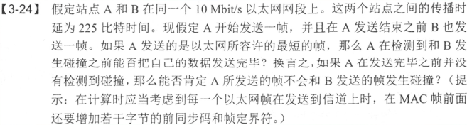

第三章还剩下一些，暂时丢掉了~

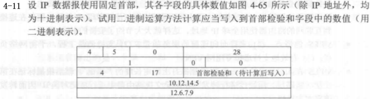

01000101 00000000
00000000 00011100
00000000 00000001
00000000 00000000
00000100 00010001
00000000 00000000
00001010 00001100
00001110 00000101
00001100 00000110
00000111 00001001
$\rightarrow$
01003532 00023414
01110100 01001110
$\rightarrow$取反码
10001011 10110001

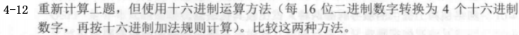

45 00
00 1C
00 01
00 00
04 11
00 00
0A 0C
0E 05
0C 06
07 09
$\rightarrow$
74 4E

十六进制太难算了

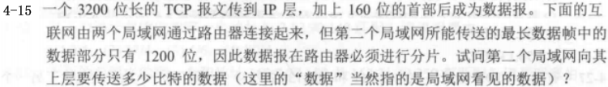

第二个局域网所能传送的最长数据帧中的数据部分只有1200bit，即每个IP数据片的数据部分不超过1200-160(bit)，由于片偏移是以8字节即64bit为单位，所以IP数据片的数据部分不超过1024bit

故3200bit的报文要分4个数据片，所以第二个局域网向上传送的比特数等于(3200+4*160)=3840bit

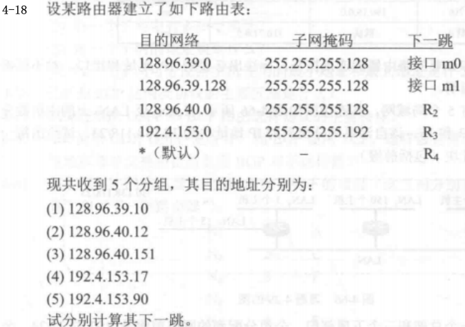

128.96.39.10属于子网128.96.39.0~128.96.39.127，故下一跳接口为m0

128.96.30.12属于子网128.96.39.0~128.96.39.127，故下一跳接口为R2

128.96.40.151不在子网128.96.40.0~128.96.40.127，故使用默认路由R4

192.4.153.17属于子网192.4.153.0~192.4.153.127，故下一跳接口为R3

192.4.153.90不在子网192.4.153.0~192.4.153.63，故使用默认路由R4

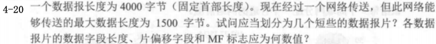

IP数据包固定首部长度即为20字节，剩下总共3980字节

分成最大数据长度为1500字节，去掉首部长度为1480字节

3980/1480>2，故划分为三个数据报片

第一片：数据字段长度为1480，片偏移为0，MF为1

第二片：数据字段长度为1480，片偏移为185，MF为1

第三片：数据字段长度为1020，片偏移为370，MF为0

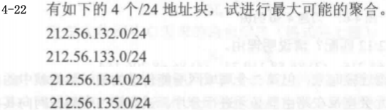

132:10000100
133:10000101
134:10000110
135:10000111

故共同前缀为 10000100(132)，总共22位

最大可能聚合为 `212.56.132.0/22`

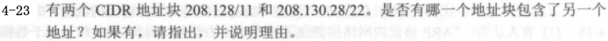

后者包含于前者，因为前面的序列都相同

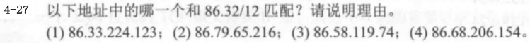

一眼是(1)哇

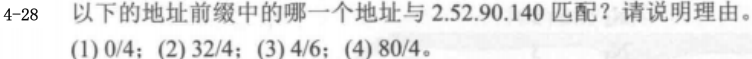

地址0/4与任意IPv4地址前四位为0000的地址都匹配

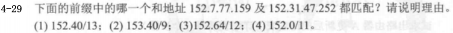

只有前11位相同（截止到第二位的16，即第12位）

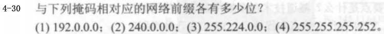

2 4 11 30

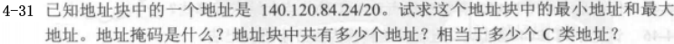

20=8+8+4

84写成二进制是01010100，取前四位为0101xxxx

最小01010000，即为80；最大01011111，即为95

最小地址为 140.120.80.00，最大地址为 140.120.95.255

地址掩码为 255.255.240.0

地址块中共有地址 $2^{32-20}=2^{12}=4096$ 个

相当于C类地址 $2^{12}/2^{8}=2^4=16$ 个

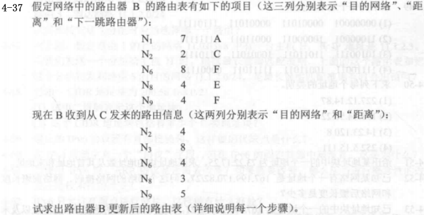

第一步：下一跳全部改为C，距离+1

第二步：和原有的进行对比，选择相对较少的那个

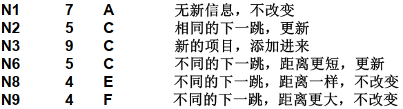

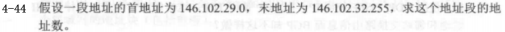

29:00011101
32:00100000

地址数为 256*4=1024

虽然这两个地址是连续的地址块，但无法写成前缀的形式。

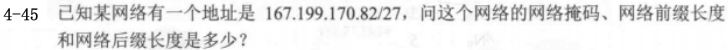

网络掩码：255.255.255.224

网络前缀长度：27

网络后缀长度：32-27=5

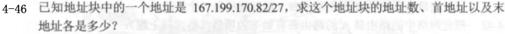

地址数：$2^5=32$ 个

首地址：`167.199.170.64`

末地址：`167.199.170.95`

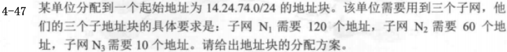

子网N1：14.24.74.0/25
子网N2：14.24.74.128/26
子网N3：14.24.74.196/28

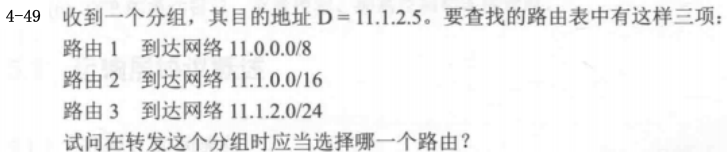

都匹配，根据最长前缀匹配原则，选择路由3

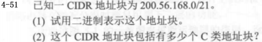

11001000 00111000 10101000 00000000/21

$\frac{2^{32-21}}{2^8}=2^3=8$

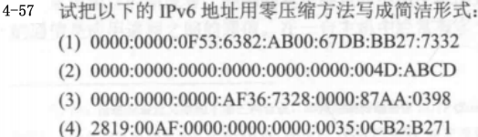

::F53:6382:AB00:67DB:BB27:7332
::4D:ABCD
::AF36:7328:0000:87AA:0398
2819:00AF::35:0CB2:B271

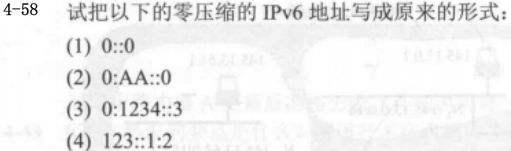

0000:0000:0000:0000:0000:0000:0000:0000
0000:00AA:0000:0000:0000:0000:0000:0000
0000:1234 :0000:0000:0000:0000:0000:0003
0123:0000:0000:0000:0000:0000:0001:0002

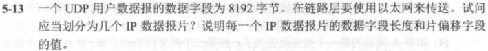

UDP的首部有8字节，故总共8200字节

IP数据包的最大长度为1500字节，首部20字节，故应当分为六片

前五段数据字段的长度为1480字节，第六片为800字节

片偏移为0,185,370,555,740,925

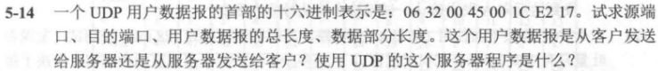

UDP首部分别是 源端口 目的端口 长度 校验和

因此源端口是 $6*256+3*16+2=1586$

目的端口是 $4*16+5=69$

用户数据总长度为 $16+12=28$

目的端口号 69<1023，是熟知端口，为服务器端使用的端口

使用的服务程序是TFTP

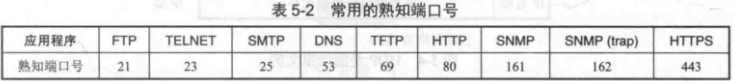

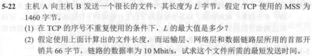

TCP报文段首部序号字段占4字节，共$2^{32}$个序号

TCP是面向字节流的，每个序号对应一个数据字节，因此在序号不重复使用的条件下，一次性能发送$2^{32}$个字节，因此L的最大值为4GB

10Mbit/s=1.25MB/s

所需时间=$\frac{L+\lceil\frac{L}{1460}\rceil*66}{1.25MB/s}$

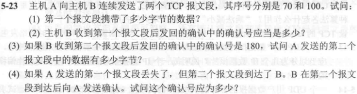

(1) 第一个报文段是70-99的数据，携带总共30个字节的数据

(2) 发回的确认号应当是100，代表100之前的序号皆被正确收到并且期待第100号

(3) 80个字节

(4) 70

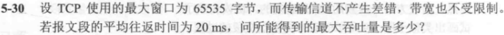

最大吞吐量=$\frac{65535B*8b/B}{20ms}=26.214Mb/s$

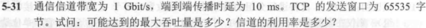

发送65535字节所需要的时间$T=T_D+RTT=\frac{65536B*8b/B}{1*10^9bit/s}+10ms*2=20.52428ms$

最大吞吐量$\frac{L}T=\frac{L}{\frac{L}C+RTT}=\frac{65536B*8b/B}{20.52428ms}=25.544Mb/s$

信道利用率=吞吐量/信道带宽=传播时延/总时延=2.5544%

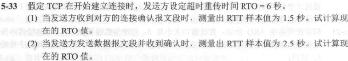

1. 初始化参数

\- 初始的`EstimatedRTT`和`DevRTT`可以根据系统预设值或初始采样值来设定。

\- 常见的初始值：

  \- `EstimatedRTT = 初始 RTT 样本值`

  \- `DevRTT = 初始 RTT 样本值 / 2`（或其他合理假设值）

2. 更新 `EstimatedRTT`

当采集到新的RTT样本值`SampleRTT`时，更新`EstimatedRTT`：

$\text{EstimatedRTT} = (1 - \alpha) \times \text{EstimatedRTT} + \alpha \times \text{SampleRTT}$

\- 这是一个加权平均公式，用于平滑RTT的估计值。

\- 参数$\alpha$的典型值是0.125（即1/8）。

3. 更新 `DevRTT`

基于`SampleRTT`与`EstimatedRTT`的差异，更新`DevRTT`（估算RTT的平均偏差）：

$\text{DevRTT} = (1 - \beta) \times \text{DevRTT} + \beta \times |\text{SampleRTT} - \text{EstimatedRTT}|$

\- 这里使用的是绝对偏差来衡量RTT的波动程度。

\- 参数$\beta$的典型值是0.25（即1/4）。

4. 计算 RTO

根据更新后的`EstimatedRTT`和`DevRTT`计算`RTO`：

$\text{RTO} = \text{EstimatedRTT} + 4 \times \text{DevRTT}$

\- 加权偏差部分（$4 \times \text{DevRTT}$）用于增加容忍度，防止因RTT波动引发过早重传。

5. 动态调整

\- RTO的上下限限制：在实际实现中，RTO通常会被限制在一个范围内。例如：

  \- 最小值：1秒

  \- 最大值：60秒

  这样可以避免计算结果极端化导致性能问题。

(1) RTO=4.5s

(2) RTTs=$\frac78$旧的RTT+$\frac18$新的RTT=1.625s

​	 RTTd=$\frac34$旧的RTTd+$\frac14$|RTTs-新的RTT样本|=0.78125s

​	 RTO= 4.75s

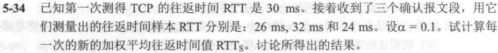

RTT0=30ms

RTT1=0.9RTT0+0.1RTT=29.6ms

RTT2=0.9RTT1+0.1RTT=29.84ms

RTT3=0.9RTT2+0.1RTT=29.256ms

$\alpha$取值较小，RTTs受RTT样本值的影响较小

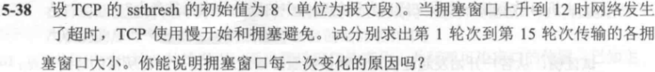

ssthresh=上次拥塞值/2

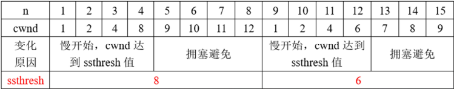

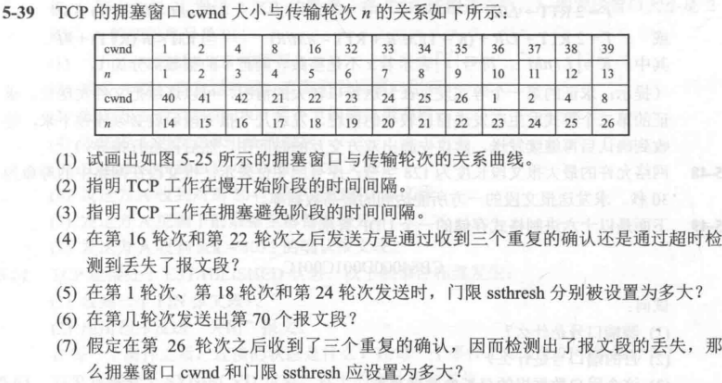

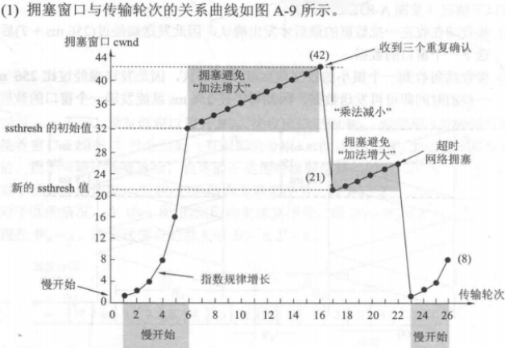

(2) 慢开始时间间隔：[1,6]和[23,26]

(3) 拥塞避免时间间隔：[6,16]和[17,22]

(4) 第16轮是收到了重复帧，第22抡是超时检测

(5) 1->32, 18->21, 24->13

(6) 第七轮

(7) 4

半期考相关考点

1. 集线器平分带宽，交换机都能使用最大带宽
2. 集线器不能隔离广播域和冲突域，交换机可以隔离冲突域但是不能隔离广播域
3. 已知网络利用率求网络延迟是最小值的多少倍，$(1-利用率)^{-1}$
4. 最小单位：物理层：比特/位；数据链路层：帧；网络层：分组；传输层：数据报；应用层：数据
5. CSMA/CD是在介质访问控制（MAC层）实现的
6. 传统以太网最短有效帧长位64字节，争用期为 $51.2\mu s$
7. 以太网的物理地址的长度为48位，IPv4地址的长度为32位
8. IP首部定长部分为20字节
