# 计组期末预习

## 重点大纲

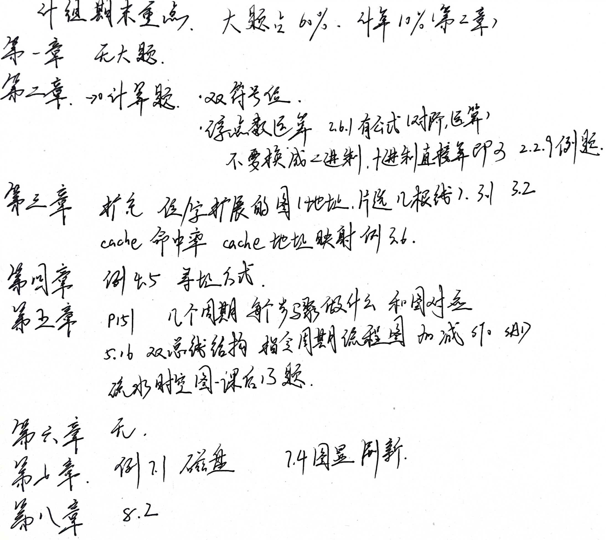

剩下的 20 分是选择，10分判断题

需要写的题占 70 分，故只用预习这部分即可

## 第二章 运算器

### 双符号位

用来判断溢出的

前置知识：正数符号位是0，负数符号位是1

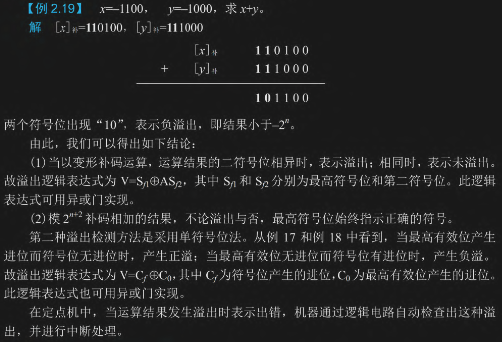

计算过程：先转补码，负数符号位是 `11`，然后直接相加，如果 `10` 则负溢出（下溢），`01`则正溢出（上溢）

### 浮点数运算

流程：先对阶，小阶向大阶看齐，然后直接相加或者减少，最后变为 1.xxx 的形式

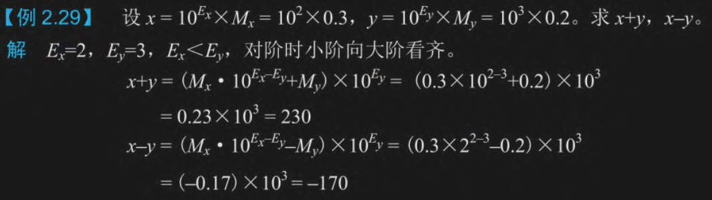

给的本身就是十进制，就不用换为二进制了

乘除法能算的就直接算，不能算的分数就不要了

## 第三章 存储器

### 字位扩展

笔记上记录的是 3.1 3.2，但是实际应该是对应 3.2.4，当时记录的应该是课后习题

位扩展：把低比特芯片（ 2 位或者 4 位）拓展到高比特位数（8 位甚至更多）。画在下面的数据总线

字扩展：加大容量。画在上面的地址总线

值得注意的是，位扩展也会加大总容量，不要计算重复了

别忘了读写线

下面是课后习题 3.1 和 3.2

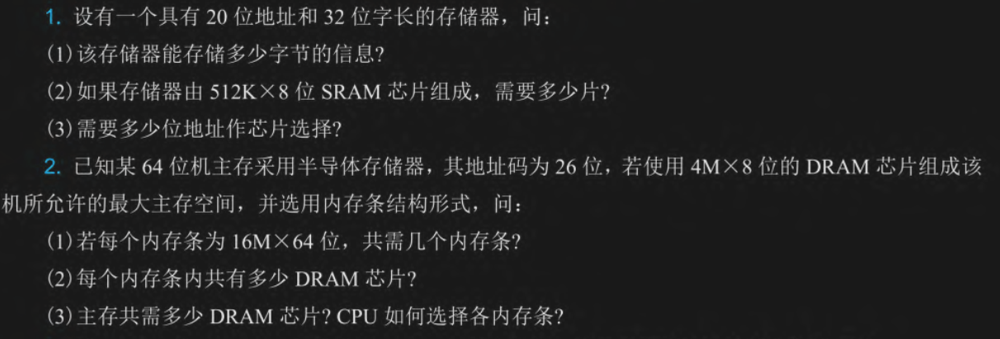

第一题
(1) 32 位所以每个地址存 4B 数据，20位地址所以总容量是 $2^{20}*4B=4MB$
(2) 8 位变 32 位，需要位扩展四倍，这里地址位是 $512K=2^{19}$，字扩展二倍即可。共计 8 片
(3) 字扩展需要片选，故 1:2 译码器即可，需要一根地址线

第二题
(1) 电脑是 64 位，内存条也是 64 位，所以不需要位扩展；$16M=2^{24}$，而地址码为 26 位，所以需要四个内存条
(2) 把 4M\*8位 字位扩展为 16M\*64位，需位扩展八倍，字扩展四倍，总共需要 32 个 DRAM 芯片
(3) 4\*32=128 个 DRAM，四个内存条所以接入一个  2:4 译码器，地址线两条，剩下地位 24 条用于条内寻址

画图的时候别忘了 读写线（ CPU端为 $R/\overline{W}$ ，芯片端为 $\overline{WE}$ 和 $\overline{OE}$）

第二题画图好像还有二次扩展？哎哎我赌考试不考

### cache 命中率

这个符号好难记哇，我不要记了

- $N_m$：命中次数
- $N_m$：未命中次数
- $t_c$：Cache 的存取周期（命中时花的时间，很短）
- $t_m$：主存的存取周期（未命中时花的时间，较长）

需要的公式：

- 命中率 $h = \frac{N_c}{N_c + N_m}$
- 平均访问时间 $t_a = h \cdot t_c + (1 - h) \cdot t_m$
- 访问效率 $e = \frac{t_c}{t_a}$ （最快比平均，不用记那个长公式）

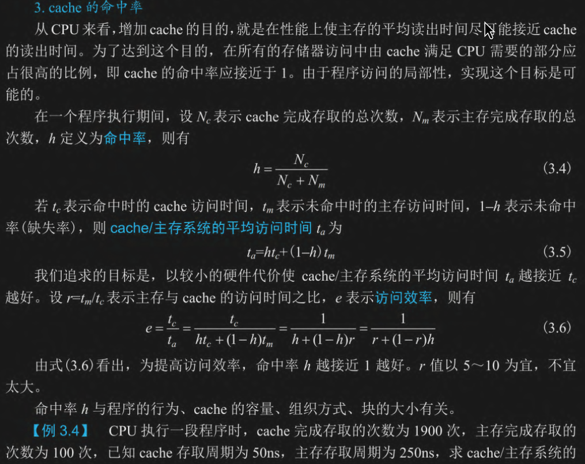
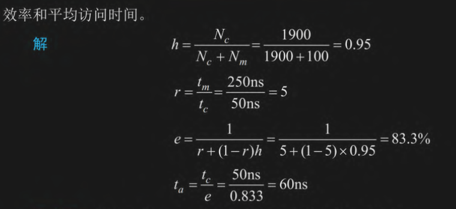

不用看上面的算法，南辕北辙了，直接返璞归真

- 命中率就是 1900/(100+1900)=95%
- 平均访问时间为 (1900\*50+100\*250)/(1900+100)=60ns
- 访问效率是最快比平均，50/60=83.3%

### cache 地址映射

要求会计算，知道格式

CPU 发出一个主存地址找数据，Cache 系统要把这个长长的主存地址切成三段，来快速判断这个数据在不在 Cache 里。

分别是 标记 组号 块内地址/字地址，从低位到高位进行

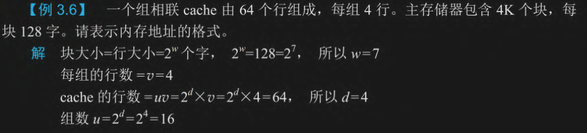
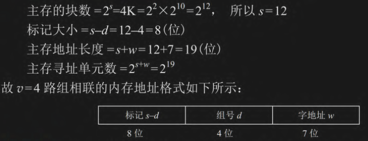

每块 128 字，也就是需要 7 位来表达它，子地址就是 7 位

cache 有 64 行，每组 4 行所以有 16 个组，组号需要 4 位来表示

主存总共有 $4K=2^{12}$ 个块， 所以除了字地址，其他的总共 12 位，标记剩下 8 位

## 第四章 指令系统

### 寻址方式

- 立即寻址：直接用后面的数字（操作数），不寻址
- 直接寻址：用后面数字的地址
- 间接寻址：用后面数字的地址的地址
- 寄存器寻址：用寄存器里面的数据
- 寄存器间接寻址：用寄存器里面地址
- 隐含寻址：和寄存器寻址有点像，但是是专用寄存器
- 偏移寻址：分为相对寻址/基址寻址/变址寻址，相对寻址是相对 PC，基址寻址和变址寻址是用寄存器里的基址，前者不好修改 后者好修改

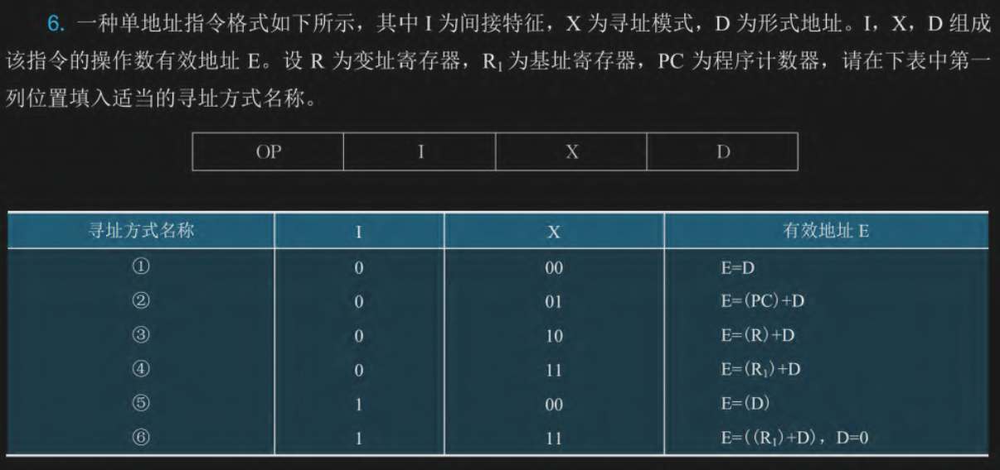

- 第一个有一次寻址，是直接寻址
- 第二个是程序计数器偏移，相对寻址
- 第三个是变址寄存器偏移，变址寻址
- 第四个是基址寄存器寻址，基址寻址
- 第五个是有一次间址，是间址寻址
- 最后一个很明显有寄存器有间址，是寄存器间址寻址

还有课后题的第十二题也是，这里不再赘述

## 第五章 CPU

### 指令周期

需要认识的缩写：

* **PC (程序计数器)**：存放**下一条**要执行的指令的地址。（快递单上的目标地址）
* **IR (指令寄存器)**：存放**当前正在执行**的指令。（拆开快递看里面要干嘛）
* **ALU (算术逻辑单元)**：负责加减乘除和逻辑运算。（加工厂）
*  **$R_0 \sim R_3$(通用寄存器)**：CPU 内部存放临时数据的草稿本。
* **DR (数据缓冲寄存器)**：CPU 和外部总线（DBUS）交换数据的临时中转站。
* **AR (地址寄存器)**：通常用来暂存要访问的内存地址（图5.5中只标了虚线框，实际使用的是专用的地址总线通道）

指令周期一般分为 取指周期 间址周期 执行周期 中断周期，这里我们只考虑取取指和执行周期，取指周期每个指令都一样 是从内存拿指令到 CPU 中的 IR，然后把 PC + 1 再取下一条，执行周期是就具体的指令去干活


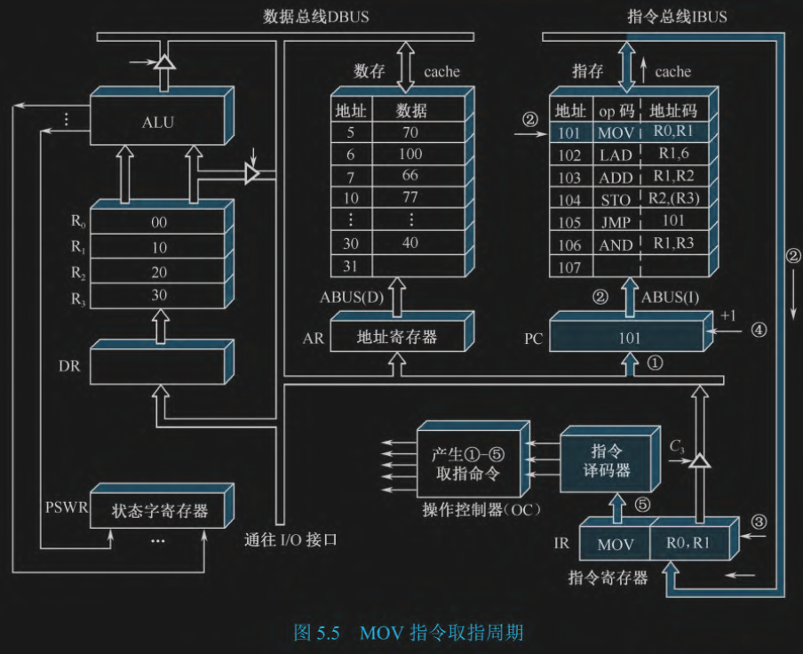

目标： 把地址为 101 的指令 MOV R0, R1 取回 CPU。

1. (PC) -> ABUS：把 PC 的地址放在地址主线
2. M(PC) -> IBUS：把 PC 对应的指令放在指令总线
3. (IBUS) -> IR：CPU 把指令总线上的 指令放在 IR 中
4. PC+1 -> PC： 程序计数器加一
5. 译码

总结：取 PC 然后把 PC 相对的指令放进指令寄存器中，最后译码

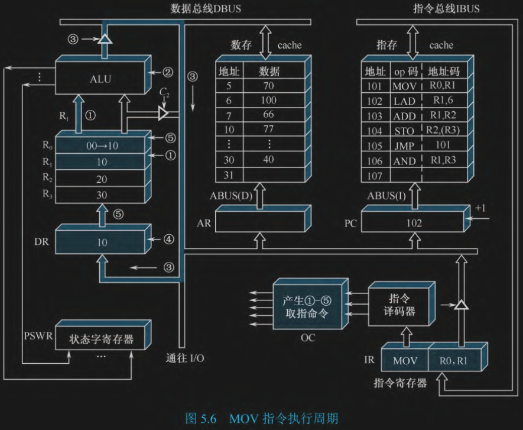

**目标：** 执行 MOV R0, R1，把  $R_1$ 里的数据复制到  $R_0$ 里。

1. (R1) -> ALU：把 R1 里面的数据放进 ALU 里面
2. 运行 ALU 里面的控制单元，只传数据而不运算
3. (ALU) -> DBUS：把 ALU 的输出放在数据总线上
4. (DBUS) -> DR：把数据总线上的数据放在数据寄存器里
5. (DR) -> R0：把 数据寄存器 里的东东放进 R0

总结：通过 ALU 把数据转了一圈

### 双总线

A 总线是入口，B 总线是出口。两个部件传输数据：

`源部件 -> B总线 -> 门G -> A总线 -> 目的部件`

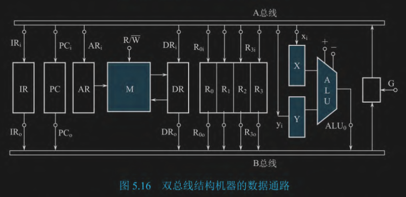

取指周期：

1. 把 PC 里的地址送到 AR：$PC \rightarrow B总线 \rightarrow G \rightarrow A总线 \rightarrow AR$，控制信号 $PC_o, G, AR_i$
2. 去内存读指令到 DR：$M \rightarrow DR$，控制信号 $R/\overline{W} = 1$（读命令）
3. 把 DR 里的指令代码送入 IR，准备译码：$DR \rightarrow B总线 \rightarrow G \rightarrow A总线 \rightarrow IR$，控制信号 $DR_o, G, IR_i$
4. PC 自动加 1：$PC \rightarrow B总线 \rightarrow G \rightarrow A总线 \rightarrow Y$，让 ALU 加一，然后$ALU \rightarrow B总线 \rightarrow G \rightarrow A总线 \rightarrow PC$

执行周期：

是不是这样： 存数STO是吧前面的放进后面，取数是把后面的提取到前面，加减法都是前者是结果

- 加法指令 ADD R1, R2 - $(R_1) + (R_2) \rightarrow R_1$
- 减法指令 SUB R1, R2 - $(R_1) - (R_2) \rightarrow R_1$
- 存数指令 STO R1, (R2) - 把 R1 的数写进 R2 指向的内存，目的地在后面（内存）
- 取数指令 LAD R1, (R2) - 把 R2 指向内存的数据写进 R1 中，目的地在前面

和前面指令周期的内容基本相同，只不过用 A 和 B 两个总线细化了传输，但也淡化了 IBUS ABUS DBUS 三个总线

### 流水时空图

这里没给理论直接给题，因为只要掌握公式就能算

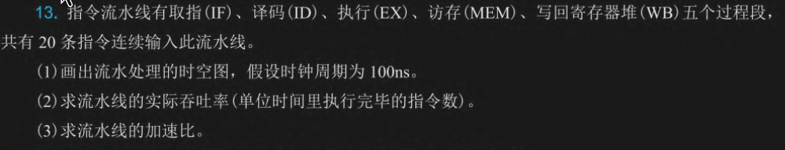

第一步：画出流水处理时空图并求总时间

就是流水线的图，题目没说 默认每个阶段时间相同，占用一个时钟周期

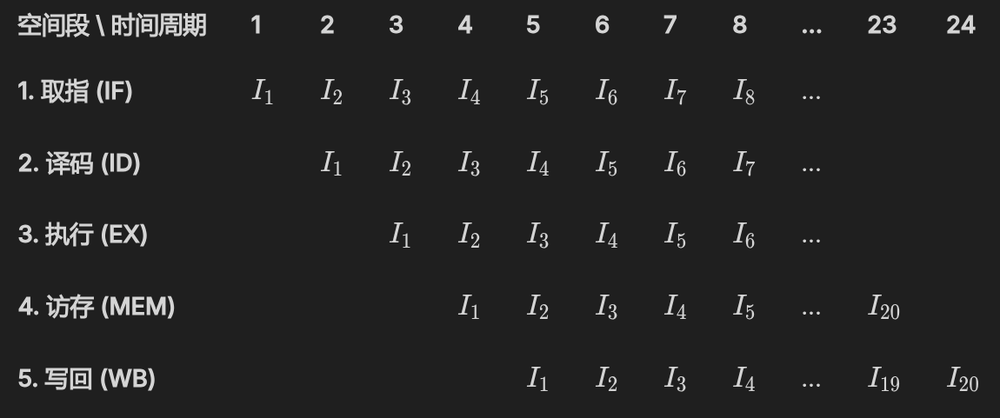

然后计算总时间，瞪眼法（观察法）得到 24 个时钟周期，也就是 2400 ns

第二步：求吞吐率

吞吐率 = 任务总量 / 总时间，也就是单位时间内能完成的指令

$$TP = \frac{n}{T} = \frac{20}{2400\text{ns}} = \frac{1}{120\text{ns}}$$

$1\text{ns} = 10^{-9}\text{s}$，所以 $

$TP = \frac{20}{2400 \times 10^{-9}\text{s}} \approx \mathbf{8.33 \times 10^6 \text{ 条/秒 (或写作 8.33 MIPS)}}$$

第三步：求流水线的加速比

也就是流水线给加快了多少，加速比=不用流水线的时间 / 使用流水线的时间

单条指令需要 $5 \times 100\text{ns} = 500\text{ns}$

20 条指令总共需要 $20 \times 500\text{ns} = \mathbf{10000\text{ns}}$

$$S = \frac{T_{顺序}}{T_{流水}} = \frac{10000\text{ns}}{2400\text{ns}} = \frac{100}{24} = \frac{25}{6} \approx \mathbf{4.17}$$

## 第七章 外围设备

### 磁盘

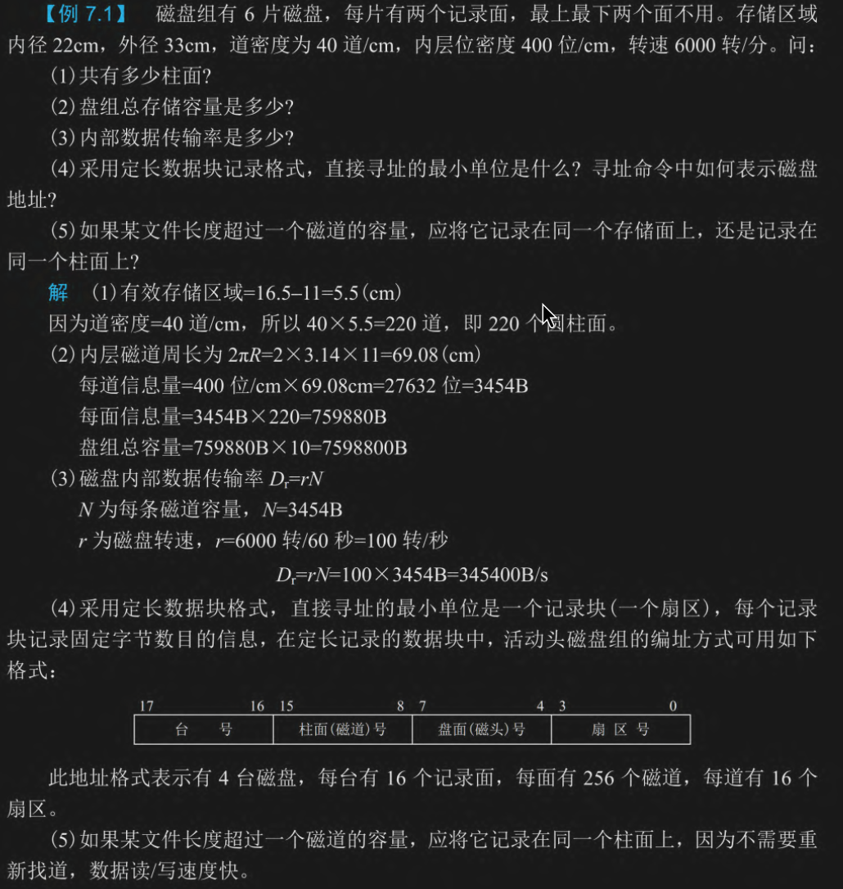

(1) 六片磁盘，最上最下两个面不用，剩下的总共 10 个面

(2) 后面计算只用半径，内径 22 cm 外径 33 cm，所以 内半径 11 cm 外半径 16.5 cm

有效宽度 =  外半径 - 内半径 = 5.5 cm，道密度为 40道/cm 所以总道数为 $5.5 \times 40 = 220 \text{ 个}$

**所有磁道的容量都和 最里面那个圈（内层磁道）一样大**

计算内层的周长 $C = 2\pi r_{内} = 2 \times 3.14 \times 11 = 69.08\text{cm}$

内密度是 400 位/cm，所以每道信息量为 $69.08 \times 400 = 27632\ \text{bit} = 3454\ \text{B}$

一个道有 $3454\ \text{B} \times$  一面有 220 道 = $759880\ \text{B}$

一个面有 $759880\ \text{B} \times$ 10 个有效面 = $7598800\ \text{B}$

(3) 磁盘转一圈，磁头就能读完一整圈（一道）的数据

转速 $r = 6000 \text{ 转/分钟}=100 \text{ 转/秒}$

传输率 $D = 100 \text{ 圈/秒} \times 3454 \text{ B/圈} = \mathbf{345400 \text{ B/s}}$

(4) 最小单位是扇区。然后按台面（区分磁盘）、柱面（磁道）、盘面（磁头）、扇区

(5) 存到同一柱面上，因为不用重新找道，全部磁头是共进退的。所以为了速度，应当先把当前柱面从上到下的面全写满，再去移动磁头找下一个柱面

### 图显刷新

核心公式

```
一屏所需数据量 = 分辨率 × 颜色深度
刷新所需带宽 = 一屏所需数据量 × 刷新率
```

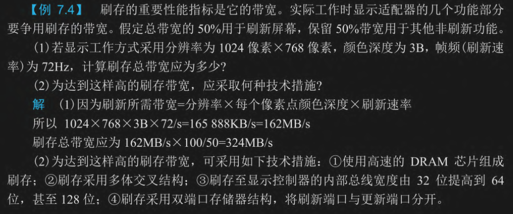

(1) 刷新带宽为 $1024 \times 768 \times 3\text{B} \times 72 = 169,869,312 \text{ B/s} = 162 \text{ MB/s}$

162 MB/s 占了一半，所以总共是 324 MB/s

注意，颜色深度是 3B，直接给了三字节，如果说 24 位 真色彩，那不能直接乘24，需要换成字节，和 3B 是一样的

(2) 如何变得好用？高速芯片+多体交叉+提高总线带宽+双端口存储器

## 第八章 IO

### 多级中断


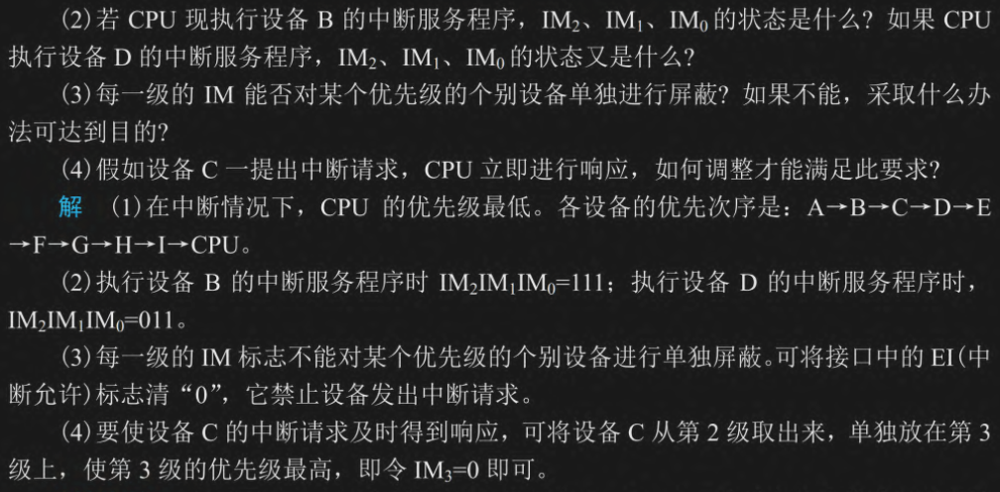
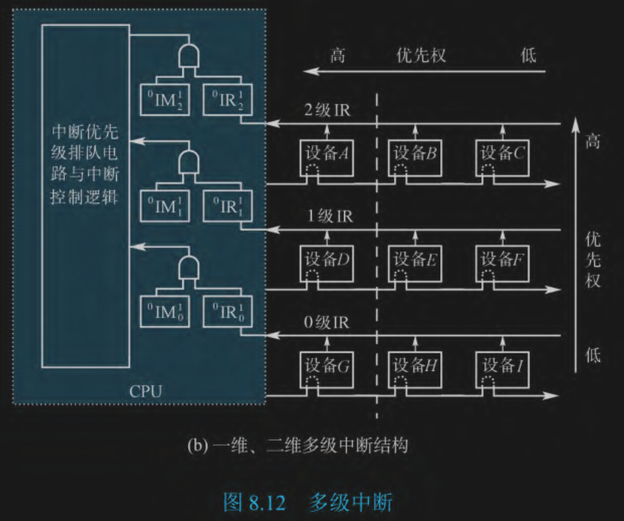

(1) 二维优先级是从左到右，从上到下

(2) 屏蔽等于或小于自己等级的，1 表示屏蔽。例如在执行 B ，那就没有更大的了，都屏蔽掉了 `111`；如果在执行 I，那就只需要屏蔽自己这一层的了 `001`；如果在执行普通程序还没中断，那就是 `000`

(3) 这个图还真不能，因为一ban就ban一行了，解决方式就是设置单独开关

(4) 新建一级，让他在 3 级 IR，AB之上