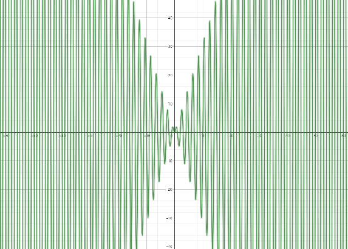

# 记录一道考研数学-关于三角函数的极限

题目：$lim_{n\rightarrow \infty}n\pi sin(n\pi)=?$

<!--more-->

因为是填空题，所以一眼能看出来得 $0$ 

为什么是零呢？因为感觉不是正数也不是负数（对偶性），所以只能是 $0$

学长的讲解：

当 $n \to \infty$ 时，可以把问题理解为一个数列的极限，也就是趋于正无穷的实数。但是，直接看 $n \pi \sin(n \pi)$ 的极限是行不通的，因为这个表达式相当于 $0 \times \infty$ 的形式。在这种情况下，你可能想把 $0$ 单独拿出来处理，但根据乘法运算的规则，只有当两个乘数都存在时，才能进行这样的操作。

所以我们先不要直接看极限，而是先看表达式 $n \pi \sin(n \pi)$ 本身。在 $n$ 为实数的情况下，$\sin(n \pi)$ 总是 $0$，因此这个表达式无论 $n$ 是多少，都是 $0$。即使把极限带入，结果也是 $0$。尽管你可能会觉得这种形式是“无穷小乘无穷大”，不一定是 $0$，但实际上这是 $0$ 乘以任何数，结果必然是 $0$。

无穷小和 $0$ 是不同的，$0$ 是无穷小的一种特殊情况。虽然无穷小乘无穷大的结果并不总是 $0$，但在这里，表达式的极限确实是 $0$。

---

但是我的问题在于，随着 $n$ 的增大（只考虑趋向于正无穷大），函数值高速震荡，感觉不像是有界的



之后发现它确实是有界的，因为：

```
在判别函数的有界性时，我们需要先知道以下两个重要结论，即： 如果f（x）在闭区间［a，b］上连续，那么f（x）在闭区间［a，b］上有界。 如果f（x）在开区间（a，b）上连续且函数的极限存在于其端点处，则f（x）在开区间（a，b）上有界。
```

这个函数包连续的，所以理所当然的有界

既然都有界了，那么极限存在

---

后记：

结合网上的说法和gpt4o给出的答案，$\lim_{n \to \infty} n \pi \sin(n \pi)$ 不存在

当且仅当 $n\in N^*$ 时，$\lim_{n \to \infty} n \pi \sin(n \pi)=0$

如果 $n$ 是非整数实数，$\sin(n \pi)$ 会在 $[-1, 1]$ 之间振荡。而由于 $n \pi$ 趋向无穷大，乘积 $n \pi \sin(n \pi)$ 是一个无穷大乘以振荡的值，无法直接确定这个极限。

因此，严格来说，$\lim_{n \to \infty} n \pi \sin(n \pi)$ 是发散的，并不存在一个简单的极限值。如果我们只考虑 $n$ 为整数的情况，则结果为 $0$，否则该极限无法求出。

 $\lim_{n \to \infty} n \pi \sin(n \pi)$ 存在，当且仅当 $\lim_{x \to \infty} \sin(x)$ 存在；众所周知的，$f(x)=\sin(x)$ 既不收敛也不发散（在讨论整个序列时，极限存在与收敛实际上是等价的），故极限不存在

