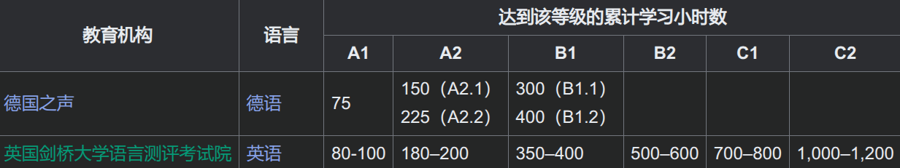
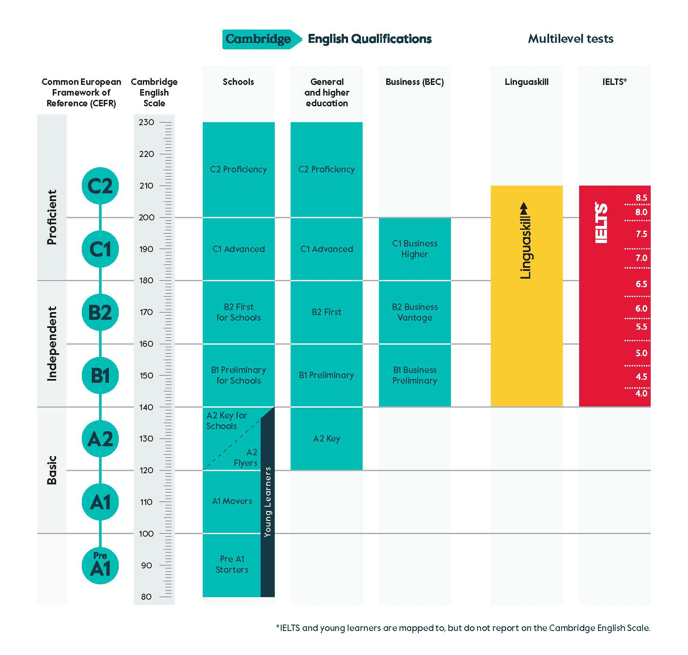

# 德语学习

德语和英语很像，建议英语有一定基础再来学习

我是直接用的多邻国学习，用英语去学习德语。时间多就学十分钟，时间少就之学一次课（保证不断连续打卡书）

下面记录一些学到的小零碎知识点

---

## 语言水平分级

按照 欧洲共同语言参考标准（The Common European Framework of Reference for Languages，简称CEFR），语言水平可以从低到高分为 A1 A2 B1 B2 C1 C2。

雅思 6.5 至 7.5 分相当于 C1 水平，而 8.0 至 9.0 分则表示 C2 水平。[来源](https://nacelesl.co.uk/zh-hans/a1%E3%80%81a2%E3%80%81b1%E3%80%81b2%E3%80%81c1-%E5%92%8C-c2-%E5%88%86%E5%88%AB%E5%AF%B9%E5%BA%94%E4%BB%80%E4%B9%88%EF%BC%9F%E4%BA%86%E8%A7%A3-cefr-%E8%8B%B1%E8%AF%AD%E8%AF%AD%E8%A8%80%E7%BA%A7/)

[CEFR欧洲共同语言参考标准详解](https://www.efset.org/zh/cefr/#nav-6)

[维基百科-欧洲共同语言参考标准](https://zh.wikipedia.org/wiki/%E6%AD%90%E6%B4%B2%E5%85%B1%E5%90%8C%E8%AA%9E%E8%A8%80%E5%8F%83%E8%80%83%E6%A8%99%E6%BA%96)

[剑桥-CEFR](https://www.cambridgeenglish.cn/exams-and-tests/cefr/)

---

## 字母表及其发音

德语发音非常严谨，几乎是所见即所得，故不必知道词义即可读出来

### 元音

分为长音和短音

### 双元音

### 常见辅音组合

### 尾音规律

### 语调与重音

[unfixed]

---

## 阳性阴性中性

每个名词都有的性质，没有什么规律，只能直接去记忆

[unfixed]

[德语名词](https://zh.wikipedia.org/wiki/%E5%BE%B7%E8%AF%AD%E5%90%8D%E8%AF%8D)

---

## 喵喵喵留空中

[unfixed]